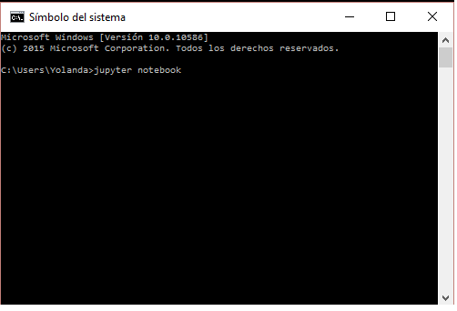
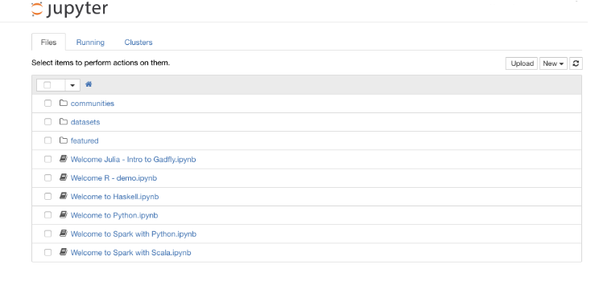
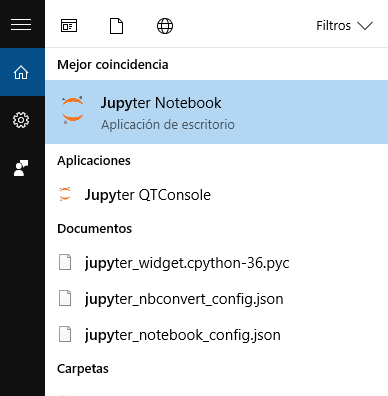
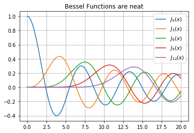

# El entorno Jupyter Notebook

* [Jupyter notebook](http://jupyter.org) es una aplicación web que permite crear documentos que contienen código vivo, texto, figuras y medios audiovisuales. 

* Estos documentos se visualizan con el navegador (Explorer, Chrome, Firefox, ...) y pueden incluir cualquier elemento accesible a una página web, además de permitir la ejecución de código escrito en el lenguaje de programación Python.

* Se trata de software libre 

* Usado por docentes, científicos, investigadores.

* También usado por periodistas como medio para contar historias y mostrar su trabajo.


__Ejemplos__

[The Tennis Racket](https://github.com/BuzzFeedNews/2016-01-tennis-betting-analysis/blob/master/notebooks/tennis-analysis.ipynb) by BuzzFeed and the BBC

[Fire officials were concerned about Westlake building where 5 died in a blaze](https://github.com/datadesk/la-vacant-building-complaints-analysis/blob/master/la-vacant-building-complaints-analysis.ipynb) by the Los Angeles Times

[Machine bias](https://github.com/propublica/compas-analysis/blob/master/Compas%20Analysis.ipynb) by ProPublica


* Este entorno es ideal para realizar tareas típicas en el contexto del análisis de datos; importación y exportación,  manipulación y transformación, visualización  y mucho más. 


##  Instalación de Jupyter (Anaconda)

Para poder ejecutar los ejemplos contenidos en este libro es necesario tener accesible un intérprete de Python 3.X y las librerías de cálculo científico Numpy, Pandas, Scipy, Matplotlib y Statsmodels. 

* Desde Windows, Linux o Mac, lo más sencillo es usar [Anaconda](https://www.continuum.io/downloads)

*  Anaconda es una distribución de Python que recopila muchas de las bibliotecas necesarias en el ámbito de la computación científica. Esta distribución incluye multitud de utilidades que nos facilitarán el trabajo y es ideal para empezar.

* Anaconda es un producto de Continuum Analytics (htp://continunm.io/) y puede descargarse de su sitio web.

* Para instalarla, sólo tienes que descargar la versión de Anaconda para tu sistema operativo desde su página web (te pedirá tu dirección de email, pero si no quieres darla, pulsa en __NO_THANKS__ y podrás descargarlo sin problema). 


## Puesta en marcha de la aplicación 

Una vez realizada la instalación en cualquiera de los sistemas operativos mencionados,
la ejecución de Jupyter Notebook se puede realizar abriendo un terminal
y ejecutando el comando `jupyter notebook`.
En Windows se puede abrir el terminal realizando una búsqueda por `cmd` entre las aplicaciones.




La ejecución de `jupyter notebook` abrirá una ventana nueva en el navegador de internet.




Otra opción es buscar la aplicación en nuestro sistetema:



## Escribir y ejecutar Python en un notebook

Un notebook de Jupyter es un fichero que contiene un conjunto de celdas donde cada celda puede ser de distintos tipos: 

* Markdown: sirven para escribir texto
* Code: sirven para escribir código ejecutable

Todas las celdas son ejecutables.


```

>>> 6 + 7

```


    13


```

>>> lavadora = 800
plancha = 100
total = lavadora + plancha

```


```

>>> total

```


    900


## ¿Qué se puede hacer en un Notebook de IPython?

### Dibujar gráficas


```

>>> import scipy.special as spec
%pylab inline
x = np.linspace(0, 20, 200)
for n in range(0,13,3):
    plt.plot(x, spec.jn(n, x), label=r'$J_{%i}(x)$' % n)
grid()
legend(loc =1)
title('Bessel Functions are neat');

```

    Populating the interactive namespace from numpy and matplotlib
    





### Incrustar imágenes


```

>>> from IPython.display import Image
Image(filename='./images/periodismo.jpg')

```


### Incrustar vídeos


```

>>> from IPython.display import YouTubeVideo
YouTubeVideo('C6hVKQL5SVo')

```


        <iframe
            width="400"
            height="300"
            src="https://www.youtube.com/embed/C6hVKQL5SVo"
            frameborder="0"
            allowfullscreen
        ></iframe>
        


------------

# References


* [jupyter](http://jupyter-notebook.readthedocs.io/en/latest/)   (http://jupyter-notebook.readthedocs.io/en/latest/) 
* [Jupyter notebook documentation](http://jupyter.readthedocs.org/en/latest/index.html)  (http://jupyter.readthedocs.org/en/latest/index.html)


----
