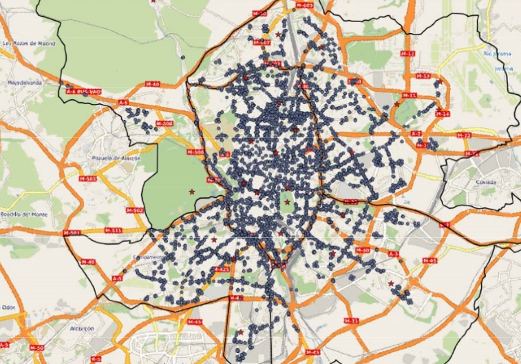

## Librería Pandas para preparación de los datos

Python tiene un montón de librerías para hacer casi todo lo que queramos.

Una gran parte de las utilidades viene por defecto con el propio lenguaje, y otras han sido desarrolladas por la comunidad Python y es necesario instalarlas e importarlas para poder usarlas.

Una de estas librerías es Pandas.


```

>>> # importar librerías necesarias para la ejecución

import pandas as pd
import numpy as np

# visualización
import seaborn as sns
import matplotlib.pyplot as plt
%matplotlib inline

## sistema operativo
import os
from os import listdir
from os.path import isfile, join

import zipfile
import time
import re


```

Se trata de la librería básica para trabajar con series y con datos en forma de tabla. 
Con ella es posible importar gran cantidad de datos, ejecutar estadísticas, filtrar los datos, agrupar los datos, y casi todo...

## Análisis de datos de tráfico - aire (C.Madrid)

El portal de datos abiertos del Ayuntamiento de Madrid (http://datos.madrid.es/portal/site/egob) pone a disposición gran cantidad de datasets.

* __Datos de observaciones de puntos de medida de tráfico__

La descripción de los datos y los ficheros en formato CSV comprimido se pueden encuentran en los siguientes enlaces:

* [Datos históricos de Tráfico](http://datos.madrid.es/portal/site/egob/menuitem.c05c1f754a33a9fbe4b2e4b284f1a5a0/?vgnextoid=33cb30c367e78410VgnVCM1000000b205a0aRCRD&amp;vgnextchannel=374512b9ace9f310VgnVCM100000171f5a0aRCRD&amp;vgnextfmt=default)

Distintos sensores de control de tráfico de la Comunidad de Madrid proporcionan datos sobre la intensidad de tráfico cada 15 minutos.


Nos planteamos algunas cuestiones:
1. La intensidad de tráfico informa acerca de la movilidad de la población

2. Queremos estudiar una estación de tráfico concreta, conocer la intensidad de tráfico que registra dicha estación a lo largo del mes, qué día registra la mayor intensidad, etc.

3. En cuanto a los protocolos de cortes de tráfico impuestos por el ayuntamiento de Madrid, ¿tienen éxito?


## Leer los datos

Mostramos cómo importar los datos en Pandas y en un notebook de Jupyter para comenzar con el análisis.

| Dataset (Portal del datos abiertos)       | Descripción    | 
| :----------- | :------ | 
| [02-2017.zip](https://drive.google.com/file/d/0B0t9M1np1rY_QkR2bEJqTER5cUE/view?usp=sharing) | Datos de intensidad de tráfico cada 15 minutos | 


| Otros datasets       | Descripción    | 
| :----------- | :------ | 
| [pmed_trafico_coord.csv](./pd_trafico/pmed_trafico_coord.csv) | Geolocalización de las estaciones de tráfico | 
| [descripcion_est_traf.xlsx](./pd_trafico/descripcion_est_traf.xlsx)   | Descripción de las estaciones de tráfico     | 

* __Formato CSV__: registros con datos separados por comas. Es uno de los formatos más habituales.

* __Formato ZIP__: fichero CSV comprimido. 

* __Formato Excel__: conocido por todos.

### Crear un dataframe de Pandas

La librería Pandas proporciona funciones de lectura y escritura de datos en muchos formatos (txt, csv, xlsx, json, ...).

Para leer datos en formato __CSV__ utilizamos la función `read_csv` de Pandas.


```

>>> # acceso en modo lectura al fichero comprimido
zf = zipfile.ZipFile( "./pd_trafico/02-2017.zip", 'r')

# crear un dataframe llamado tf
tf = pd.read_csv(zf.open(zf.namelist()[0]),  sep = ';', parse_dates =[1])

```

Como se puede observar a continuación, tenemos una estructura de tabla (con filas y columnas) similar a una hoja de cálculo. Una diferencia es que todo lo que hagamos con los datos se podrá reproducir en cualquier momento.


```

>>> tf         # acceso al contenido

```


<div>
<table border="1" class="dataframe">
  <thead>
    <tr style="text-align: right;">
      <th></th>
      <th>idelem</th>
      <th>fecha</th>
      <th>identif</th>
      <th>tipo_elem</th>
      <th>intensidad</th>
      <th>ocupacion</th>
      <th>carga</th>
      <th>vmed</th>
      <th>error</th>
      <th>periodo_integracion</th>
    </tr>
  </thead>
  <tbody>
    <tr>
      <th>0</th>
      <td>3753</td>
      <td>2017-02-18 01:45:00</td>
      <td>09004</td>
      <td>PUNTOS MEDIDA URBANOS</td>
      <td>1986</td>
      <td>23</td>
      <td>93</td>
      <td>0</td>
      <td>N</td>
      <td>15</td>
    </tr>
    <tr>
      <th>1</th>
      <td>4021</td>
      <td>2017-02-18 01:45:00</td>
      <td>09005</td>
      <td>PUNTOS MEDIDA URBANOS</td>
      <td>330</td>
      <td>1</td>
      <td>19</td>
      <td>0</td>
      <td>N</td>
      <td>15</td>
    </tr>
    <tr>
      <th>2</th>
      <td>4022</td>
      <td>2017-02-18 01:45:00</td>
      <td>09006</td>
      <td>PUNTOS MEDIDA URBANOS</td>
      <td>298</td>
      <td>1</td>
      <td>31</td>
      <td>0</td>
      <td>N</td>
      <td>15</td>
    </tr>
    <tr>
      <th>3</th>
      <td>4023</td>
      <td>2017-02-18 01:45:00</td>
      <td>09007</td>
      <td>PUNTOS MEDIDA URBANOS</td>
      <td>263</td>
      <td>4</td>
      <td>23</td>
      <td>0</td>
      <td>N</td>
      <td>15</td>
    </tr>
    <tr>
      <th>4</th>
      <td>4024</td>
      <td>2017-02-18 01:45:00</td>
      <td>09008</td>
      <td>PUNTOS MEDIDA URBANOS</td>
      <td>95</td>
      <td>0</td>
      <td>10</td>
      <td>0</td>
      <td>N</td>
      <td>15</td>
    </tr>
    <tr>
      <th>5</th>
      <td>4025</td>
      <td>2017-02-18 01:45:00</td>
      <td>09009</td>
      <td>PUNTOS MEDIDA URBANOS</td>
      <td>866</td>
      <td>4</td>
      <td>21</td>
      <td>0</td>
      <td>N</td>
      <td>15</td>
    </tr>
    <tr>
      <th>6</th>
      <td>4026</td>
      <td>2017-02-18 01:45:00</td>
      <td>09010</td>
      <td>PUNTOS MEDIDA URBANOS</td>
      <td>422</td>
      <td>2</td>
      <td>21</td>
      <td>0</td>
      <td>N</td>
      <td>15</td>
    </tr>
    <tr>
      <th>7</th>
      <td>4027</td>
      <td>2017-02-18 01:45:00</td>
      <td>09011</td>
      <td>PUNTOS MEDIDA URBANOS</td>
      <td>300</td>
      <td>3</td>
      <td>24</td>
      <td>0</td>
      <td>N</td>
      <td>15</td>
    </tr>
    <tr>
      <th>8</th>
      <td>4028</td>
      <td>2017-02-18 01:45:00</td>
      <td>09012</td>
      <td>PUNTOS MEDIDA URBANOS</td>
      <td>428</td>
      <td>3</td>
      <td>22</td>
      <td>0</td>
      <td>N</td>
      <td>15</td>
    </tr>
    <tr>
      <th>9</th>
      <td>4029</td>
      <td>2017-02-18 01:45:00</td>
      <td>09013</td>
      <td>PUNTOS MEDIDA URBANOS</td>
      <td>334</td>
      <td>2</td>
      <td>18</td>
      <td>0</td>
      <td>N</td>
      <td>15</td>
    </tr>
    <tr>
      <th>10</th>
      <td>4030</td>
      <td>2017-02-18 01:45:00</td>
      <td>09014</td>
      <td>PUNTOS MEDIDA URBANOS</td>
      <td>39</td>
      <td>2</td>
      <td>14</td>
      <td>0</td>
      <td>N</td>
      <td>15</td>
    </tr>
    <tr>
      <th>11</th>
      <td>4031</td>
      <td>2017-02-18 01:45:00</td>
      <td>09015</td>
      <td>PUNTOS MEDIDA URBANOS</td>
      <td>429</td>
      <td>2</td>
      <td>19</td>
      <td>0</td>
      <td>N</td>
      <td>15</td>
    </tr>
    <tr>
      <th>12</th>
      <td>4032</td>
      <td>2017-02-18 01:45:00</td>
      <td>09016</td>
      <td>PUNTOS MEDIDA URBANOS</td>
      <td>538</td>
      <td>4</td>
      <td>23</td>
      <td>0</td>
      <td>N</td>
      <td>15</td>
    </tr>
    <tr>
      <th>13</th>
      <td>4033</td>
      <td>2017-02-18 01:45:00</td>
      <td>09017</td>
      <td>PUNTOS MEDIDA URBANOS</td>
      <td>159</td>
      <td>2</td>
      <td>12</td>
      <td>0</td>
      <td>N</td>
      <td>15</td>
    </tr>
    <tr>
      <th>14</th>
      <td>4034</td>
      <td>2017-02-18 01:45:00</td>
      <td>09018</td>
      <td>PUNTOS MEDIDA URBANOS</td>
      <td>370</td>
      <td>2</td>
      <td>26</td>
      <td>0</td>
      <td>N</td>
      <td>15</td>
    </tr>
    <tr>
      <th>15</th>
      <td>4035</td>
      <td>2017-02-18 01:45:00</td>
      <td>09019</td>
      <td>PUNTOS MEDIDA URBANOS</td>
      <td>255</td>
      <td>1</td>
      <td>13</td>
      <td>0</td>
      <td>N</td>
      <td>15</td>
    </tr>
    <tr>
      <th>16</th>
      <td>3614</td>
      <td>2017-02-18 01:45:00</td>
      <td>11009</td>
      <td>PUNTOS MEDIDA URBANOS</td>
      <td>124</td>
      <td>3</td>
      <td>7</td>
      <td>0</td>
      <td>N</td>
      <td>15</td>
    </tr>
    <tr>
      <th>17</th>
      <td>3615</td>
      <td>2017-02-18 01:45:00</td>
      <td>11010</td>
      <td>PUNTOS MEDIDA URBANOS</td>
      <td>86</td>
      <td>1</td>
      <td>2</td>
      <td>0</td>
      <td>N</td>
      <td>15</td>
    </tr>
    <tr>
      <th>18</th>
      <td>4084</td>
      <td>2017-02-18 01:45:00</td>
      <td>11011</td>
      <td>PUNTOS MEDIDA URBANOS</td>
      <td>20</td>
      <td>0</td>
      <td>4</td>
      <td>0</td>
      <td>N</td>
      <td>15</td>
    </tr>
    <tr>
      <th>19</th>
      <td>4085</td>
      <td>2017-02-18 01:45:00</td>
      <td>11012</td>
      <td>PUNTOS MEDIDA URBANOS</td>
      <td>0</td>
      <td>0</td>
      <td>0</td>
      <td>0</td>
      <td>N</td>
      <td>15</td>
    </tr>
    <tr>
      <th>20</th>
      <td>5095</td>
      <td>2017-02-18 01:45:00</td>
      <td>11013</td>
      <td>PUNTOS MEDIDA URBANOS</td>
      <td>14</td>
      <td>0</td>
      <td>6</td>
      <td>0</td>
      <td>N</td>
      <td>15</td>
    </tr>
    <tr>
      <th>21</th>
      <td>5096</td>
      <td>2017-02-18 01:45:00</td>
      <td>11014</td>
      <td>PUNTOS MEDIDA URBANOS</td>
      <td>56</td>
      <td>0</td>
      <td>13</td>
      <td>0</td>
      <td>N</td>
      <td>15</td>
    </tr>
    <tr>
      <th>22</th>
      <td>9841</td>
      <td>2017-02-05 19:30:00</td>
      <td>03001</td>
      <td>PUNTOS MEDIDA URBANOS</td>
      <td>507</td>
      <td>1</td>
      <td>12</td>
      <td>0</td>
      <td>N</td>
      <td>15</td>
    </tr>
    <tr>
      <th>23</th>
      <td>4086</td>
      <td>2017-02-18 01:45:00</td>
      <td>11015</td>
      <td>PUNTOS MEDIDA URBANOS</td>
      <td>158</td>
      <td>1</td>
      <td>15</td>
      <td>0</td>
      <td>N</td>
      <td>15</td>
    </tr>
    <tr>
      <th>24</th>
      <td>4088</td>
      <td>2017-02-18 01:45:00</td>
      <td>11017</td>
      <td>PUNTOS MEDIDA URBANOS</td>
      <td>36</td>
      <td>1</td>
      <td>11</td>
      <td>0</td>
      <td>N</td>
      <td>15</td>
    </tr>
    <tr>
      <th>25</th>
      <td>3928</td>
      <td>2017-02-05 19:30:00</td>
      <td>04022</td>
      <td>PUNTOS MEDIDA URBANOS</td>
      <td>17</td>
      <td>20</td>
      <td>13</td>
      <td>0</td>
      <td>N</td>
      <td>7</td>
    </tr>
    <tr>
      <th>26</th>
      <td>4089</td>
      <td>2017-02-18 01:45:00</td>
      <td>11018</td>
      <td>PUNTOS MEDIDA URBANOS</td>
      <td>5</td>
      <td>0</td>
      <td>4</td>
      <td>0</td>
      <td>N</td>
      <td>15</td>
    </tr>
    <tr>
      <th>27</th>
      <td>4090</td>
      <td>2017-02-18 01:45:00</td>
      <td>11019</td>
      <td>PUNTOS MEDIDA URBANOS</td>
      <td>199</td>
      <td>1</td>
      <td>16</td>
      <td>0</td>
      <td>N</td>
      <td>15</td>
    </tr>
    <tr>
      <th>28</th>
      <td>4091</td>
      <td>2017-02-18 01:45:00</td>
      <td>11020</td>
      <td>PUNTOS MEDIDA URBANOS</td>
      <td>114</td>
      <td>1</td>
      <td>13</td>
      <td>0</td>
      <td>N</td>
      <td>15</td>
    </tr>
    <tr>
      <th>29</th>
      <td>4092</td>
      <td>2017-02-18 01:45:00</td>
      <td>11021</td>
      <td>PUNTOS MEDIDA URBANOS</td>
      <td>50</td>
      <td>0</td>
      <td>8</td>
      <td>0</td>
      <td>N</td>
      <td>15</td>
    </tr>
    <tr>
      <th>...</th>
      <td>...</td>
      <td>...</td>
      <td>...</td>
      <td>...</td>
      <td>...</td>
      <td>...</td>
      <td>...</td>
      <td>...</td>
      <td>...</td>
      <td>...</td>
    </tr>
    <tr>
      <th>8823487</th>
      <td>3819</td>
      <td>2017-02-28 09:45:00</td>
      <td>PM10502</td>
      <td>PUNTOS MEDIDA M-30</td>
      <td>6829</td>
      <td>11</td>
      <td>60</td>
      <td>76</td>
      <td>N</td>
      <td>15</td>
    </tr>
    <tr>
      <th>8823488</th>
      <td>3820</td>
      <td>2017-02-28 09:45:00</td>
      <td>PM10561</td>
      <td>PUNTOS MEDIDA M-30</td>
      <td>5128</td>
      <td>15</td>
      <td>73</td>
      <td>83</td>
      <td>N</td>
      <td>15</td>
    </tr>
    <tr>
      <th>8823489</th>
      <td>6663</td>
      <td>2017-02-28 09:45:00</td>
      <td>PM10562</td>
      <td>PUNTOS MEDIDA M-30</td>
      <td>4300</td>
      <td>14</td>
      <td>50</td>
      <td>68</td>
      <td>N</td>
      <td>15</td>
    </tr>
    <tr>
      <th>8823490</th>
      <td>3799</td>
      <td>2017-02-28 09:45:00</td>
      <td>PM10611</td>
      <td>PUNTOS MEDIDA M-30</td>
      <td>4940</td>
      <td>10</td>
      <td>53</td>
      <td>89</td>
      <td>N</td>
      <td>15</td>
    </tr>
    <tr>
      <th>8823491</th>
      <td>3800</td>
      <td>2017-02-28 09:45:00</td>
      <td>PM10612</td>
      <td>PUNTOS MEDIDA M-30</td>
      <td>2312</td>
      <td>9</td>
      <td>51</td>
      <td>80</td>
      <td>N</td>
      <td>15</td>
    </tr>
    <tr>
      <th>8823492</th>
      <td>6664</td>
      <td>2017-02-28 09:45:00</td>
      <td>PM10661</td>
      <td>PUNTOS MEDIDA M-30</td>
      <td>4008</td>
      <td>11</td>
      <td>59</td>
      <td>88</td>
      <td>N</td>
      <td>15</td>
    </tr>
    <tr>
      <th>8823493</th>
      <td>6665</td>
      <td>2017-02-28 09:45:00</td>
      <td>PM10662</td>
      <td>PUNTOS MEDIDA M-30</td>
      <td>3724</td>
      <td>9</td>
      <td>44</td>
      <td>76</td>
      <td>N</td>
      <td>15</td>
    </tr>
    <tr>
      <th>8823494</th>
      <td>4225</td>
      <td>2017-02-28 09:45:00</td>
      <td>06009</td>
      <td>PUNTOS MEDIDA URBANOS</td>
      <td>408</td>
      <td>2</td>
      <td>49</td>
      <td>0</td>
      <td>N</td>
      <td>5</td>
    </tr>
    <tr>
      <th>8823495</th>
      <td>4214</td>
      <td>2017-02-28 09:45:00</td>
      <td>14018</td>
      <td>PUNTOS MEDIDA URBANOS</td>
      <td>590</td>
      <td>24</td>
      <td>69</td>
      <td>0</td>
      <td>N</td>
      <td>4</td>
    </tr>
    <tr>
      <th>8823496</th>
      <td>4387</td>
      <td>2017-02-28 09:45:00</td>
      <td>18010</td>
      <td>PUNTOS MEDIDA URBANOS</td>
      <td>430</td>
      <td>7</td>
      <td>23</td>
      <td>0</td>
      <td>N</td>
      <td>6</td>
    </tr>
    <tr>
      <th>8823497</th>
      <td>6926</td>
      <td>2017-02-28 09:45:00</td>
      <td>55063</td>
      <td>PUNTOS MEDIDA URBANOS</td>
      <td>318</td>
      <td>3</td>
      <td>29</td>
      <td>0</td>
      <td>N</td>
      <td>9</td>
    </tr>
    <tr>
      <th>8823498</th>
      <td>6286</td>
      <td>2017-02-28 09:45:00</td>
      <td>56001</td>
      <td>PUNTOS MEDIDA URBANOS</td>
      <td>387</td>
      <td>45</td>
      <td>38</td>
      <td>0</td>
      <td>N</td>
      <td>14</td>
    </tr>
    <tr>
      <th>8823499</th>
      <td>6520</td>
      <td>2017-02-28 09:45:00</td>
      <td>71020</td>
      <td>PUNTOS MEDIDA URBANOS</td>
      <td>362</td>
      <td>4</td>
      <td>17</td>
      <td>0</td>
      <td>N</td>
      <td>13</td>
    </tr>
    <tr>
      <th>8823500</th>
      <td>6628</td>
      <td>2017-02-28 09:45:00</td>
      <td>79403</td>
      <td>PUNTOS MEDIDA URBANOS</td>
      <td>26</td>
      <td>1</td>
      <td>13</td>
      <td>0</td>
      <td>N</td>
      <td>7</td>
    </tr>
    <tr>
      <th>8823501</th>
      <td>5199</td>
      <td>2017-02-28 09:45:00</td>
      <td>82001</td>
      <td>PUNTOS MEDIDA URBANOS</td>
      <td>530</td>
      <td>9</td>
      <td>79</td>
      <td>0</td>
      <td>N</td>
      <td>14</td>
    </tr>
    <tr>
      <th>8823502</th>
      <td>9834</td>
      <td>2017-02-28 09:45:00</td>
      <td>83007</td>
      <td>PUNTOS MEDIDA URBANOS</td>
      <td>891</td>
      <td>8</td>
      <td>83</td>
      <td>0</td>
      <td>N</td>
      <td>14</td>
    </tr>
    <tr>
      <th>8823503</th>
      <td>5170</td>
      <td>2017-02-28 09:45:00</td>
      <td>80027</td>
      <td>PUNTOS MEDIDA URBANOS</td>
      <td>103</td>
      <td>0</td>
      <td>7</td>
      <td>0</td>
      <td>N</td>
      <td>14</td>
    </tr>
    <tr>
      <th>8823504</th>
      <td>4590</td>
      <td>2017-02-28 09:45:00</td>
      <td>33006</td>
      <td>PUNTOS MEDIDA URBANOS</td>
      <td>36</td>
      <td>1</td>
      <td>5</td>
      <td>0</td>
      <td>N</td>
      <td>10</td>
    </tr>
    <tr>
      <th>8823505</th>
      <td>4591</td>
      <td>2017-02-28 09:45:00</td>
      <td>33007</td>
      <td>PUNTOS MEDIDA URBANOS</td>
      <td>36</td>
      <td>1</td>
      <td>5</td>
      <td>0</td>
      <td>N</td>
      <td>10</td>
    </tr>
    <tr>
      <th>8823506</th>
      <td>5449</td>
      <td>2017-02-28 09:45:00</td>
      <td>43038</td>
      <td>PUNTOS MEDIDA URBANOS</td>
      <td>42</td>
      <td>5</td>
      <td>7</td>
      <td>0</td>
      <td>N</td>
      <td>13</td>
    </tr>
    <tr>
      <th>8823507</th>
      <td>4726</td>
      <td>2017-02-28 09:45:00</td>
      <td>93009</td>
      <td>PUNTOS MEDIDA URBANOS</td>
      <td>43</td>
      <td>5</td>
      <td>7</td>
      <td>0</td>
      <td>N</td>
      <td>14</td>
    </tr>
    <tr>
      <th>8823508</th>
      <td>9911</td>
      <td>2017-02-28 09:45:00</td>
      <td>93032</td>
      <td>PUNTOS MEDIDA URBANOS</td>
      <td>99</td>
      <td>2</td>
      <td>8</td>
      <td>0</td>
      <td>N</td>
      <td>15</td>
    </tr>
    <tr>
      <th>8823509</th>
      <td>9910</td>
      <td>2017-02-28 09:45:00</td>
      <td>93033</td>
      <td>PUNTOS MEDIDA URBANOS</td>
      <td>59</td>
      <td>2</td>
      <td>4</td>
      <td>0</td>
      <td>N</td>
      <td>15</td>
    </tr>
    <tr>
      <th>8823510</th>
      <td>9898</td>
      <td>2017-02-28 09:45:00</td>
      <td>93034</td>
      <td>PUNTOS MEDIDA URBANOS</td>
      <td>1129</td>
      <td>14</td>
      <td>46</td>
      <td>0</td>
      <td>N</td>
      <td>15</td>
    </tr>
    <tr>
      <th>8823511</th>
      <td>9899</td>
      <td>2017-02-28 09:45:00</td>
      <td>93035</td>
      <td>PUNTOS MEDIDA URBANOS</td>
      <td>212</td>
      <td>2</td>
      <td>9</td>
      <td>0</td>
      <td>N</td>
      <td>15</td>
    </tr>
    <tr>
      <th>8823512</th>
      <td>9900</td>
      <td>2017-02-28 09:45:00</td>
      <td>93036</td>
      <td>PUNTOS MEDIDA URBANOS</td>
      <td>463</td>
      <td>3</td>
      <td>17</td>
      <td>0</td>
      <td>N</td>
      <td>15</td>
    </tr>
    <tr>
      <th>8823513</th>
      <td>9975</td>
      <td>2017-02-28 09:45:00</td>
      <td>93037</td>
      <td>PUNTOS MEDIDA URBANOS</td>
      <td>292</td>
      <td>3</td>
      <td>12</td>
      <td>0</td>
      <td>N</td>
      <td>15</td>
    </tr>
    <tr>
      <th>8823514</th>
      <td>9974</td>
      <td>2017-02-28 09:45:00</td>
      <td>93038</td>
      <td>PUNTOS MEDIDA URBANOS</td>
      <td>488</td>
      <td>4</td>
      <td>18</td>
      <td>0</td>
      <td>N</td>
      <td>15</td>
    </tr>
    <tr>
      <th>8823515</th>
      <td>9973</td>
      <td>2017-02-28 09:45:00</td>
      <td>93039</td>
      <td>PUNTOS MEDIDA URBANOS</td>
      <td>83</td>
      <td>2</td>
      <td>6</td>
      <td>0</td>
      <td>N</td>
      <td>15</td>
    </tr>
    <tr>
      <th>8823516</th>
      <td>9976</td>
      <td>2017-02-28 09:45:00</td>
      <td>93040</td>
      <td>PUNTOS MEDIDA URBANOS</td>
      <td>175</td>
      <td>3</td>
      <td>12</td>
      <td>0</td>
      <td>N</td>
      <td>15</td>
    </tr>
  </tbody>
</table>
<p>8823517 rows × 10 columns</p>
</div>


Los dataframes de Pandas tienen asociadas un montón de operaciones o métodos:

__El método head()__


```

>>> tf.head()

```


<div>
<table border="1" class="dataframe">
  <thead>
    <tr style="text-align: right;">
      <th></th>
      <th>idelem</th>
      <th>fecha</th>
      <th>identif</th>
      <th>tipo_elem</th>
      <th>intensidad</th>
      <th>ocupacion</th>
      <th>carga</th>
      <th>vmed</th>
      <th>error</th>
      <th>periodo_integracion</th>
    </tr>
  </thead>
  <tbody>
    <tr>
      <th>0</th>
      <td>3753</td>
      <td>2017-02-18 01:45:00</td>
      <td>09004</td>
      <td>PUNTOS MEDIDA URBANOS</td>
      <td>1986</td>
      <td>23</td>
      <td>93</td>
      <td>0</td>
      <td>N</td>
      <td>15</td>
    </tr>
    <tr>
      <th>1</th>
      <td>4021</td>
      <td>2017-02-18 01:45:00</td>
      <td>09005</td>
      <td>PUNTOS MEDIDA URBANOS</td>
      <td>330</td>
      <td>1</td>
      <td>19</td>
      <td>0</td>
      <td>N</td>
      <td>15</td>
    </tr>
    <tr>
      <th>2</th>
      <td>4022</td>
      <td>2017-02-18 01:45:00</td>
      <td>09006</td>
      <td>PUNTOS MEDIDA URBANOS</td>
      <td>298</td>
      <td>1</td>
      <td>31</td>
      <td>0</td>
      <td>N</td>
      <td>15</td>
    </tr>
    <tr>
      <th>3</th>
      <td>4023</td>
      <td>2017-02-18 01:45:00</td>
      <td>09007</td>
      <td>PUNTOS MEDIDA URBANOS</td>
      <td>263</td>
      <td>4</td>
      <td>23</td>
      <td>0</td>
      <td>N</td>
      <td>15</td>
    </tr>
    <tr>
      <th>4</th>
      <td>4024</td>
      <td>2017-02-18 01:45:00</td>
      <td>09008</td>
      <td>PUNTOS MEDIDA URBANOS</td>
      <td>95</td>
      <td>0</td>
      <td>10</td>
      <td>0</td>
      <td>N</td>
      <td>15</td>
    </tr>
  </tbody>
</table>
</div>


__El método info()__


```

>>> tf.info()

```

    <class 'pandas.core.frame.DataFrame'>
    RangeIndex: 8823517 entries, 0 to 8823516
    Data columns (total 10 columns):
    idelem                 int64
    fecha                  datetime64[ns]
    identif                object
    tipo_elem              object
    intensidad             int64
    ocupacion              int64
    carga                  int64
    vmed                   int64
    error                  object
    periodo_integracion    int64
    dtypes: datetime64[ns](1), int64(6), object(3)
    memory usage: 673.2+ MB
    

#### Descripción de los datos de tráfico

En el propio portal podemos encontrar información acerca del contenido de los ficheros ([info tráfico](http://datos.madrid.es/FWProjects/egob/contenidos/datasets/ficheros/Estructura%20y%20contenido%20del%20fichero%20csv.pdf)).


* `idelem`: Identificación  única  del  Punto  de  Medida  en  los  sistemas  de  control  del tráfico del Ayuntamiento de Madrid. 
* `fecha`: fecha en formato Año, mes, día, hora, minutos, segundos
* `intensidad`: Intensidad   del   Punto   de   Medida   en
   el   periodo   de   15   minutos  (vehículos/hora). 
* `vmed`: Velocidad  media  de  los  vehículos  en  el periodo  de  15  minutos  (Km./h). Sólo para puntos de medida interurbanos M30. 
* `error`: Indicación de si ha habido al menos una
 muestra errónea o sustituida en el periodo de 15 minutos. 
    * `N`: no ha habido errores ni sustituciones 
    * `E`: los parámetros de calidad de alguna de las muestras integradas no son óptimos. 
* `periodo_integracion`: Número   de   muestras   recibidas   y   consideradas

En realidad, no necesitamos todas las columnas para nuestro análisis. Cargamos de nuevo el dataset, pero esta vez con menos columnas.


```

>>> # crear un dataframe llamado tf
tf = pd.read_csv(zf.open(zf.namelist()[0]),  sep = ';', 
                 usecols = [0,1,3,4,5,9],                   # leemos solo 6 columnas
                 parse_dates =[1])

```


```

>>> tf.head()

```


<div>
<table border="1" class="dataframe">
  <thead>
    <tr style="text-align: right;">
      <th></th>
      <th>idelem</th>
      <th>fecha</th>
      <th>tipo_elem</th>
      <th>intensidad</th>
      <th>ocupacion</th>
      <th>periodo_integracion</th>
    </tr>
  </thead>
  <tbody>
    <tr>
      <th>0</th>
      <td>3753</td>
      <td>2017-02-18 01:45:00</td>
      <td>PUNTOS MEDIDA URBANOS</td>
      <td>1986</td>
      <td>23</td>
      <td>15</td>
    </tr>
    <tr>
      <th>1</th>
      <td>4021</td>
      <td>2017-02-18 01:45:00</td>
      <td>PUNTOS MEDIDA URBANOS</td>
      <td>330</td>
      <td>1</td>
      <td>15</td>
    </tr>
    <tr>
      <th>2</th>
      <td>4022</td>
      <td>2017-02-18 01:45:00</td>
      <td>PUNTOS MEDIDA URBANOS</td>
      <td>298</td>
      <td>1</td>
      <td>15</td>
    </tr>
    <tr>
      <th>3</th>
      <td>4023</td>
      <td>2017-02-18 01:45:00</td>
      <td>PUNTOS MEDIDA URBANOS</td>
      <td>263</td>
      <td>4</td>
      <td>15</td>
    </tr>
    <tr>
      <th>4</th>
      <td>4024</td>
      <td>2017-02-18 01:45:00</td>
      <td>PUNTOS MEDIDA URBANOS</td>
      <td>95</td>
      <td>0</td>
      <td>15</td>
    </tr>
  </tbody>
</table>
</div>


### Acceso a columnas

Para ver los datos de una columna separada del resto de los datos es necesario escribir el nombre del dataframe, seguido del nombre de la columna.


```

>>> # Accesso al tipo de elemento
tf.tipo_elem

```


    0          PUNTOS MEDIDA URBANOS
    1          PUNTOS MEDIDA URBANOS
    2          PUNTOS MEDIDA URBANOS
    3          PUNTOS MEDIDA URBANOS
    4          PUNTOS MEDIDA URBANOS
    5          PUNTOS MEDIDA URBANOS
    6          PUNTOS MEDIDA URBANOS
    7          PUNTOS MEDIDA URBANOS
    8          PUNTOS MEDIDA URBANOS
    9          PUNTOS MEDIDA URBANOS
    10         PUNTOS MEDIDA URBANOS
    11         PUNTOS MEDIDA URBANOS
    12         PUNTOS MEDIDA URBANOS
    13         PUNTOS MEDIDA URBANOS
    14         PUNTOS MEDIDA URBANOS
    15         PUNTOS MEDIDA URBANOS
    16         PUNTOS MEDIDA URBANOS
    17         PUNTOS MEDIDA URBANOS
    18         PUNTOS MEDIDA URBANOS
    19         PUNTOS MEDIDA URBANOS
    20         PUNTOS MEDIDA URBANOS
    21         PUNTOS MEDIDA URBANOS
    22         PUNTOS MEDIDA URBANOS
    23         PUNTOS MEDIDA URBANOS
    24         PUNTOS MEDIDA URBANOS
    25         PUNTOS MEDIDA URBANOS
    26         PUNTOS MEDIDA URBANOS
    27         PUNTOS MEDIDA URBANOS
    28         PUNTOS MEDIDA URBANOS
    29         PUNTOS MEDIDA URBANOS
                       ...          
    8823487       PUNTOS MEDIDA M-30
    8823488       PUNTOS MEDIDA M-30
    8823489       PUNTOS MEDIDA M-30
    8823490       PUNTOS MEDIDA M-30
    8823491       PUNTOS MEDIDA M-30
    8823492       PUNTOS MEDIDA M-30
    8823493       PUNTOS MEDIDA M-30
    8823494    PUNTOS MEDIDA URBANOS
    8823495    PUNTOS MEDIDA URBANOS
    8823496    PUNTOS MEDIDA URBANOS
    8823497    PUNTOS MEDIDA URBANOS
    8823498    PUNTOS MEDIDA URBANOS
    8823499    PUNTOS MEDIDA URBANOS
    8823500    PUNTOS MEDIDA URBANOS
    8823501    PUNTOS MEDIDA URBANOS
    8823502    PUNTOS MEDIDA URBANOS
    8823503    PUNTOS MEDIDA URBANOS
    8823504    PUNTOS MEDIDA URBANOS
    8823505    PUNTOS MEDIDA URBANOS
    8823506    PUNTOS MEDIDA URBANOS
    8823507    PUNTOS MEDIDA URBANOS
    8823508    PUNTOS MEDIDA URBANOS
    8823509    PUNTOS MEDIDA URBANOS
    8823510    PUNTOS MEDIDA URBANOS
    8823511    PUNTOS MEDIDA URBANOS
    8823512    PUNTOS MEDIDA URBANOS
    8823513    PUNTOS MEDIDA URBANOS
    8823514    PUNTOS MEDIDA URBANOS
    8823515    PUNTOS MEDIDA URBANOS
    8823516    PUNTOS MEDIDA URBANOS
    Name: tipo_elem, dtype: object


Cada columna es un elemento de Pandas denominado `Serie`. 

__Contar el número de valores distintos de una columna__

Las series de Pandas también tienen un gran conjunto de operaciones y métodos. El método `value_counts()` permite calcular el número de valores distintos que aparecen en una columna.


```

>>> tf.tipo_elem.value_counts()

```


    PUNTOS MEDIDA URBANOS    7816294
    PUNTOS MEDIDA M-30       1007223
    Name: tipo_elem, dtype: int64


El valor devuelto por el método `value_counts()` es una serie. Para convertirlo en dataframe utilizamos el método `reset_index()`.


```

>>> tf.tipo_elem.value_counts().reset_index()

```


<div>
<table border="1" class="dataframe">
  <thead>
    <tr style="text-align: right;">
      <th></th>
      <th>index</th>
      <th>tipo_elem</th>
    </tr>
  </thead>
  <tbody>
    <tr>
      <th>0</th>
      <td>PUNTOS MEDIDA URBANOS</td>
      <td>7816294</td>
    </tr>
    <tr>
      <th>1</th>
      <td>PUNTOS MEDIDA M-30</td>
      <td>1007223</td>
    </tr>
  </tbody>
</table>
</div>


La siguiente figura muestra en un mapa las distintas estaciones de tráfico y las estaciones de aire.




-----
Podemos preguntar acerca del número de muestras consideradas para el cálculo de la intensidad:


```

>>> tf.periodo_integracion.value_counts().reset_index()

```


<div>
<table border="1" class="dataframe">
  <thead>
    <tr style="text-align: right;">
      <th></th>
      <th>index</th>
      <th>periodo_integracion</th>
    </tr>
  </thead>
  <tbody>
    <tr>
      <th>0</th>
      <td>15</td>
      <td>6738368</td>
    </tr>
    <tr>
      <th>1</th>
      <td>14</td>
      <td>489858</td>
    </tr>
    <tr>
      <th>2</th>
      <td>5</td>
      <td>373479</td>
    </tr>
    <tr>
      <th>3</th>
      <td>13</td>
      <td>253298</td>
    </tr>
    <tr>
      <th>4</th>
      <td>12</td>
      <td>161149</td>
    </tr>
    <tr>
      <th>5</th>
      <td>11</td>
      <td>113305</td>
    </tr>
    <tr>
      <th>6</th>
      <td>1</td>
      <td>113039</td>
    </tr>
    <tr>
      <th>7</th>
      <td>10</td>
      <td>91408</td>
    </tr>
    <tr>
      <th>8</th>
      <td>3</td>
      <td>84858</td>
    </tr>
    <tr>
      <th>9</th>
      <td>2</td>
      <td>84365</td>
    </tr>
    <tr>
      <th>10</th>
      <td>9</td>
      <td>73266</td>
    </tr>
    <tr>
      <th>11</th>
      <td>8</td>
      <td>66651</td>
    </tr>
    <tr>
      <th>12</th>
      <td>4</td>
      <td>66297</td>
    </tr>
    <tr>
      <th>13</th>
      <td>7</td>
      <td>57696</td>
    </tr>
    <tr>
      <th>14</th>
      <td>6</td>
      <td>56479</td>
    </tr>
    <tr>
      <th>15</th>
      <td>16</td>
      <td>1</td>
    </tr>
  </tbody>
</table>
</div>


#### Para visualización


```

>>> import seaborn as sns

sns.set(style="white", context="talk")

ranking = tf.periodo_integracion.value_counts().reset_index().sort_values(by = 'index')

# figuras
f, ax1 = plt.subplots(1, figsize=(8, 6))

# Ejemplo 1
sns.barplot(ranking['index'], ranking.periodo_integracion, palette="BuGn_d", ax=ax1)
ax1.set_ylabel("Numero de observaciones");

```


### Análisis estadístico

Con los dataframes creados es posible realizar operaciones estadísticas mediante las funciones y métodos proporcionados por la librería. Por ejemplo, la media, la suma, etc...


```

>>> # valor máximo de intensidad en el mes de febrero de 2017
tf.intensidad.max()

```


    99999


```

>>> # valor mínimo de intensidad en el mes de febrero de 2017
tf.intensidad.min()

```


    0


```

>>> # valor medio
tf.intensidad.mean()

```


    491.7426563580033


```

>>> # desviación típica
tf.intensidad.std()

```


    760.7516804691924


```

>>> # suma de todas la intensidades
tf.intensidad.sum()

```


    43932392


El método `describe()` calcula los primeros estadísticos para las columnas numéricas:


```

>>> tf.describe()

```


<div>
<table border="1" class="dataframe">
  <thead>
    <tr style="text-align: right;">
      <th></th>
      <th>idelem</th>
      <th>intensidad</th>
      <th>ocupacion</th>
      <th>periodo_integracion</th>
    </tr>
  </thead>
  <tbody>
    <tr>
      <th>count</th>
      <td>8.823517e+06</td>
      <td>8.823517e+06</td>
      <td>8.823517e+06</td>
      <td>8.823517e+06</td>
    </tr>
    <tr>
      <th>mean</th>
      <td>5.500865e+03</td>
      <td>4.917427e+02</td>
      <td>6.736623e+00</td>
      <td>1.359151e+01</td>
    </tr>
    <tr>
      <th>std</th>
      <td>1.667975e+03</td>
      <td>7.607517e+02</td>
      <td>1.108778e+01</td>
      <td>3.327914e+00</td>
    </tr>
    <tr>
      <th>min</th>
      <td>1.001000e+03</td>
      <td>0.000000e+00</td>
      <td>-1.000000e+00</td>
      <td>1.000000e+00</td>
    </tr>
    <tr>
      <th>25%</th>
      <td>4.275000e+03</td>
      <td>7.400000e+01</td>
      <td>1.000000e+00</td>
      <td>1.500000e+01</td>
    </tr>
    <tr>
      <th>50%</th>
      <td>5.452000e+03</td>
      <td>2.300000e+02</td>
      <td>3.000000e+00</td>
      <td>1.500000e+01</td>
    </tr>
    <tr>
      <th>75%</th>
      <td>6.373000e+03</td>
      <td>5.890000e+02</td>
      <td>8.000000e+00</td>
      <td>1.500000e+01</td>
    </tr>
    <tr>
      <th>max</th>
      <td>1.018100e+04</td>
      <td>9.999900e+04</td>
      <td>1.000000e+02</td>
      <td>1.600000e+01</td>
    </tr>
  </tbody>
</table>
</div>


## Transformar datos

Pandas dispone de gran cantidad de funciones para el tratamiento de datos de tipo texto. 

Una transformación muy sencilla es la de acortar los nombre de la columna `tipo_elem`. Por ejemplo eliminado el prefijo `PUNTOS MEDIDA`. Para ello utilizamos el método  `apply` junto con la función `replace`.


```

>>> tf.tipo_elem = tf.tipo_elem.apply(lambda x :x.replace('PUNTOS MEDIDA ', ''))

```


```

>>> tf.head()

```


<div>
<table border="1" class="dataframe">
  <thead>
    <tr style="text-align: right;">
      <th></th>
      <th>idelem</th>
      <th>fecha</th>
      <th>tipo_elem</th>
      <th>intensidad</th>
      <th>ocupacion</th>
      <th>periodo_integracion</th>
    </tr>
  </thead>
  <tbody>
    <tr>
      <th>0</th>
      <td>3753</td>
      <td>2017-02-18 01:45:00</td>
      <td>URBANOS</td>
      <td>1986</td>
      <td>23</td>
      <td>15</td>
    </tr>
    <tr>
      <th>1</th>
      <td>4021</td>
      <td>2017-02-18 01:45:00</td>
      <td>URBANOS</td>
      <td>330</td>
      <td>1</td>
      <td>15</td>
    </tr>
    <tr>
      <th>2</th>
      <td>4022</td>
      <td>2017-02-18 01:45:00</td>
      <td>URBANOS</td>
      <td>298</td>
      <td>1</td>
      <td>15</td>
    </tr>
    <tr>
      <th>3</th>
      <td>4023</td>
      <td>2017-02-18 01:45:00</td>
      <td>URBANOS</td>
      <td>263</td>
      <td>4</td>
      <td>15</td>
    </tr>
    <tr>
      <th>4</th>
      <td>4024</td>
      <td>2017-02-18 01:45:00</td>
      <td>URBANOS</td>
      <td>95</td>
      <td>0</td>
      <td>15</td>
    </tr>
  </tbody>
</table>
</div>


```

>>> tf.tipo_elem.value_counts()

```


    URBANOS    7816294
    M-30       1007223
    Name: tipo_elem, dtype: int64


```

>>> tf.tipo_elem = tf.tipo_elem.apply(lambda x :x.title())

```


```

>>> tf.head()

```


<div>
<table border="1" class="dataframe">
  <thead>
    <tr style="text-align: right;">
      <th></th>
      <th>idelem</th>
      <th>fecha</th>
      <th>tipo_elem</th>
      <th>intensidad</th>
      <th>ocupacion</th>
      <th>periodo_integracion</th>
    </tr>
  </thead>
  <tbody>
    <tr>
      <th>0</th>
      <td>3753</td>
      <td>2017-02-18 01:45:00</td>
      <td>Urbanos</td>
      <td>1986</td>
      <td>23</td>
      <td>15</td>
    </tr>
    <tr>
      <th>1</th>
      <td>4021</td>
      <td>2017-02-18 01:45:00</td>
      <td>Urbanos</td>
      <td>330</td>
      <td>1</td>
      <td>15</td>
    </tr>
    <tr>
      <th>2</th>
      <td>4022</td>
      <td>2017-02-18 01:45:00</td>
      <td>Urbanos</td>
      <td>298</td>
      <td>1</td>
      <td>15</td>
    </tr>
    <tr>
      <th>3</th>
      <td>4023</td>
      <td>2017-02-18 01:45:00</td>
      <td>Urbanos</td>
      <td>263</td>
      <td>4</td>
      <td>15</td>
    </tr>
    <tr>
      <th>4</th>
      <td>4024</td>
      <td>2017-02-18 01:45:00</td>
      <td>Urbanos</td>
      <td>95</td>
      <td>0</td>
      <td>15</td>
    </tr>
  </tbody>
</table>
</div>


```

>>> tf.tipo_elem.value_counts()

```


    Urbanos    7816294
    M-30       1007223
    Name: tipo_elem, dtype: int64


## Filtros

Supongamos que queremos centrar el análisis en las estaciones de tráfico de la M30. 

En Pandas, para seleccionar un conjunto de tuplas utilizamos lo que se denominan filtros, que no son más que una serie  con valores que indican si la tupla debe ser filtrada o no. Los filtros se crean utilizado operadores de comparación (==, >, <, ...).


```

>>> tf.tipo_elem == 'M-30'

```


    0          False
    1          False
    2          False
    3          False
    4          False
    5          False
    6          False
    7          False
    8          False
    9          False
    10         False
    11         False
    12         False
    13         False
    14         False
    15         False
    16         False
    17         False
    18         False
    19         False
    20         False
    21         False
    22         False
    23         False
    24         False
    25         False
    26         False
    27         False
    28         False
    29         False
               ...  
    8823487     True
    8823488     True
    8823489     True
    8823490     True
    8823491     True
    8823492     True
    8823493     True
    8823494    False
    8823495    False
    8823496    False
    8823497    False
    8823498    False
    8823499    False
    8823500    False
    8823501    False
    8823502    False
    8823503    False
    8823504    False
    8823505    False
    8823506    False
    8823507    False
    8823508    False
    8823509    False
    8823510    False
    8823511    False
    8823512    False
    8823513    False
    8823514    False
    8823515    False
    8823516    False
    Name: tipo_elem, dtype: bool


```

>>> tf_m30 = tf[tf.tipo_elem == 'M-30']

```


```

>>> tf_m30.head()

```


<div>
<table border="1" class="dataframe">
  <thead>
    <tr style="text-align: right;">
      <th></th>
      <th>idelem</th>
      <th>fecha</th>
      <th>tipo_elem</th>
      <th>intensidad</th>
      <th>ocupacion</th>
      <th>periodo_integracion</th>
    </tr>
  </thead>
  <tbody>
    <tr>
      <th>315</th>
      <td>1010</td>
      <td>2017-02-13 11:45:00</td>
      <td>M-30</td>
      <td>2640</td>
      <td>5</td>
      <td>5</td>
    </tr>
    <tr>
      <th>317</th>
      <td>1044</td>
      <td>2017-02-13 11:45:00</td>
      <td>M-30</td>
      <td>948</td>
      <td>6</td>
      <td>5</td>
    </tr>
    <tr>
      <th>330</th>
      <td>3542</td>
      <td>2017-02-13 11:45:00</td>
      <td>M-30</td>
      <td>2592</td>
      <td>7</td>
      <td>5</td>
    </tr>
    <tr>
      <th>331</th>
      <td>7119</td>
      <td>2017-02-13 11:45:00</td>
      <td>M-30</td>
      <td>1728</td>
      <td>7</td>
      <td>5</td>
    </tr>
    <tr>
      <th>402</th>
      <td>1021</td>
      <td>2017-02-13 11:45:00</td>
      <td>M-30</td>
      <td>2364</td>
      <td>6</td>
      <td>5</td>
    </tr>
  </tbody>
</table>
</div>


```

>>> tf_m30.info()

```

    <class 'pandas.core.frame.DataFrame'>
    Int64Index: 1007223 entries, 315 to 8823493
    Data columns (total 6 columns):
    idelem                 1007223 non-null int64
    fecha                  1007223 non-null datetime64[ns]
    tipo_elem              1007223 non-null object
    intensidad             1007223 non-null int64
    ocupacion              1007223 non-null int64
    periodo_integracion    1007223 non-null int64
    dtypes: datetime64[ns](1), int64(4), object(1)
    memory usage: 53.8+ MB
    

Seleccionar solo aquellas tuplas o filas de las estaciones situadas dentro de la M-30 con intensidad de tráfico superior a 5000.


```

>>> # intensidad > 1000
alta = tf_m30[tf_m30.intensidad > 5000]

```


```

>>> alta.tail()

```


<div>
<table border="1" class="dataframe">
  <thead>
    <tr style="text-align: right;">
      <th></th>
      <th>idelem</th>
      <th>fecha</th>
      <th>tipo_elem</th>
      <th>intensidad</th>
      <th>ocupacion</th>
      <th>periodo_integracion</th>
    </tr>
  </thead>
  <tbody>
    <tr>
      <th>8823355</th>
      <td>6840</td>
      <td>2017-02-28 09:45:00</td>
      <td>M-30</td>
      <td>6456</td>
      <td>21</td>
      <td>5</td>
    </tr>
    <tr>
      <th>8823356</th>
      <td>6839</td>
      <td>2017-02-28 09:45:00</td>
      <td>M-30</td>
      <td>5256</td>
      <td>19</td>
      <td>5</td>
    </tr>
    <tr>
      <th>8823359</th>
      <td>6843</td>
      <td>2017-02-28 09:45:00</td>
      <td>M-30</td>
      <td>5376</td>
      <td>11</td>
      <td>5</td>
    </tr>
    <tr>
      <th>8823487</th>
      <td>3819</td>
      <td>2017-02-28 09:45:00</td>
      <td>M-30</td>
      <td>6829</td>
      <td>11</td>
      <td>15</td>
    </tr>
    <tr>
      <th>8823488</th>
      <td>3820</td>
      <td>2017-02-28 09:45:00</td>
      <td>M-30</td>
      <td>5128</td>
      <td>15</td>
      <td>15</td>
    </tr>
  </tbody>
</table>
</div>


```

>>> alta.info()

```

    <class 'pandas.core.frame.DataFrame'>
    Int64Index: 35846 entries, 2142 to 8823488
    Data columns (total 6 columns):
    idelem                 35846 non-null int64
    fecha                  35846 non-null datetime64[ns]
    tipo_elem              35846 non-null object
    intensidad             35846 non-null int64
    ocupacion              35846 non-null int64
    periodo_integracion    35846 non-null int64
    dtypes: datetime64[ns](1), int64(4), object(1)
    memory usage: 1.9+ MB
    

## Crear nuevos datos

Cuando trabamos con datos, es muy habitual construir nuevos datos a partir de otros. Por ejemplo, puede ser útil añadir a los datos de tráfico una nueva columna que represente el día de la semana.

El método `map` permite aplicar funciones a cada uno de los valores de una columna del dataframe para producir una nueva columna.


```

>>> col_dia = tf_m30.fecha.map(lambda x : x.day)    # crear una nueva columna

```


```

>>> col_dia.value_counts()

```


    26    36468
    25    36388
    24    36376
    27    36371
    28    36327
    5     36165
    14    36161
    17    36140
    20    36119
    8     36093
    7     36064
    15    36035
    3     36034
    4     36020
    10    36012
    1     36009
    16    35972
    18    35955
    13    35945
    6     35905
    2     35891
    23    35853
    11    35845
    9     35841
    12    35776
    19    35710
    21    35608
    22    34140
    Name: fecha, dtype: int64


```

>>> tf_m30.insert(2, 'dia', col_dia)        # insertarla en el dataframe
tf_m30.head()

```


<div>
<table border="1" class="dataframe">
  <thead>
    <tr style="text-align: right;">
      <th></th>
      <th>idelem</th>
      <th>fecha</th>
      <th>dia</th>
      <th>tipo_elem</th>
      <th>intensidad</th>
      <th>ocupacion</th>
      <th>periodo_integracion</th>
    </tr>
  </thead>
  <tbody>
    <tr>
      <th>315</th>
      <td>1010</td>
      <td>2017-02-13 11:45:00</td>
      <td>13</td>
      <td>M-30</td>
      <td>2640</td>
      <td>5</td>
      <td>5</td>
    </tr>
    <tr>
      <th>317</th>
      <td>1044</td>
      <td>2017-02-13 11:45:00</td>
      <td>13</td>
      <td>M-30</td>
      <td>948</td>
      <td>6</td>
      <td>5</td>
    </tr>
    <tr>
      <th>330</th>
      <td>3542</td>
      <td>2017-02-13 11:45:00</td>
      <td>13</td>
      <td>M-30</td>
      <td>2592</td>
      <td>7</td>
      <td>5</td>
    </tr>
    <tr>
      <th>331</th>
      <td>7119</td>
      <td>2017-02-13 11:45:00</td>
      <td>13</td>
      <td>M-30</td>
      <td>1728</td>
      <td>7</td>
      <td>5</td>
    </tr>
    <tr>
      <th>402</th>
      <td>1021</td>
      <td>2017-02-13 11:45:00</td>
      <td>13</td>
      <td>M-30</td>
      <td>2364</td>
      <td>6</td>
      <td>5</td>
    </tr>
  </tbody>
</table>
</div>


## Combinación de datos

Para las estaciones de tráfico de la M30, conocemos el identificador, pero no tenemos información geográfica ni una descripción.

Queremos conocer la intensidad de tráfico registrada por la estación `P1 Castellana S-N - Pl. Colon-Ayala`, el día en que se ha producido mayor intensidad, etc...

La información de los nombres o descripciones de las estaciones se encuentran en otro dataset. Esta vez se trata de un fichero en forma Excel. Pandas proporciona la función `read_excel` para crear un dataframe a partir de una hoja de cálculo.


```

>>> desc_tr = pd.read_excel('./pd_trafico/descripcion_est_traf.xlsx')
desc_tr.head()

```


<div>
<table border="1" class="dataframe">
  <thead>
    <tr style="text-align: right;">
      <th></th>
      <th>idelem</th>
      <th>nombre</th>
    </tr>
  </thead>
  <tbody>
    <tr>
      <th>0</th>
      <td>16007</td>
      <td>Cuesta San Vicente O-E - Gran Via-Ferraz</td>
    </tr>
    <tr>
      <th>1</th>
      <td>16005</td>
      <td>San Leonardo E-O - Maestro Guerrero-Princesa</td>
    </tr>
    <tr>
      <th>2</th>
      <td>17021</td>
      <td>(AFOROS) Princesa S-N - San Leonardo-Duque de ...</td>
    </tr>
    <tr>
      <th>3</th>
      <td>16042</td>
      <td>Cuesta San Vicente O-E - Bailen-Gran Via</td>
    </tr>
    <tr>
      <th>4</th>
      <td>16301</td>
      <td>(MICRO) Cuesta San Vicente S-N(Delante G.2)(P....</td>
    </tr>
  </tbody>
</table>
</div>


```

>>> coor_tf = pd.read_csv('./pd_trafico/pmed_trafico_coord.csv', sep = ';', decimal= b',',
                         usecols = ['idelem', 'Xcoord', 'Ycoord'])
coor_tf.head()

```


<div>
<table border="1" class="dataframe">
  <thead>
    <tr style="text-align: right;">
      <th></th>
      <th>idelem</th>
      <th>Xcoord</th>
      <th>Ycoord</th>
    </tr>
  </thead>
  <tbody>
    <tr>
      <th>0</th>
      <td>1044</td>
      <td>-3.720754</td>
      <td>40.419125</td>
    </tr>
    <tr>
      <th>1</th>
      <td>3600</td>
      <td>-3.664409</td>
      <td>40.406252</td>
    </tr>
    <tr>
      <th>2</th>
      <td>3705</td>
      <td>-3.709906</td>
      <td>40.390721</td>
    </tr>
    <tr>
      <th>3</th>
      <td>6823</td>
      <td>-3.717737</td>
      <td>40.384554</td>
    </tr>
    <tr>
      <th>4</th>
      <td>7033</td>
      <td>-3.690105</td>
      <td>40.426231</td>
    </tr>
  </tbody>
</table>
</div>


Como podemos observar, los dataframes recién creados contienen la columna `idelem` que representa el código de la estación de tráfico. 

Lo que haremos a continuación será unir la información de ambos dataframes en un único dataframe. Utilizamos la función  `merge` de Pandas.


```

>>> merged_1 = pd.merge(desc_tr, coor_tf,  on = 'idelem' ) 

```


```

>>> merged_1.head()

```


<div>
<table border="1" class="dataframe">
  <thead>
    <tr style="text-align: right;">
      <th></th>
      <th>idelem</th>
      <th>nombre</th>
      <th>Xcoord</th>
      <th>Ycoord</th>
    </tr>
  </thead>
  <tbody>
    <tr>
      <th>0</th>
      <td>1021</td>
      <td>Hortaleza, 75 S-N - Travesia San Mateo-Fernand...</td>
      <td>-3.702702</td>
      <td>40.393459</td>
    </tr>
    <tr>
      <th>1</th>
      <td>1020</td>
      <td>Fernado VI E-O - Campoamor-Hortaleza</td>
      <td>-3.698097</td>
      <td>40.389509</td>
    </tr>
    <tr>
      <th>2</th>
      <td>1010</td>
      <td>Pl. Santa  Barbara S-N - Serrano Anguita-Pl. A...</td>
      <td>-3.725040</td>
      <td>40.416313</td>
    </tr>
    <tr>
      <th>3</th>
      <td>1017</td>
      <td>Barbara Braganza O-E  - Conde Xiquena-Tamayo y...</td>
      <td>-3.725528</td>
      <td>40.422277</td>
    </tr>
    <tr>
      <th>4</th>
      <td>1009</td>
      <td>(AFOROS) Genova 13 E-O - Zurbano-Campoamor</td>
      <td>-3.724906</td>
      <td>40.416234</td>
    </tr>
  </tbody>
</table>
</div>


```

>>> merged = pd.merge(tf_m30, merged_1,  on = 'idelem' ) 

```


```

>>> merged.head()

```


<div>
<table border="1" class="dataframe">
  <thead>
    <tr style="text-align: right;">
      <th></th>
      <th>idelem</th>
      <th>fecha</th>
      <th>dia</th>
      <th>tipo_elem</th>
      <th>intensidad</th>
      <th>ocupacion</th>
      <th>periodo_integracion</th>
      <th>nombre</th>
      <th>Xcoord</th>
      <th>Ycoord</th>
    </tr>
  </thead>
  <tbody>
    <tr>
      <th>0</th>
      <td>1010</td>
      <td>2017-02-13 11:45:00</td>
      <td>13</td>
      <td>M-30</td>
      <td>2640</td>
      <td>5</td>
      <td>5</td>
      <td>Pl. Santa  Barbara S-N - Serrano Anguita-Pl. A...</td>
      <td>-3.72504</td>
      <td>40.416313</td>
    </tr>
    <tr>
      <th>1</th>
      <td>1010</td>
      <td>2017-02-22 15:15:00</td>
      <td>22</td>
      <td>M-30</td>
      <td>1320</td>
      <td>3</td>
      <td>5</td>
      <td>Pl. Santa  Barbara S-N - Serrano Anguita-Pl. A...</td>
      <td>-3.72504</td>
      <td>40.416313</td>
    </tr>
    <tr>
      <th>2</th>
      <td>1010</td>
      <td>2017-02-01 21:30:00</td>
      <td>1</td>
      <td>M-30</td>
      <td>3036</td>
      <td>7</td>
      <td>5</td>
      <td>Pl. Santa  Barbara S-N - Serrano Anguita-Pl. A...</td>
      <td>-3.72504</td>
      <td>40.416313</td>
    </tr>
    <tr>
      <th>3</th>
      <td>1010</td>
      <td>2017-02-09 16:30:00</td>
      <td>9</td>
      <td>M-30</td>
      <td>4680</td>
      <td>11</td>
      <td>5</td>
      <td>Pl. Santa  Barbara S-N - Serrano Anguita-Pl. A...</td>
      <td>-3.72504</td>
      <td>40.416313</td>
    </tr>
    <tr>
      <th>4</th>
      <td>1010</td>
      <td>2017-02-17 07:15:00</td>
      <td>17</td>
      <td>M-30</td>
      <td>1168</td>
      <td>2</td>
      <td>5</td>
      <td>Pl. Santa  Barbara S-N - Serrano Anguita-Pl. A...</td>
      <td>-3.72504</td>
      <td>40.416313</td>
    </tr>
  </tbody>
</table>
</div>


Para conocer la intensidad de tráfico registrada por la estación `P1 Castellana S-N - Pl. Colon-Ayala` tenemos que utilizar los filtros.


```

>>> tf_castellana = merged[merged.nombre == 'P1 Castellana S-N - Pl. Colon-Ayala']
tf_castellana.head()

```


<div>
<table border="1" class="dataframe">
  <thead>
    <tr style="text-align: right;">
      <th></th>
      <th>idelem</th>
      <th>fecha</th>
      <th>dia</th>
      <th>tipo_elem</th>
      <th>intensidad</th>
      <th>ocupacion</th>
      <th>periodo_integracion</th>
      <th>nombre</th>
      <th>Xcoord</th>
      <th>Ycoord</th>
    </tr>
  </thead>
  <tbody>
    <tr>
      <th>28861</th>
      <td>1030</td>
      <td>2017-02-11 00:30:00</td>
      <td>11</td>
      <td>M-30</td>
      <td>228</td>
      <td>3</td>
      <td>5</td>
      <td>P1 Castellana S-N - Pl. Colon-Ayala</td>
      <td>-3.706254</td>
      <td>40.395465</td>
    </tr>
    <tr>
      <th>28862</th>
      <td>1030</td>
      <td>2017-02-01 21:30:00</td>
      <td>1</td>
      <td>M-30</td>
      <td>576</td>
      <td>7</td>
      <td>5</td>
      <td>P1 Castellana S-N - Pl. Colon-Ayala</td>
      <td>-3.706254</td>
      <td>40.395465</td>
    </tr>
    <tr>
      <th>28863</th>
      <td>1030</td>
      <td>2017-02-10 08:45:00</td>
      <td>10</td>
      <td>M-30</td>
      <td>492</td>
      <td>7</td>
      <td>5</td>
      <td>P1 Castellana S-N - Pl. Colon-Ayala</td>
      <td>-3.706254</td>
      <td>40.395465</td>
    </tr>
    <tr>
      <th>28864</th>
      <td>1030</td>
      <td>2017-02-03 12:00:00</td>
      <td>3</td>
      <td>M-30</td>
      <td>552</td>
      <td>8</td>
      <td>5</td>
      <td>P1 Castellana S-N - Pl. Colon-Ayala</td>
      <td>-3.706254</td>
      <td>40.395465</td>
    </tr>
    <tr>
      <th>28865</th>
      <td>1030</td>
      <td>2017-02-17 07:15:00</td>
      <td>17</td>
      <td>M-30</td>
      <td>408</td>
      <td>5</td>
      <td>5</td>
      <td>P1 Castellana S-N - Pl. Colon-Ayala</td>
      <td>-3.706254</td>
      <td>40.395465</td>
    </tr>
  </tbody>
</table>
</div>


```

>>> tf_castellana.intensidad.max()

```


    1104


```

>>> tf_castellana[tf_castellana.intensidad == tf_castellana.intensidad.max()]

```


<div>
<table border="1" class="dataframe">
  <thead>
    <tr style="text-align: right;">
      <th></th>
      <th>idelem</th>
      <th>fecha</th>
      <th>dia</th>
      <th>tipo_elem</th>
      <th>intensidad</th>
      <th>ocupacion</th>
      <th>periodo_integracion</th>
      <th>nombre</th>
      <th>Xcoord</th>
      <th>Ycoord</th>
    </tr>
  </thead>
  <tbody>
    <tr>
      <th>29879</th>
      <td>1030</td>
      <td>2017-02-10 14:45:00</td>
      <td>10</td>
      <td>M-30</td>
      <td>1104</td>
      <td>15</td>
      <td>5</td>
      <td>P1 Castellana S-N - Pl. Colon-Ayala</td>
      <td>-3.706254</td>
      <td>40.395465</td>
    </tr>
  </tbody>
</table>
</div>


El día 10 de Febrero a las 14:45 se registra un pico en intensidad de tráfico en la estación `P1 Castellana S-N - Pl. Colon-Ayala`.


## Ordenar datos

Otra tarea muy típica cuando se trabaja con datos es la ordenación. Utilizamos el método `sort_values()` de Pandas indicando el campo de ordenación.


```

>>> merged.sort_values('intensidad', ascending = False)

```


<div>
<table border="1" class="dataframe">
  <thead>
    <tr style="text-align: right;">
      <th></th>
      <th>idelem</th>
      <th>fecha</th>
      <th>dia</th>
      <th>tipo_elem</th>
      <th>intensidad</th>
      <th>ocupacion</th>
      <th>periodo_integracion</th>
      <th>nombre</th>
      <th>Xcoord</th>
      <th>Ycoord</th>
    </tr>
  </thead>
  <tbody>
    <tr>
      <th>24137</th>
      <td>1003</td>
      <td>2017-02-07 07:45:00</td>
      <td>7</td>
      <td>M-30</td>
      <td>7656</td>
      <td>26</td>
      <td>5</td>
      <td>P1 Recoletos N-S - Almirante-Prim</td>
      <td>-3.746831</td>
      <td>40.406825</td>
    </tr>
    <tr>
      <th>25277</th>
      <td>1003</td>
      <td>2017-02-16 07:45:00</td>
      <td>16</td>
      <td>M-30</td>
      <td>7536</td>
      <td>24</td>
      <td>5</td>
      <td>P1 Recoletos N-S - Almirante-Prim</td>
      <td>-3.746831</td>
      <td>40.406825</td>
    </tr>
    <tr>
      <th>26165</th>
      <td>1003</td>
      <td>2017-02-28 07:45:00</td>
      <td>28</td>
      <td>M-30</td>
      <td>7536</td>
      <td>25</td>
      <td>5</td>
      <td>P1 Recoletos N-S - Almirante-Prim</td>
      <td>-3.746831</td>
      <td>40.406825</td>
    </tr>
    <tr>
      <th>43522</th>
      <td>1018</td>
      <td>2017-02-16 15:30:00</td>
      <td>16</td>
      <td>M-30</td>
      <td>7512</td>
      <td>14</td>
      <td>5</td>
      <td>(AFOROS) Pa Castellana N-S - Eduardo Dato-Marq...</td>
      <td>-3.724722</td>
      <td>40.421812</td>
    </tr>
    <tr>
      <th>25488</th>
      <td>1003</td>
      <td>2017-02-20 08:00:00</td>
      <td>20</td>
      <td>M-30</td>
      <td>7500</td>
      <td>25</td>
      <td>5</td>
      <td>P1 Recoletos N-S - Almirante-Prim</td>
      <td>-3.746831</td>
      <td>40.406825</td>
    </tr>
    <tr>
      <th>23739</th>
      <td>1003</td>
      <td>2017-02-01 07:45:00</td>
      <td>1</td>
      <td>M-30</td>
      <td>7440</td>
      <td>25</td>
      <td>5</td>
      <td>P1 Recoletos N-S - Almirante-Prim</td>
      <td>-3.746831</td>
      <td>40.406825</td>
    </tr>
    <tr>
      <th>25978</th>
      <td>1003</td>
      <td>2017-02-24 07:30:00</td>
      <td>24</td>
      <td>M-30</td>
      <td>7428</td>
      <td>25</td>
      <td>5</td>
      <td>P1 Recoletos N-S - Almirante-Prim</td>
      <td>-3.746831</td>
      <td>40.406825</td>
    </tr>
    <tr>
      <th>25909</th>
      <td>1003</td>
      <td>2017-02-23 07:45:00</td>
      <td>23</td>
      <td>M-30</td>
      <td>7416</td>
      <td>23</td>
      <td>5</td>
      <td>P1 Recoletos N-S - Almirante-Prim</td>
      <td>-3.746831</td>
      <td>40.406825</td>
    </tr>
    <tr>
      <th>25028</th>
      <td>1003</td>
      <td>2017-02-15 08:30:00</td>
      <td>15</td>
      <td>M-30</td>
      <td>7404</td>
      <td>23</td>
      <td>5</td>
      <td>P1 Recoletos N-S - Almirante-Prim</td>
      <td>-3.746831</td>
      <td>40.406825</td>
    </tr>
    <tr>
      <th>23965</th>
      <td>1003</td>
      <td>2017-02-03 08:30:00</td>
      <td>3</td>
      <td>M-30</td>
      <td>7392</td>
      <td>28</td>
      <td>5</td>
      <td>P1 Recoletos N-S - Almirante-Prim</td>
      <td>-3.746831</td>
      <td>40.406825</td>
    </tr>
    <tr>
      <th>26125</th>
      <td>1003</td>
      <td>2017-02-27 07:45:00</td>
      <td>27</td>
      <td>M-30</td>
      <td>7392</td>
      <td>25</td>
      <td>5</td>
      <td>P1 Recoletos N-S - Almirante-Prim</td>
      <td>-3.746831</td>
      <td>40.406825</td>
    </tr>
    <tr>
      <th>25543</th>
      <td>1003</td>
      <td>2017-02-20 08:30:00</td>
      <td>20</td>
      <td>M-30</td>
      <td>7380</td>
      <td>24</td>
      <td>5</td>
      <td>P1 Recoletos N-S - Almirante-Prim</td>
      <td>-3.746831</td>
      <td>40.406825</td>
    </tr>
    <tr>
      <th>24269</th>
      <td>1003</td>
      <td>2017-02-17 07:45:00</td>
      <td>17</td>
      <td>M-30</td>
      <td>7380</td>
      <td>24</td>
      <td>5</td>
      <td>P1 Recoletos N-S - Almirante-Prim</td>
      <td>-3.746831</td>
      <td>40.406825</td>
    </tr>
    <tr>
      <th>25979</th>
      <td>1003</td>
      <td>2017-02-24 07:45:00</td>
      <td>24</td>
      <td>M-30</td>
      <td>7380</td>
      <td>27</td>
      <td>5</td>
      <td>P1 Recoletos N-S - Almirante-Prim</td>
      <td>-3.746831</td>
      <td>40.406825</td>
    </tr>
    <tr>
      <th>23917</th>
      <td>1003</td>
      <td>2017-02-03 07:45:00</td>
      <td>3</td>
      <td>M-30</td>
      <td>7344</td>
      <td>25</td>
      <td>5</td>
      <td>P1 Recoletos N-S - Almirante-Prim</td>
      <td>-3.746831</td>
      <td>40.406825</td>
    </tr>
    <tr>
      <th>25690</th>
      <td>1003</td>
      <td>2017-02-21 08:45:00</td>
      <td>21</td>
      <td>M-30</td>
      <td>7332</td>
      <td>23</td>
      <td>5</td>
      <td>P1 Recoletos N-S - Almirante-Prim</td>
      <td>-3.746831</td>
      <td>40.406825</td>
    </tr>
    <tr>
      <th>23927</th>
      <td>1003</td>
      <td>2017-02-02 07:30:00</td>
      <td>2</td>
      <td>M-30</td>
      <td>7332</td>
      <td>24</td>
      <td>5</td>
      <td>P1 Recoletos N-S - Almirante-Prim</td>
      <td>-3.746831</td>
      <td>40.406825</td>
    </tr>
    <tr>
      <th>24374</th>
      <td>1003</td>
      <td>2017-02-14 08:00:00</td>
      <td>14</td>
      <td>M-30</td>
      <td>7320</td>
      <td>28</td>
      <td>5</td>
      <td>P1 Recoletos N-S - Almirante-Prim</td>
      <td>-3.746831</td>
      <td>40.406825</td>
    </tr>
    <tr>
      <th>25667</th>
      <td>1003</td>
      <td>2017-02-21 07:45:00</td>
      <td>21</td>
      <td>M-30</td>
      <td>7320</td>
      <td>25</td>
      <td>5</td>
      <td>P1 Recoletos N-S - Almirante-Prim</td>
      <td>-3.746831</td>
      <td>40.406825</td>
    </tr>
    <tr>
      <th>25900</th>
      <td>1003</td>
      <td>2017-02-23 07:30:00</td>
      <td>23</td>
      <td>M-30</td>
      <td>7308</td>
      <td>24</td>
      <td>5</td>
      <td>P1 Recoletos N-S - Almirante-Prim</td>
      <td>-3.746831</td>
      <td>40.406825</td>
    </tr>
    <tr>
      <th>25744</th>
      <td>1003</td>
      <td>2017-02-22 07:45:00</td>
      <td>22</td>
      <td>M-30</td>
      <td>7308</td>
      <td>23</td>
      <td>5</td>
      <td>P1 Recoletos N-S - Almirante-Prim</td>
      <td>-3.746831</td>
      <td>40.406825</td>
    </tr>
    <tr>
      <th>24095</th>
      <td>1003</td>
      <td>2017-02-06 07:45:00</td>
      <td>6</td>
      <td>M-30</td>
      <td>7296</td>
      <td>25</td>
      <td>5</td>
      <td>P1 Recoletos N-S - Almirante-Prim</td>
      <td>-3.746831</td>
      <td>40.406825</td>
    </tr>
    <tr>
      <th>24309</th>
      <td>1003</td>
      <td>2017-02-14 07:45:00</td>
      <td>14</td>
      <td>M-30</td>
      <td>7296</td>
      <td>24</td>
      <td>5</td>
      <td>P1 Recoletos N-S - Almirante-Prim</td>
      <td>-3.746831</td>
      <td>40.406825</td>
    </tr>
    <tr>
      <th>25687</th>
      <td>1003</td>
      <td>2017-02-21 08:30:00</td>
      <td>21</td>
      <td>M-30</td>
      <td>7272</td>
      <td>24</td>
      <td>5</td>
      <td>P1 Recoletos N-S - Almirante-Prim</td>
      <td>-3.746831</td>
      <td>40.406825</td>
    </tr>
    <tr>
      <th>44766</th>
      <td>1018</td>
      <td>2017-02-28 15:15:00</td>
      <td>28</td>
      <td>M-30</td>
      <td>7272</td>
      <td>16</td>
      <td>5</td>
      <td>(AFOROS) Pa Castellana N-S - Eduardo Dato-Marq...</td>
      <td>-3.724722</td>
      <td>40.421812</td>
    </tr>
    <tr>
      <th>23732</th>
      <td>1003</td>
      <td>2017-02-01 07:30:00</td>
      <td>1</td>
      <td>M-30</td>
      <td>7272</td>
      <td>23</td>
      <td>5</td>
      <td>P1 Recoletos N-S - Almirante-Prim</td>
      <td>-3.746831</td>
      <td>40.406825</td>
    </tr>
    <tr>
      <th>23728</th>
      <td>1003</td>
      <td>2017-02-01 07:15:00</td>
      <td>1</td>
      <td>M-30</td>
      <td>7260</td>
      <td>23</td>
      <td>4</td>
      <td>P1 Recoletos N-S - Almirante-Prim</td>
      <td>-3.746831</td>
      <td>40.406825</td>
    </tr>
    <tr>
      <th>24162</th>
      <td>1003</td>
      <td>2017-02-06 07:30:00</td>
      <td>6</td>
      <td>M-30</td>
      <td>7248</td>
      <td>25</td>
      <td>5</td>
      <td>P1 Recoletos N-S - Almirante-Prim</td>
      <td>-3.746831</td>
      <td>40.406825</td>
    </tr>
    <tr>
      <th>23936</th>
      <td>1003</td>
      <td>2017-02-02 07:45:00</td>
      <td>2</td>
      <td>M-30</td>
      <td>7224</td>
      <td>26</td>
      <td>5</td>
      <td>P1 Recoletos N-S - Almirante-Prim</td>
      <td>-3.746831</td>
      <td>40.406825</td>
    </tr>
    <tr>
      <th>25675</th>
      <td>1003</td>
      <td>2017-02-21 08:00:00</td>
      <td>21</td>
      <td>M-30</td>
      <td>7224</td>
      <td>25</td>
      <td>5</td>
      <td>P1 Recoletos N-S - Almirante-Prim</td>
      <td>-3.746831</td>
      <td>40.406825</td>
    </tr>
    <tr>
      <th>...</th>
      <td>...</td>
      <td>...</td>
      <td>...</td>
      <td>...</td>
      <td>...</td>
      <td>...</td>
      <td>...</td>
      <td>...</td>
      <td>...</td>
      <td>...</td>
    </tr>
    <tr>
      <th>45994</th>
      <td>1016</td>
      <td>2017-02-25 10:15:00</td>
      <td>25</td>
      <td>M-30</td>
      <td>0</td>
      <td>0</td>
      <td>5</td>
      <td>Marques de la Ensenada N-S - Orellana - Barbar...</td>
      <td>-3.721951</td>
      <td>40.420470</td>
    </tr>
    <tr>
      <th>436</th>
      <td>1010</td>
      <td>2017-02-06 02:30:00</td>
      <td>6</td>
      <td>M-30</td>
      <td>0</td>
      <td>0</td>
      <td>5</td>
      <td>Pl. Santa  Barbara S-N - Serrano Anguita-Pl. A...</td>
      <td>-3.725040</td>
      <td>40.416313</td>
    </tr>
    <tr>
      <th>47647</th>
      <td>1016</td>
      <td>2017-02-28 03:00:00</td>
      <td>28</td>
      <td>M-30</td>
      <td>0</td>
      <td>0</td>
      <td>5</td>
      <td>Marques de la Ensenada N-S - Orellana - Barbar...</td>
      <td>-3.721951</td>
      <td>40.420470</td>
    </tr>
    <tr>
      <th>47649</th>
      <td>1016</td>
      <td>2017-02-28 03:15:00</td>
      <td>28</td>
      <td>M-30</td>
      <td>0</td>
      <td>0</td>
      <td>5</td>
      <td>Marques de la Ensenada N-S - Orellana - Barbar...</td>
      <td>-3.721951</td>
      <td>40.420470</td>
    </tr>
    <tr>
      <th>47652</th>
      <td>1016</td>
      <td>2017-02-28 03:45:00</td>
      <td>28</td>
      <td>M-30</td>
      <td>0</td>
      <td>0</td>
      <td>5</td>
      <td>Marques de la Ensenada N-S - Orellana - Barbar...</td>
      <td>-3.721951</td>
      <td>40.420470</td>
    </tr>
    <tr>
      <th>47653</th>
      <td>1016</td>
      <td>2017-02-28 04:00:00</td>
      <td>28</td>
      <td>M-30</td>
      <td>0</td>
      <td>0</td>
      <td>5</td>
      <td>Marques de la Ensenada N-S - Orellana - Barbar...</td>
      <td>-3.721951</td>
      <td>40.420470</td>
    </tr>
    <tr>
      <th>47655</th>
      <td>1016</td>
      <td>2017-02-28 04:30:00</td>
      <td>28</td>
      <td>M-30</td>
      <td>0</td>
      <td>0</td>
      <td>5</td>
      <td>Marques de la Ensenada N-S - Orellana - Barbar...</td>
      <td>-3.721951</td>
      <td>40.420470</td>
    </tr>
    <tr>
      <th>47657</th>
      <td>1016</td>
      <td>2017-02-28 05:00:00</td>
      <td>28</td>
      <td>M-30</td>
      <td>0</td>
      <td>0</td>
      <td>5</td>
      <td>Marques de la Ensenada N-S - Orellana - Barbar...</td>
      <td>-3.721951</td>
      <td>40.420470</td>
    </tr>
    <tr>
      <th>6938</th>
      <td>7014</td>
      <td>2017-02-17 00:00:00</td>
      <td>17</td>
      <td>M-30</td>
      <td>0</td>
      <td>0</td>
      <td>1</td>
      <td>Jose Ortega y Gasset E-O - Montesa-Martires Co...</td>
      <td>-3.672344</td>
      <td>40.484965</td>
    </tr>
    <tr>
      <th>6940</th>
      <td>7014</td>
      <td>2017-02-17 00:15:00</td>
      <td>17</td>
      <td>M-30</td>
      <td>0</td>
      <td>0</td>
      <td>3</td>
      <td>Jose Ortega y Gasset E-O - Montesa-Martires Co...</td>
      <td>-3.672344</td>
      <td>40.484965</td>
    </tr>
    <tr>
      <th>47658</th>
      <td>1016</td>
      <td>2017-02-28 05:15:00</td>
      <td>28</td>
      <td>M-30</td>
      <td>0</td>
      <td>0</td>
      <td>5</td>
      <td>Marques de la Ensenada N-S - Orellana - Barbar...</td>
      <td>-3.721951</td>
      <td>40.420470</td>
    </tr>
    <tr>
      <th>17833</th>
      <td>6716</td>
      <td>2017-02-23 02:30:00</td>
      <td>23</td>
      <td>M-30</td>
      <td>0</td>
      <td>0</td>
      <td>15</td>
      <td>(AFOROS) Velazquez, 24 S-N - Jorge Juan-Goya</td>
      <td>-3.671378</td>
      <td>40.471123</td>
    </tr>
    <tr>
      <th>6951</th>
      <td>7014</td>
      <td>2017-02-16 06:15:00</td>
      <td>16</td>
      <td>M-30</td>
      <td>0</td>
      <td>0</td>
      <td>4</td>
      <td>Jose Ortega y Gasset E-O - Montesa-Martires Co...</td>
      <td>-3.672344</td>
      <td>40.484965</td>
    </tr>
    <tr>
      <th>11843</th>
      <td>7012</td>
      <td>2017-02-19 03:15:00</td>
      <td>19</td>
      <td>M-30</td>
      <td>0</td>
      <td>0</td>
      <td>3</td>
      <td>Jose Ortega y Gasset O-E - Gral. Diaz Polier-C...</td>
      <td>-3.763542</td>
      <td>40.399098</td>
    </tr>
    <tr>
      <th>466</th>
      <td>1010</td>
      <td>2017-02-06 03:30:00</td>
      <td>6</td>
      <td>M-30</td>
      <td>0</td>
      <td>0</td>
      <td>5</td>
      <td>Pl. Santa  Barbara S-N - Serrano Anguita-Pl. A...</td>
      <td>-3.725040</td>
      <td>40.416313</td>
    </tr>
    <tr>
      <th>6632</th>
      <td>7014</td>
      <td>2017-02-14 02:15:00</td>
      <td>14</td>
      <td>M-30</td>
      <td>0</td>
      <td>0</td>
      <td>4</td>
      <td>Jose Ortega y Gasset E-O - Montesa-Martires Co...</td>
      <td>-3.672344</td>
      <td>40.484965</td>
    </tr>
    <tr>
      <th>11837</th>
      <td>7012</td>
      <td>2017-02-19 03:00:00</td>
      <td>19</td>
      <td>M-30</td>
      <td>0</td>
      <td>0</td>
      <td>1</td>
      <td>Jose Ortega y Gasset O-E - Gral. Diaz Polier-C...</td>
      <td>-3.763542</td>
      <td>40.399098</td>
    </tr>
    <tr>
      <th>47792</th>
      <td>1015</td>
      <td>2017-02-01 03:30:00</td>
      <td>1</td>
      <td>M-30</td>
      <td>0</td>
      <td>0</td>
      <td>5</td>
      <td>P1 Castellana S-N - Pl. Colon-Hermosilla</td>
      <td>-3.721861</td>
      <td>40.420521</td>
    </tr>
    <tr>
      <th>57572</th>
      <td>1011</td>
      <td>2017-02-20 05:00:00</td>
      <td>20</td>
      <td>M-30</td>
      <td>0</td>
      <td>0</td>
      <td>5</td>
      <td>(AFOROS) Genova O-E - General Castagos-Pl. Colon</td>
      <td>-3.723105</td>
      <td>40.418221</td>
    </tr>
    <tr>
      <th>19548</th>
      <td>7013</td>
      <td>2017-02-14 02:15:00</td>
      <td>14</td>
      <td>M-30</td>
      <td>0</td>
      <td>0</td>
      <td>4</td>
      <td>Jose Ortega y  Gasset, 67 E-O - Alcantara-Cond...</td>
      <td>-3.672427</td>
      <td>40.484974</td>
    </tr>
    <tr>
      <th>55445</th>
      <td>1012</td>
      <td>2017-02-24 02:30:00</td>
      <td>24</td>
      <td>M-30</td>
      <td>0</td>
      <td>0</td>
      <td>5</td>
      <td>P0 Recoletos  N-S -  (PL. Colon-BErbara Braga...</td>
      <td>-3.722132</td>
      <td>40.419859</td>
    </tr>
    <tr>
      <th>45373</th>
      <td>1016</td>
      <td>2017-02-06 01:45:00</td>
      <td>6</td>
      <td>M-30</td>
      <td>0</td>
      <td>0</td>
      <td>5</td>
      <td>Marques de la Ensenada N-S - Orellana - Barbar...</td>
      <td>-3.721951</td>
      <td>40.420470</td>
    </tr>
    <tr>
      <th>19554</th>
      <td>7013</td>
      <td>2017-02-19 03:15:00</td>
      <td>19</td>
      <td>M-30</td>
      <td>0</td>
      <td>0</td>
      <td>3</td>
      <td>Jose Ortega y  Gasset, 67 E-O - Alcantara-Cond...</td>
      <td>-3.672427</td>
      <td>40.484974</td>
    </tr>
    <tr>
      <th>17719</th>
      <td>6716</td>
      <td>2017-02-22 04:00:00</td>
      <td>22</td>
      <td>M-30</td>
      <td>0</td>
      <td>0</td>
      <td>1</td>
      <td>(AFOROS) Velazquez, 24 S-N - Jorge Juan-Goya</td>
      <td>-3.671378</td>
      <td>40.471123</td>
    </tr>
    <tr>
      <th>36235</th>
      <td>1001</td>
      <td>2017-02-21 03:15:00</td>
      <td>21</td>
      <td>M-30</td>
      <td>0</td>
      <td>0</td>
      <td>5</td>
      <td>Jose Ortega y Gasset E-O - PA Castellana-Serrano</td>
      <td>-3.740747</td>
      <td>40.409738</td>
    </tr>
    <tr>
      <th>36231</th>
      <td>1001</td>
      <td>2017-02-21 03:00:00</td>
      <td>21</td>
      <td>M-30</td>
      <td>0</td>
      <td>0</td>
      <td>5</td>
      <td>Jose Ortega y Gasset E-O - PA Castellana-Serrano</td>
      <td>-3.740747</td>
      <td>40.409738</td>
    </tr>
    <tr>
      <th>36220</th>
      <td>1001</td>
      <td>2017-02-21 02:45:00</td>
      <td>21</td>
      <td>M-30</td>
      <td>0</td>
      <td>0</td>
      <td>5</td>
      <td>Jose Ortega y Gasset E-O - PA Castellana-Serrano</td>
      <td>-3.740747</td>
      <td>40.409738</td>
    </tr>
    <tr>
      <th>55388</th>
      <td>1012</td>
      <td>2017-02-23 05:00:00</td>
      <td>23</td>
      <td>M-30</td>
      <td>0</td>
      <td>0</td>
      <td>5</td>
      <td>P0 Recoletos  N-S -  (PL. Colon-BErbara Braga...</td>
      <td>-3.722132</td>
      <td>40.419859</td>
    </tr>
    <tr>
      <th>47986</th>
      <td>1015</td>
      <td>2017-02-07 04:00:00</td>
      <td>7</td>
      <td>M-30</td>
      <td>0</td>
      <td>0</td>
      <td>5</td>
      <td>P1 Castellana S-N - Pl. Colon-Hermosilla</td>
      <td>-3.721861</td>
      <td>40.420521</td>
    </tr>
    <tr>
      <th>45546</th>
      <td>1016</td>
      <td>2017-02-07 05:30:00</td>
      <td>7</td>
      <td>M-30</td>
      <td>0</td>
      <td>0</td>
      <td>5</td>
      <td>Marques de la Ensenada N-S - Orellana - Barbar...</td>
      <td>-3.721951</td>
      <td>40.420470</td>
    </tr>
  </tbody>
</table>
<p>58429 rows × 10 columns</p>
</div>


## Grupos y operaciones de agrupación

* Supongamos que queremos calcular la intensidad máxima registrada por tipo de elemento (M-30 o Urbano)
* Supongamos que queremos calcular la intensidad media de tráfico por estación.
* Supongamos que queremos calcular la intensidad media de tráfico por día del mes.

Pandas proporciona el método `groupby` para construir grupos sobre los cuales se aplica posteriormente alguna operación de agregación, como la media, la suma, máximo, etc.


```

>>> # intensidad máxima por tipo de elemento
tf.groupby(['tipo_elem']).intensidad.max().reset_index()

```


<div>
<table border="1" class="dataframe">
  <thead>
    <tr style="text-align: right;">
      <th></th>
      <th>tipo_elem</th>
      <th>intensidad</th>
    </tr>
  </thead>
  <tbody>
    <tr>
      <th>0</th>
      <td>M-30</td>
      <td>9232</td>
    </tr>
    <tr>
      <th>1</th>
      <td>Urbanos</td>
      <td>99999</td>
    </tr>
  </tbody>
</table>
</div>


```

>>> # intensidad media por tipo de elemento
tf.groupby(['tipo_elem']).intensidad.mean().reset_index()

```


<div>
<table border="1" class="dataframe">
  <thead>
    <tr style="text-align: right;">
      <th></th>
      <th>tipo_elem</th>
      <th>intensidad</th>
    </tr>
  </thead>
  <tbody>
    <tr>
      <th>0</th>
      <td>M-30</td>
      <td>1448.641587</td>
    </tr>
    <tr>
      <th>1</th>
      <td>Urbanos</td>
      <td>368.434780</td>
    </tr>
  </tbody>
</table>
</div>


```

>>> # los dos valores, el máximo y la media
tf.groupby(['tipo_elem']).intensidad.agg([max, np.mean])

```


<div>
<table border="1" class="dataframe">
  <thead>
    <tr style="text-align: right;">
      <th></th>
      <th>max</th>
      <th>mean</th>
    </tr>
    <tr>
      <th>tipo_elem</th>
      <th></th>
      <th></th>
    </tr>
  </thead>
  <tbody>
    <tr>
      <th>M-30</th>
      <td>9232</td>
      <td>1448.641587</td>
    </tr>
    <tr>
      <th>Urbanos</th>
      <td>99999</td>
      <td>368.434780</td>
    </tr>
  </tbody>
</table>
</div>


Intensidad media por estación. Además ordenamos los valores obtenidos de forma descendente.


```

>>> tf.groupby(['idelem']).intensidad.mean().sort_values(ascending = False)

```


    idelem
    3819     4456.097987
    6679     4083.683408
    6666     3931.986235
    6747     3852.108340
    6733     3773.160424
    6725     3744.718524
    6676     3677.470961
    3820     3672.540984
    6846     3667.480655
    6756     3597.010789
    6727     3519.084720
    6642     3485.329081
    3490     3393.583333
    6842     3387.531994
    6737     3377.491071
    6845     3376.241443
    3823     3316.648801
    6715     3315.266017
    3799     3301.719494
    6843     3290.052455
    6685     3247.393376
    6662     3201.364083
    3815     3175.915551
    6789     3103.891686
    6665     3099.061384
    6663     3086.258752
    3491     3083.810640
    6847     3067.225818
    6683     3060.428359
    6654     3057.895089
                ...     
    6895       17.471354
    6187       16.473885
    5029       16.318182
    5187       16.298578
    5993       16.076299
    7000       15.666667
    6537       15.555556
    5033       15.530000
    6236       15.300000
    5089       15.226316
    6539       14.750220
    3928       13.715711
    10135      13.710000
    6626       13.514539
    4914       13.144873
    5032       11.596875
    5173       10.637191
    6268        8.888889
    6547        8.778409
    3680        4.833333
    3861        0.000000
    7060        0.000000
    4160        0.000000
    6396        0.000000
    6267        0.000000
    6298        0.000000
    4202        0.000000
    3526        0.000000
    6822        0.000000
    4384        0.000000
    Name: intensidad, dtype: float64


__Agrupar por varios campos__

Para calcular la intensidad media de tráfico por día del mes, tenemos que agrupar por dos columnas:


```

>>> tf_m30.groupby(['idelem', 'dia']).intensidad.mean().reset_index()

```


<div>
<table border="1" class="dataframe">
  <thead>
    <tr style="text-align: right;">
      <th></th>
      <th>idelem</th>
      <th>dia</th>
      <th>intensidad</th>
    </tr>
  </thead>
  <tbody>
    <tr>
      <th>0</th>
      <td>1001</td>
      <td>1</td>
      <td>1854.416667</td>
    </tr>
    <tr>
      <th>1</th>
      <td>1001</td>
      <td>2</td>
      <td>1903.354167</td>
    </tr>
    <tr>
      <th>2</th>
      <td>1001</td>
      <td>3</td>
      <td>2023.281250</td>
    </tr>
    <tr>
      <th>3</th>
      <td>1001</td>
      <td>4</td>
      <td>1656.604167</td>
    </tr>
    <tr>
      <th>4</th>
      <td>1001</td>
      <td>5</td>
      <td>1049.250000</td>
    </tr>
    <tr>
      <th>5</th>
      <td>1001</td>
      <td>6</td>
      <td>1887.500000</td>
    </tr>
    <tr>
      <th>6</th>
      <td>1001</td>
      <td>7</td>
      <td>1705.750000</td>
    </tr>
    <tr>
      <th>7</th>
      <td>1001</td>
      <td>8</td>
      <td>1954.375000</td>
    </tr>
    <tr>
      <th>8</th>
      <td>1001</td>
      <td>9</td>
      <td>2241.500000</td>
    </tr>
    <tr>
      <th>9</th>
      <td>1001</td>
      <td>10</td>
      <td>2064.375000</td>
    </tr>
    <tr>
      <th>10</th>
      <td>1001</td>
      <td>11</td>
      <td>1728.000000</td>
    </tr>
    <tr>
      <th>11</th>
      <td>1001</td>
      <td>12</td>
      <td>1417.770833</td>
    </tr>
    <tr>
      <th>12</th>
      <td>1001</td>
      <td>13</td>
      <td>2167.541667</td>
    </tr>
    <tr>
      <th>13</th>
      <td>1001</td>
      <td>14</td>
      <td>1954.093750</td>
    </tr>
    <tr>
      <th>14</th>
      <td>1001</td>
      <td>15</td>
      <td>2112.375000</td>
    </tr>
    <tr>
      <th>15</th>
      <td>1001</td>
      <td>16</td>
      <td>2243.281250</td>
    </tr>
    <tr>
      <th>16</th>
      <td>1001</td>
      <td>17</td>
      <td>2266.125000</td>
    </tr>
    <tr>
      <th>17</th>
      <td>1001</td>
      <td>18</td>
      <td>1730.312500</td>
    </tr>
    <tr>
      <th>18</th>
      <td>1001</td>
      <td>19</td>
      <td>1438.916667</td>
    </tr>
    <tr>
      <th>19</th>
      <td>1001</td>
      <td>20</td>
      <td>1939.708333</td>
    </tr>
    <tr>
      <th>20</th>
      <td>1001</td>
      <td>21</td>
      <td>2049.020833</td>
    </tr>
    <tr>
      <th>21</th>
      <td>1001</td>
      <td>22</td>
      <td>2197.125000</td>
    </tr>
    <tr>
      <th>22</th>
      <td>1001</td>
      <td>23</td>
      <td>2038.750000</td>
    </tr>
    <tr>
      <th>23</th>
      <td>1001</td>
      <td>24</td>
      <td>2165.406250</td>
    </tr>
    <tr>
      <th>24</th>
      <td>1001</td>
      <td>25</td>
      <td>584.656250</td>
    </tr>
    <tr>
      <th>25</th>
      <td>1001</td>
      <td>26</td>
      <td>1481.375000</td>
    </tr>
    <tr>
      <th>26</th>
      <td>1001</td>
      <td>27</td>
      <td>1773.854167</td>
    </tr>
    <tr>
      <th>27</th>
      <td>1001</td>
      <td>28</td>
      <td>1886.250000</td>
    </tr>
    <tr>
      <th>28</th>
      <td>1002</td>
      <td>1</td>
      <td>2249.500000</td>
    </tr>
    <tr>
      <th>29</th>
      <td>1002</td>
      <td>2</td>
      <td>2258.250000</td>
    </tr>
    <tr>
      <th>...</th>
      <td>...</td>
      <td>...</td>
      <td>...</td>
    </tr>
    <tr>
      <th>10577</th>
      <td>10177</td>
      <td>27</td>
      <td>1404.041667</td>
    </tr>
    <tr>
      <th>10578</th>
      <td>10177</td>
      <td>28</td>
      <td>1394.052083</td>
    </tr>
    <tr>
      <th>10579</th>
      <td>10180</td>
      <td>1</td>
      <td>1787.729167</td>
    </tr>
    <tr>
      <th>10580</th>
      <td>10180</td>
      <td>2</td>
      <td>1888.760417</td>
    </tr>
    <tr>
      <th>10581</th>
      <td>10180</td>
      <td>3</td>
      <td>1828.531250</td>
    </tr>
    <tr>
      <th>10582</th>
      <td>10180</td>
      <td>4</td>
      <td>1170.031250</td>
    </tr>
    <tr>
      <th>10583</th>
      <td>10180</td>
      <td>5</td>
      <td>1088.197917</td>
    </tr>
    <tr>
      <th>10584</th>
      <td>10180</td>
      <td>6</td>
      <td>1750.687500</td>
    </tr>
    <tr>
      <th>10585</th>
      <td>10180</td>
      <td>7</td>
      <td>1787.270833</td>
    </tr>
    <tr>
      <th>10586</th>
      <td>10180</td>
      <td>8</td>
      <td>1837.989583</td>
    </tr>
    <tr>
      <th>10587</th>
      <td>10180</td>
      <td>9</td>
      <td>1792.937500</td>
    </tr>
    <tr>
      <th>10588</th>
      <td>10180</td>
      <td>10</td>
      <td>1793.572917</td>
    </tr>
    <tr>
      <th>10589</th>
      <td>10180</td>
      <td>11</td>
      <td>1112.562500</td>
    </tr>
    <tr>
      <th>10590</th>
      <td>10180</td>
      <td>12</td>
      <td>1059.406250</td>
    </tr>
    <tr>
      <th>10591</th>
      <td>10180</td>
      <td>13</td>
      <td>1695.781250</td>
    </tr>
    <tr>
      <th>10592</th>
      <td>10180</td>
      <td>14</td>
      <td>1798.937500</td>
    </tr>
    <tr>
      <th>10593</th>
      <td>10180</td>
      <td>15</td>
      <td>1843.177083</td>
    </tr>
    <tr>
      <th>10594</th>
      <td>10180</td>
      <td>16</td>
      <td>1882.270833</td>
    </tr>
    <tr>
      <th>10595</th>
      <td>10180</td>
      <td>17</td>
      <td>1853.843750</td>
    </tr>
    <tr>
      <th>10596</th>
      <td>10180</td>
      <td>18</td>
      <td>1272.114583</td>
    </tr>
    <tr>
      <th>10597</th>
      <td>10180</td>
      <td>19</td>
      <td>1220.750000</td>
    </tr>
    <tr>
      <th>10598</th>
      <td>10180</td>
      <td>20</td>
      <td>1767.072917</td>
    </tr>
    <tr>
      <th>10599</th>
      <td>10180</td>
      <td>21</td>
      <td>1820.541667</td>
    </tr>
    <tr>
      <th>10600</th>
      <td>10180</td>
      <td>22</td>
      <td>1863.010417</td>
    </tr>
    <tr>
      <th>10601</th>
      <td>10180</td>
      <td>23</td>
      <td>1864.489583</td>
    </tr>
    <tr>
      <th>10602</th>
      <td>10180</td>
      <td>24</td>
      <td>1949.531250</td>
    </tr>
    <tr>
      <th>10603</th>
      <td>10180</td>
      <td>25</td>
      <td>1473.468750</td>
    </tr>
    <tr>
      <th>10604</th>
      <td>10180</td>
      <td>26</td>
      <td>1291.708333</td>
    </tr>
    <tr>
      <th>10605</th>
      <td>10180</td>
      <td>27</td>
      <td>1789.656250</td>
    </tr>
    <tr>
      <th>10606</th>
      <td>10180</td>
      <td>28</td>
      <td>1843.645833</td>
    </tr>
  </tbody>
</table>
<p>10607 rows × 3 columns</p>
</div>


Cuando se trabaja con fechas, podemos agrupar los datos por minutos, horas, días, años, etc. En este caso, vamos a agrupar los datos por horas y calculamos la media de intensidad de todas las estaciones por hora. Para ellos usamos el método `resemple` de Pandas. 

__Agrupar datos teniendo en cuenta la fecha__


```

>>> tf.resample('H', on='fecha').apply(np.mean).intensidad.reset_index().head()

```


<div>
<table border="1" class="dataframe">
  <thead>
    <tr style="text-align: right;">
      <th></th>
      <th>fecha</th>
      <th>intensidad</th>
    </tr>
  </thead>
  <tbody>
    <tr>
      <th>0</th>
      <td>2017-02-01 00:00:00</td>
      <td>164.886881</td>
    </tr>
    <tr>
      <th>1</th>
      <td>2017-02-01 01:00:00</td>
      <td>84.339541</td>
    </tr>
    <tr>
      <th>2</th>
      <td>2017-02-01 02:00:00</td>
      <td>51.511014</td>
    </tr>
    <tr>
      <th>3</th>
      <td>2017-02-01 03:00:00</td>
      <td>39.851909</td>
    </tr>
    <tr>
      <th>4</th>
      <td>2017-02-01 04:00:00</td>
      <td>39.069174</td>
    </tr>
  </tbody>
</table>
</div>


__Agrupar por varios campos__


```

>>> tf.groupby(['fecha', 'idelem']).intensidad.mean().reset_index()

```


<div>
<table border="1" class="dataframe">
  <thead>
    <tr style="text-align: right;">
      <th></th>
      <th>fecha</th>
      <th>idelem</th>
      <th>intensidad</th>
    </tr>
  </thead>
  <tbody>
    <tr>
      <th>0</th>
      <td>2017-02-01 00:00:00</td>
      <td>1001</td>
      <td>372</td>
    </tr>
    <tr>
      <th>1</th>
      <td>2017-02-01 00:00:00</td>
      <td>1002</td>
      <td>684</td>
    </tr>
    <tr>
      <th>2</th>
      <td>2017-02-01 00:00:00</td>
      <td>1003</td>
      <td>600</td>
    </tr>
    <tr>
      <th>3</th>
      <td>2017-02-01 00:00:00</td>
      <td>1006</td>
      <td>744</td>
    </tr>
    <tr>
      <th>4</th>
      <td>2017-02-01 00:00:00</td>
      <td>1009</td>
      <td>648</td>
    </tr>
    <tr>
      <th>5</th>
      <td>2017-02-01 00:00:00</td>
      <td>1010</td>
      <td>1116</td>
    </tr>
    <tr>
      <th>6</th>
      <td>2017-02-01 00:00:00</td>
      <td>1011</td>
      <td>672</td>
    </tr>
    <tr>
      <th>7</th>
      <td>2017-02-01 00:00:00</td>
      <td>1012</td>
      <td>384</td>
    </tr>
    <tr>
      <th>8</th>
      <td>2017-02-01 00:00:00</td>
      <td>1013</td>
      <td>780</td>
    </tr>
    <tr>
      <th>9</th>
      <td>2017-02-01 00:00:00</td>
      <td>1014</td>
      <td>420</td>
    </tr>
    <tr>
      <th>10</th>
      <td>2017-02-01 00:00:00</td>
      <td>1015</td>
      <td>600</td>
    </tr>
    <tr>
      <th>11</th>
      <td>2017-02-01 00:00:00</td>
      <td>1016</td>
      <td>192</td>
    </tr>
    <tr>
      <th>12</th>
      <td>2017-02-01 00:00:00</td>
      <td>1017</td>
      <td>768</td>
    </tr>
    <tr>
      <th>13</th>
      <td>2017-02-01 00:00:00</td>
      <td>1018</td>
      <td>1068</td>
    </tr>
    <tr>
      <th>14</th>
      <td>2017-02-01 00:00:00</td>
      <td>1019</td>
      <td>1128</td>
    </tr>
    <tr>
      <th>15</th>
      <td>2017-02-01 00:00:00</td>
      <td>1020</td>
      <td>792</td>
    </tr>
    <tr>
      <th>16</th>
      <td>2017-02-01 00:00:00</td>
      <td>1021</td>
      <td>828</td>
    </tr>
    <tr>
      <th>17</th>
      <td>2017-02-01 00:00:00</td>
      <td>1022</td>
      <td>192</td>
    </tr>
    <tr>
      <th>18</th>
      <td>2017-02-01 00:00:00</td>
      <td>1023</td>
      <td>300</td>
    </tr>
    <tr>
      <th>19</th>
      <td>2017-02-01 00:00:00</td>
      <td>1024</td>
      <td>60</td>
    </tr>
    <tr>
      <th>20</th>
      <td>2017-02-01 00:00:00</td>
      <td>1025</td>
      <td>36</td>
    </tr>
    <tr>
      <th>21</th>
      <td>2017-02-01 00:00:00</td>
      <td>1026</td>
      <td>72</td>
    </tr>
    <tr>
      <th>22</th>
      <td>2017-02-01 00:00:00</td>
      <td>1027</td>
      <td>84</td>
    </tr>
    <tr>
      <th>23</th>
      <td>2017-02-01 00:00:00</td>
      <td>1028</td>
      <td>444</td>
    </tr>
    <tr>
      <th>24</th>
      <td>2017-02-01 00:00:00</td>
      <td>1029</td>
      <td>108</td>
    </tr>
    <tr>
      <th>25</th>
      <td>2017-02-01 00:00:00</td>
      <td>1030</td>
      <td>240</td>
    </tr>
    <tr>
      <th>26</th>
      <td>2017-02-01 00:00:00</td>
      <td>1031</td>
      <td>348</td>
    </tr>
    <tr>
      <th>27</th>
      <td>2017-02-01 00:00:00</td>
      <td>1032</td>
      <td>84</td>
    </tr>
    <tr>
      <th>28</th>
      <td>2017-02-01 00:00:00</td>
      <td>1033</td>
      <td>240</td>
    </tr>
    <tr>
      <th>29</th>
      <td>2017-02-01 00:00:00</td>
      <td>1034</td>
      <td>192</td>
    </tr>
    <tr>
      <th>...</th>
      <td>...</td>
      <td>...</td>
      <td>...</td>
    </tr>
    <tr>
      <th>8823487</th>
      <td>2017-02-28 23:45:00</td>
      <td>10143</td>
      <td>25</td>
    </tr>
    <tr>
      <th>8823488</th>
      <td>2017-02-28 23:45:00</td>
      <td>10144</td>
      <td>35</td>
    </tr>
    <tr>
      <th>8823489</th>
      <td>2017-02-28 23:45:00</td>
      <td>10145</td>
      <td>26</td>
    </tr>
    <tr>
      <th>8823490</th>
      <td>2017-02-28 23:45:00</td>
      <td>10146</td>
      <td>198</td>
    </tr>
    <tr>
      <th>8823491</th>
      <td>2017-02-28 23:45:00</td>
      <td>10147</td>
      <td>179</td>
    </tr>
    <tr>
      <th>8823492</th>
      <td>2017-02-28 23:45:00</td>
      <td>10148</td>
      <td>209</td>
    </tr>
    <tr>
      <th>8823493</th>
      <td>2017-02-28 23:45:00</td>
      <td>10149</td>
      <td>172</td>
    </tr>
    <tr>
      <th>8823494</th>
      <td>2017-02-28 23:45:00</td>
      <td>10150</td>
      <td>54</td>
    </tr>
    <tr>
      <th>8823495</th>
      <td>2017-02-28 23:45:00</td>
      <td>10151</td>
      <td>170</td>
    </tr>
    <tr>
      <th>8823496</th>
      <td>2017-02-28 23:45:00</td>
      <td>10152</td>
      <td>130</td>
    </tr>
    <tr>
      <th>8823497</th>
      <td>2017-02-28 23:45:00</td>
      <td>10153</td>
      <td>49</td>
    </tr>
    <tr>
      <th>8823498</th>
      <td>2017-02-28 23:45:00</td>
      <td>10154</td>
      <td>80</td>
    </tr>
    <tr>
      <th>8823499</th>
      <td>2017-02-28 23:45:00</td>
      <td>10155</td>
      <td>47</td>
    </tr>
    <tr>
      <th>8823500</th>
      <td>2017-02-28 23:45:00</td>
      <td>10156</td>
      <td>41</td>
    </tr>
    <tr>
      <th>8823501</th>
      <td>2017-02-28 23:45:00</td>
      <td>10157</td>
      <td>214</td>
    </tr>
    <tr>
      <th>8823502</th>
      <td>2017-02-28 23:45:00</td>
      <td>10158</td>
      <td>172</td>
    </tr>
    <tr>
      <th>8823503</th>
      <td>2017-02-28 23:45:00</td>
      <td>10159</td>
      <td>325</td>
    </tr>
    <tr>
      <th>8823504</th>
      <td>2017-02-28 23:45:00</td>
      <td>10160</td>
      <td>227</td>
    </tr>
    <tr>
      <th>8823505</th>
      <td>2017-02-28 23:45:00</td>
      <td>10161</td>
      <td>471</td>
    </tr>
    <tr>
      <th>8823506</th>
      <td>2017-02-28 23:45:00</td>
      <td>10162</td>
      <td>123</td>
    </tr>
    <tr>
      <th>8823507</th>
      <td>2017-02-28 23:45:00</td>
      <td>10163</td>
      <td>248</td>
    </tr>
    <tr>
      <th>8823508</th>
      <td>2017-02-28 23:45:00</td>
      <td>10164</td>
      <td>150</td>
    </tr>
    <tr>
      <th>8823509</th>
      <td>2017-02-28 23:45:00</td>
      <td>10165</td>
      <td>33</td>
    </tr>
    <tr>
      <th>8823510</th>
      <td>2017-02-28 23:45:00</td>
      <td>10166</td>
      <td>72</td>
    </tr>
    <tr>
      <th>8823511</th>
      <td>2017-02-28 23:45:00</td>
      <td>10167</td>
      <td>65</td>
    </tr>
    <tr>
      <th>8823512</th>
      <td>2017-02-28 23:45:00</td>
      <td>10168</td>
      <td>214</td>
    </tr>
    <tr>
      <th>8823513</th>
      <td>2017-02-28 23:45:00</td>
      <td>10169</td>
      <td>89</td>
    </tr>
    <tr>
      <th>8823514</th>
      <td>2017-02-28 23:45:00</td>
      <td>10170</td>
      <td>68</td>
    </tr>
    <tr>
      <th>8823515</th>
      <td>2017-02-28 23:45:00</td>
      <td>10177</td>
      <td>488</td>
    </tr>
    <tr>
      <th>8823516</th>
      <td>2017-02-28 23:45:00</td>
      <td>10180</td>
      <td>548</td>
    </tr>
  </tbody>
</table>
<p>8823517 rows × 3 columns</p>
</div>


##  Exportar datos a formatos excel, csv, txt, json


```

>>> tf_m30.to_excel('../datos/trafico_m30.xlsx')

```


```

>>> tf_m30.to_csv('../datos/trafico_m30.csv')

```

## Visualización

Existen varias librerías para realizar las tareas de visualización:

### Matplotlib

Matplotlib es una de las librerías en Python más utilizadas en ciencia de datos.

* Una de las características que hace que tenga éxito es __la facilidad de uso__

* Visualizaciones de datos con __muy pocas líneas de código__ 

* Los gráficos se puedan incluir en cualquier proyecto web

* Diagramas de barras


Gráficos de áreas, histogramas, visualizaciones de líneas, barras, diagramas de dispersión… matplotlib es una de las librerías en Python más utilizadas en ciencia de datos.

[Librería gráfica matplotlib](http://matplotlib.org/) (http://matplotlib.org/)


```

>>> import matplotlib.pyplot as plt
%matplotlib inline

```

#### Diagrama de barras

Representación de la intensidad media por día del mes.


```

>>> # intensidad media de tráfico recogida por cada estación cada día de la semana
# preparo los datos: agrupo por día y calculo la media de la intensidad
pordias = tf_m30.groupby(['dia']).intensidad.mean().reset_index()

```


```

>>> pordias.head()

```


<div>
<table border="1" class="dataframe">
  <thead>
    <tr style="text-align: right;">
      <th></th>
      <th>dia</th>
      <th>intensidad</th>
    </tr>
  </thead>
  <tbody>
    <tr>
      <th>0</th>
      <td>1</td>
      <td>1562.337471</td>
    </tr>
    <tr>
      <th>1</th>
      <td>2</td>
      <td>1572.550222</td>
    </tr>
    <tr>
      <th>2</th>
      <td>3</td>
      <td>1599.078592</td>
    </tr>
    <tr>
      <th>3</th>
      <td>4</td>
      <td>1175.492921</td>
    </tr>
    <tr>
      <th>4</th>
      <td>5</td>
      <td>1036.042030</td>
    </tr>
  </tbody>
</table>
</div>


```

>>> fig, ax = plt.subplots(nrows = 1, figsize=(10,5))
ax.bar(pordias.dia, pordias.intensidad)  
ax.legend(loc=0)

ax.set_title('Diagrama de barras con Matplotlib')
ax.set_xlabel('Dias del mes')
ax.set_ylabel('Intensidad media');

```

    C:\Users\Yoli\Anaconda3\lib\site-packages\matplotlib\axes\_axes.py:545: UserWarning: No labelled objects found. Use label='...' kwarg on individual plots.
      warnings.warn("No labelled objects found. "
    


### Seaborn

Seaborn es una librería de visualización de datos en Python basada en matplotlib. Sus características:

- Mejora el diseño de matplotlib.

- Dispone de herramientas para la elección de paletas de colores.

- Funciones para comparar subconjuntos de datos.

- Herramientas para adaptar y visualizar modelos de regresión lineal.

- Funciones para visualizar matrices de datos.

- Uso de algoritmos de clustering.

- Posibilidad de establecer series temporales estadísticas con los datos.

[Seaborn](https://seaborn.pydata.org/)  (https://seaborn.pydata.org/)


```

>>> # módulos necesarios
import seaborn as sns
import numpy as np
import matplotlib.pyplot as plt
%matplotlib inline

```

#### Diagrama de barras con Seaborn


```

>>> sns.set(style="white", context="talk")

# figuras
f, ax1 = plt.subplots(1, figsize=(8, 6))

# Ejemplo 1
sns.barplot(pordias.dia, pordias.intensidad, palette="BuGn_d", ax=ax1)
ax1.set_ylabel("Intensidad media");

```


#### Diagramas de calor

Creamos un dataframe aplicando el método `pivot_table`. La nueva tabla se crea a partir de 3 columnas.


```

>>> tf_p = tf_m30.pivot_table(index = "idelem", columns = "dia", values = "intensidad")

```


```

>>> tf_p.head(10)

```


<div>
<table border="1" class="dataframe">
  <thead>
    <tr style="text-align: right;">
      <th>dia</th>
      <th>1</th>
      <th>2</th>
      <th>3</th>
      <th>4</th>
      <th>5</th>
      <th>6</th>
      <th>7</th>
      <th>8</th>
      <th>9</th>
      <th>10</th>
      <th>...</th>
      <th>19</th>
      <th>20</th>
      <th>21</th>
      <th>22</th>
      <th>23</th>
      <th>24</th>
      <th>25</th>
      <th>26</th>
      <th>27</th>
      <th>28</th>
    </tr>
    <tr>
      <th>idelem</th>
      <th></th>
      <th></th>
      <th></th>
      <th></th>
      <th></th>
      <th></th>
      <th></th>
      <th></th>
      <th></th>
      <th></th>
      <th></th>
      <th></th>
      <th></th>
      <th></th>
      <th></th>
      <th></th>
      <th></th>
      <th></th>
      <th></th>
      <th></th>
      <th></th>
    </tr>
  </thead>
  <tbody>
    <tr>
      <th>1001</th>
      <td>1854.416667</td>
      <td>1903.354167</td>
      <td>2023.28125</td>
      <td>1656.604167</td>
      <td>1049.250000</td>
      <td>1887.500</td>
      <td>1705.750000</td>
      <td>1954.375000</td>
      <td>2241.500000</td>
      <td>2064.3750</td>
      <td>...</td>
      <td>1438.916667</td>
      <td>1939.708333</td>
      <td>2049.020833</td>
      <td>2197.12500</td>
      <td>2038.75000</td>
      <td>2165.406250</td>
      <td>584.65625</td>
      <td>1481.375000</td>
      <td>1773.854167</td>
      <td>1886.250</td>
    </tr>
    <tr>
      <th>1002</th>
      <td>2249.500000</td>
      <td>2258.250000</td>
      <td>2328.12500</td>
      <td>1716.229167</td>
      <td>1492.500000</td>
      <td>2238.000</td>
      <td>2180.312500</td>
      <td>2169.375000</td>
      <td>2313.000000</td>
      <td>2353.5000</td>
      <td>...</td>
      <td>1551.666667</td>
      <td>2150.833333</td>
      <td>2229.354167</td>
      <td>2287.18750</td>
      <td>2312.84375</td>
      <td>2405.364583</td>
      <td>527.65625</td>
      <td>1600.041667</td>
      <td>2271.562500</td>
      <td>2302.000</td>
    </tr>
    <tr>
      <th>1003</th>
      <td>2968.041667</td>
      <td>3023.416667</td>
      <td>3073.25000</td>
      <td>2276.666667</td>
      <td>1969.125000</td>
      <td>2935.375</td>
      <td>2881.062500</td>
      <td>2849.875000</td>
      <td>3024.125000</td>
      <td>3075.3750</td>
      <td>...</td>
      <td>2050.666667</td>
      <td>2872.208333</td>
      <td>2953.104167</td>
      <td>3018.62500</td>
      <td>3093.25000</td>
      <td>3183.229167</td>
      <td>821.96875</td>
      <td>2260.645833</td>
      <td>2981.208333</td>
      <td>3013.375</td>
    </tr>
    <tr>
      <th>1006</th>
      <td>2313.437500</td>
      <td>2329.791667</td>
      <td>2327.15625</td>
      <td>1753.468750</td>
      <td>1530.750000</td>
      <td>2256.375</td>
      <td>2192.812500</td>
      <td>2271.000000</td>
      <td>2359.250000</td>
      <td>2497.6250</td>
      <td>...</td>
      <td>1574.875000</td>
      <td>2206.875000</td>
      <td>2247.645833</td>
      <td>2287.65625</td>
      <td>2376.53125</td>
      <td>2484.968750</td>
      <td>677.84375</td>
      <td>1700.062500</td>
      <td>2315.895833</td>
      <td>2339.125</td>
    </tr>
    <tr>
      <th>1009</th>
      <td>2329.875000</td>
      <td>2361.708333</td>
      <td>2377.68750</td>
      <td>1753.625000</td>
      <td>1564.500000</td>
      <td>2265.875</td>
      <td>2303.625000</td>
      <td>2269.500000</td>
      <td>2389.250000</td>
      <td>2388.6250</td>
      <td>...</td>
      <td>1566.208333</td>
      <td>2258.666667</td>
      <td>2309.770833</td>
      <td>2376.03125</td>
      <td>2382.90625</td>
      <td>2442.187500</td>
      <td>852.96875</td>
      <td>1721.104167</td>
      <td>2345.427083</td>
      <td>2386.875</td>
    </tr>
    <tr>
      <th>1010</th>
      <td>2265.062500</td>
      <td>2319.687500</td>
      <td>2308.71875</td>
      <td>1694.500000</td>
      <td>1419.083333</td>
      <td>2466.750</td>
      <td>2030.458333</td>
      <td>2568.166667</td>
      <td>2929.833333</td>
      <td>2927.4375</td>
      <td>...</td>
      <td>1998.166667</td>
      <td>2000.239583</td>
      <td>1748.666667</td>
      <td>1164.37500</td>
      <td>1696.50000</td>
      <td>1820.291667</td>
      <td>479.50000</td>
      <td>743.166667</td>
      <td>1685.270833</td>
      <td>1747.000</td>
    </tr>
    <tr>
      <th>1011</th>
      <td>1414.312500</td>
      <td>1424.062500</td>
      <td>1451.84375</td>
      <td>1006.260417</td>
      <td>931.625000</td>
      <td>1400.750</td>
      <td>1374.187500</td>
      <td>1395.875000</td>
      <td>1468.625000</td>
      <td>1433.1250</td>
      <td>...</td>
      <td>965.875000</td>
      <td>1420.000000</td>
      <td>1425.729167</td>
      <td>1423.87500</td>
      <td>1411.40625</td>
      <td>1498.270833</td>
      <td>447.71875</td>
      <td>1052.208333</td>
      <td>1420.302083</td>
      <td>1485.375</td>
    </tr>
    <tr>
      <th>1012</th>
      <td>647.354167</td>
      <td>664.562500</td>
      <td>717.84375</td>
      <td>509.864583</td>
      <td>496.125000</td>
      <td>670.375</td>
      <td>661.125000</td>
      <td>689.125000</td>
      <td>708.125000</td>
      <td>767.3750</td>
      <td>...</td>
      <td>500.541667</td>
      <td>679.541667</td>
      <td>667.270833</td>
      <td>673.96875</td>
      <td>700.12500</td>
      <td>763.114583</td>
      <td>274.28125</td>
      <td>556.250000</td>
      <td>696.000000</td>
      <td>687.875</td>
    </tr>
    <tr>
      <th>1013</th>
      <td>1983.791667</td>
      <td>1979.041667</td>
      <td>1996.90625</td>
      <td>1359.802083</td>
      <td>1266.250000</td>
      <td>1912.500</td>
      <td>1994.437500</td>
      <td>1985.625000</td>
      <td>2027.875000</td>
      <td>1962.6250</td>
      <td>...</td>
      <td>1401.375000</td>
      <td>1984.375000</td>
      <td>2038.916667</td>
      <td>2052.81250</td>
      <td>2051.62500</td>
      <td>2049.479167</td>
      <td>809.34375</td>
      <td>1442.270833</td>
      <td>1997.864583</td>
      <td>2006.500</td>
    </tr>
    <tr>
      <th>1014</th>
      <td>1165.604167</td>
      <td>1143.791667</td>
      <td>1154.96875</td>
      <td>837.614583</td>
      <td>731.250000</td>
      <td>1111.500</td>
      <td>1107.187500</td>
      <td>1130.500000</td>
      <td>1169.500000</td>
      <td>1149.5000</td>
      <td>...</td>
      <td>785.833333</td>
      <td>1133.250000</td>
      <td>1152.958333</td>
      <td>1145.87500</td>
      <td>1166.12500</td>
      <td>1213.302083</td>
      <td>316.59375</td>
      <td>896.666667</td>
      <td>1162.145833</td>
      <td>1175.375</td>
    </tr>
  </tbody>
</table>
<p>10 rows × 28 columns</p>
</div>


Construimos un diagrama de calor de las 10 primeras estaciones:


```

>>> fig, g = plt.subplots(figsize=(15, 5))
# mapa de calor
sns.heatmap(tf_p.head(10), annot=False, vmax=3000, linewidths=1, ax = g);

# decoración
g.set_title('Intensidad de tráfico - Febrero 2017', fontsize = 23);
g.axes.xaxis.set_label_text("Días de la semana", fontdict={"size":16})
g.axes.yaxis.set_label_text("Estaciones de tráfico", fontdict={"size":16})
plt.yticks( rotation='horizontal', fontsize = 14);

```


¿Cuál es el nombre de las estación 1012?


```

>>> merged[merged.idelem == 1012]

```


<div>
<table border="1" class="dataframe">
  <thead>
    <tr style="text-align: right;">
      <th></th>
      <th>idelem</th>
      <th>fecha</th>
      <th>dia</th>
      <th>tipo_elem</th>
      <th>intensidad</th>
      <th>ocupacion</th>
      <th>periodo_integracion</th>
      <th>nombre</th>
      <th>Xcoord</th>
      <th>Ycoord</th>
    </tr>
  </thead>
  <tbody>
    <tr>
      <th>53053</th>
      <td>1012</td>
      <td>2017-02-25 09:45:00</td>
      <td>25</td>
      <td>M-30</td>
      <td>180</td>
      <td>1</td>
      <td>5</td>
      <td>P0 Recoletos  N-S -  (PL. Colon-BErbara Braga...</td>
      <td>-3.722132</td>
      <td>40.419859</td>
    </tr>
    <tr>
      <th>53054</th>
      <td>1012</td>
      <td>2017-02-01 09:15:00</td>
      <td>1</td>
      <td>M-30</td>
      <td>972</td>
      <td>9</td>
      <td>5</td>
      <td>P0 Recoletos  N-S -  (PL. Colon-BErbara Braga...</td>
      <td>-3.722132</td>
      <td>40.419859</td>
    </tr>
    <tr>
      <th>53055</th>
      <td>1012</td>
      <td>2017-02-01 21:45:00</td>
      <td>1</td>
      <td>M-30</td>
      <td>828</td>
      <td>8</td>
      <td>5</td>
      <td>P0 Recoletos  N-S -  (PL. Colon-BErbara Braga...</td>
      <td>-3.722132</td>
      <td>40.419859</td>
    </tr>
    <tr>
      <th>53056</th>
      <td>1012</td>
      <td>2017-02-03 12:15:00</td>
      <td>3</td>
      <td>M-30</td>
      <td>780</td>
      <td>8</td>
      <td>5</td>
      <td>P0 Recoletos  N-S -  (PL. Colon-BErbara Braga...</td>
      <td>-3.722132</td>
      <td>40.419859</td>
    </tr>
    <tr>
      <th>53057</th>
      <td>1012</td>
      <td>2017-02-05 19:45:00</td>
      <td>5</td>
      <td>M-30</td>
      <td>852</td>
      <td>8</td>
      <td>5</td>
      <td>P0 Recoletos  N-S -  (PL. Colon-BErbara Braga...</td>
      <td>-3.722132</td>
      <td>40.419859</td>
    </tr>
    <tr>
      <th>53058</th>
      <td>1012</td>
      <td>2017-02-01 09:30:00</td>
      <td>1</td>
      <td>M-30</td>
      <td>960</td>
      <td>10</td>
      <td>5</td>
      <td>P0 Recoletos  N-S -  (PL. Colon-BErbara Braga...</td>
      <td>-3.722132</td>
      <td>40.419859</td>
    </tr>
    <tr>
      <th>53059</th>
      <td>1012</td>
      <td>2017-02-02 22:45:00</td>
      <td>2</td>
      <td>M-30</td>
      <td>756</td>
      <td>7</td>
      <td>5</td>
      <td>P0 Recoletos  N-S -  (PL. Colon-BErbara Braga...</td>
      <td>-3.722132</td>
      <td>40.419859</td>
    </tr>
    <tr>
      <th>53060</th>
      <td>1012</td>
      <td>2017-02-04 14:45:00</td>
      <td>4</td>
      <td>M-30</td>
      <td>1152</td>
      <td>10</td>
      <td>5</td>
      <td>P0 Recoletos  N-S -  (PL. Colon-BErbara Braga...</td>
      <td>-3.722132</td>
      <td>40.419859</td>
    </tr>
    <tr>
      <th>53061</th>
      <td>1012</td>
      <td>2017-02-05 04:30:00</td>
      <td>5</td>
      <td>M-30</td>
      <td>72</td>
      <td>1</td>
      <td>5</td>
      <td>P0 Recoletos  N-S -  (PL. Colon-BErbara Braga...</td>
      <td>-3.722132</td>
      <td>40.419859</td>
    </tr>
    <tr>
      <th>53062</th>
      <td>1012</td>
      <td>2017-02-04 01:15:00</td>
      <td>4</td>
      <td>M-30</td>
      <td>516</td>
      <td>4</td>
      <td>5</td>
      <td>P0 Recoletos  N-S -  (PL. Colon-BErbara Braga...</td>
      <td>-3.722132</td>
      <td>40.419859</td>
    </tr>
    <tr>
      <th>53063</th>
      <td>1012</td>
      <td>2017-02-02 10:15:00</td>
      <td>2</td>
      <td>M-30</td>
      <td>660</td>
      <td>7</td>
      <td>5</td>
      <td>P0 Recoletos  N-S -  (PL. Colon-BErbara Braga...</td>
      <td>-3.722132</td>
      <td>40.419859</td>
    </tr>
    <tr>
      <th>53064</th>
      <td>1012</td>
      <td>2017-02-02 10:30:00</td>
      <td>2</td>
      <td>M-30</td>
      <td>828</td>
      <td>8</td>
      <td>5</td>
      <td>P0 Recoletos  N-S -  (PL. Colon-BErbara Braga...</td>
      <td>-3.722132</td>
      <td>40.419859</td>
    </tr>
    <tr>
      <th>53065</th>
      <td>1012</td>
      <td>2017-02-01 22:15:00</td>
      <td>1</td>
      <td>M-30</td>
      <td>504</td>
      <td>5</td>
      <td>5</td>
      <td>P0 Recoletos  N-S -  (PL. Colon-BErbara Braga...</td>
      <td>-3.722132</td>
      <td>40.419859</td>
    </tr>
    <tr>
      <th>53066</th>
      <td>1012</td>
      <td>2017-02-04 15:00:00</td>
      <td>4</td>
      <td>M-30</td>
      <td>1280</td>
      <td>13</td>
      <td>3</td>
      <td>P0 Recoletos  N-S -  (PL. Colon-BErbara Braga...</td>
      <td>-3.722132</td>
      <td>40.419859</td>
    </tr>
    <tr>
      <th>53067</th>
      <td>1012</td>
      <td>2017-02-01 10:15:00</td>
      <td>1</td>
      <td>M-30</td>
      <td>888</td>
      <td>9</td>
      <td>5</td>
      <td>P0 Recoletos  N-S -  (PL. Colon-BErbara Braga...</td>
      <td>-3.722132</td>
      <td>40.419859</td>
    </tr>
    <tr>
      <th>53068</th>
      <td>1012</td>
      <td>2017-02-03 12:30:00</td>
      <td>3</td>
      <td>M-30</td>
      <td>612</td>
      <td>5</td>
      <td>5</td>
      <td>P0 Recoletos  N-S -  (PL. Colon-BErbara Braga...</td>
      <td>-3.722132</td>
      <td>40.419859</td>
    </tr>
    <tr>
      <th>53069</th>
      <td>1012</td>
      <td>2017-02-05 04:45:00</td>
      <td>5</td>
      <td>M-30</td>
      <td>156</td>
      <td>0</td>
      <td>5</td>
      <td>P0 Recoletos  N-S -  (PL. Colon-BErbara Braga...</td>
      <td>-3.722132</td>
      <td>40.419859</td>
    </tr>
    <tr>
      <th>53070</th>
      <td>1012</td>
      <td>2017-02-01 09:45:00</td>
      <td>1</td>
      <td>M-30</td>
      <td>756</td>
      <td>7</td>
      <td>5</td>
      <td>P0 Recoletos  N-S -  (PL. Colon-BErbara Braga...</td>
      <td>-3.722132</td>
      <td>40.419859</td>
    </tr>
    <tr>
      <th>53071</th>
      <td>1012</td>
      <td>2017-02-02 23:00:00</td>
      <td>2</td>
      <td>M-30</td>
      <td>432</td>
      <td>4</td>
      <td>5</td>
      <td>P0 Recoletos  N-S -  (PL. Colon-BErbara Braga...</td>
      <td>-3.722132</td>
      <td>40.419859</td>
    </tr>
    <tr>
      <th>53072</th>
      <td>1012</td>
      <td>2017-02-01 10:00:00</td>
      <td>1</td>
      <td>M-30</td>
      <td>1116</td>
      <td>10</td>
      <td>5</td>
      <td>P0 Recoletos  N-S -  (PL. Colon-BErbara Braga...</td>
      <td>-3.722132</td>
      <td>40.419859</td>
    </tr>
    <tr>
      <th>53073</th>
      <td>1012</td>
      <td>2017-02-01 22:00:00</td>
      <td>1</td>
      <td>M-30</td>
      <td>552</td>
      <td>5</td>
      <td>5</td>
      <td>P0 Recoletos  N-S -  (PL. Colon-BErbara Braga...</td>
      <td>-3.722132</td>
      <td>40.419859</td>
    </tr>
    <tr>
      <th>53074</th>
      <td>1012</td>
      <td>2017-02-01 11:15:00</td>
      <td>1</td>
      <td>M-30</td>
      <td>660</td>
      <td>6</td>
      <td>5</td>
      <td>P0 Recoletos  N-S -  (PL. Colon-BErbara Braga...</td>
      <td>-3.722132</td>
      <td>40.419859</td>
    </tr>
    <tr>
      <th>53075</th>
      <td>1012</td>
      <td>2017-02-01 11:30:00</td>
      <td>1</td>
      <td>M-30</td>
      <td>660</td>
      <td>6</td>
      <td>5</td>
      <td>P0 Recoletos  N-S -  (PL. Colon-BErbara Braga...</td>
      <td>-3.722132</td>
      <td>40.419859</td>
    </tr>
    <tr>
      <th>53076</th>
      <td>1012</td>
      <td>2017-02-02 23:15:00</td>
      <td>2</td>
      <td>M-30</td>
      <td>336</td>
      <td>3</td>
      <td>5</td>
      <td>P0 Recoletos  N-S -  (PL. Colon-BErbara Braga...</td>
      <td>-3.722132</td>
      <td>40.419859</td>
    </tr>
    <tr>
      <th>53077</th>
      <td>1012</td>
      <td>2017-02-03 12:45:00</td>
      <td>3</td>
      <td>M-30</td>
      <td>1104</td>
      <td>11</td>
      <td>5</td>
      <td>P0 Recoletos  N-S -  (PL. Colon-BErbara Braga...</td>
      <td>-3.722132</td>
      <td>40.419859</td>
    </tr>
    <tr>
      <th>53078</th>
      <td>1012</td>
      <td>2017-02-01 00:00:00</td>
      <td>1</td>
      <td>M-30</td>
      <td>384</td>
      <td>4</td>
      <td>5</td>
      <td>P0 Recoletos  N-S -  (PL. Colon-BErbara Braga...</td>
      <td>-3.722132</td>
      <td>40.419859</td>
    </tr>
    <tr>
      <th>53079</th>
      <td>1012</td>
      <td>2017-02-07 02:00:00</td>
      <td>7</td>
      <td>M-30</td>
      <td>72</td>
      <td>-1</td>
      <td>5</td>
      <td>P0 Recoletos  N-S -  (PL. Colon-BErbara Braga...</td>
      <td>-3.722132</td>
      <td>40.419859</td>
    </tr>
    <tr>
      <th>53080</th>
      <td>1012</td>
      <td>2017-02-01 10:30:00</td>
      <td>1</td>
      <td>M-30</td>
      <td>876</td>
      <td>9</td>
      <td>5</td>
      <td>P0 Recoletos  N-S -  (PL. Colon-BErbara Braga...</td>
      <td>-3.722132</td>
      <td>40.419859</td>
    </tr>
    <tr>
      <th>53081</th>
      <td>1012</td>
      <td>2017-02-01 22:45:00</td>
      <td>1</td>
      <td>M-30</td>
      <td>432</td>
      <td>4</td>
      <td>5</td>
      <td>P0 Recoletos  N-S -  (PL. Colon-BErbara Braga...</td>
      <td>-3.722132</td>
      <td>40.419859</td>
    </tr>
    <tr>
      <th>53082</th>
      <td>1012</td>
      <td>2017-02-06 12:00:00</td>
      <td>6</td>
      <td>M-30</td>
      <td>600</td>
      <td>6</td>
      <td>5</td>
      <td>P0 Recoletos  N-S -  (PL. Colon-BErbara Braga...</td>
      <td>-3.722132</td>
      <td>40.419859</td>
    </tr>
    <tr>
      <th>...</th>
      <td>...</td>
      <td>...</td>
      <td>...</td>
      <td>...</td>
      <td>...</td>
      <td>...</td>
      <td>...</td>
      <td>...</td>
      <td>...</td>
      <td>...</td>
    </tr>
    <tr>
      <th>55711</th>
      <td>1012</td>
      <td>2017-02-28 03:00:00</td>
      <td>28</td>
      <td>M-30</td>
      <td>36</td>
      <td>-1</td>
      <td>5</td>
      <td>P0 Recoletos  N-S -  (PL. Colon-BErbara Braga...</td>
      <td>-3.722132</td>
      <td>40.419859</td>
    </tr>
    <tr>
      <th>55712</th>
      <td>1012</td>
      <td>2017-02-28 23:30:00</td>
      <td>28</td>
      <td>M-30</td>
      <td>336</td>
      <td>3</td>
      <td>5</td>
      <td>P0 Recoletos  N-S -  (PL. Colon-BErbara Braga...</td>
      <td>-3.722132</td>
      <td>40.419859</td>
    </tr>
    <tr>
      <th>55713</th>
      <td>1012</td>
      <td>2017-02-28 03:15:00</td>
      <td>28</td>
      <td>M-30</td>
      <td>72</td>
      <td>1</td>
      <td>5</td>
      <td>P0 Recoletos  N-S -  (PL. Colon-BErbara Braga...</td>
      <td>-3.722132</td>
      <td>40.419859</td>
    </tr>
    <tr>
      <th>55714</th>
      <td>1012</td>
      <td>2017-02-28 23:45:00</td>
      <td>28</td>
      <td>M-30</td>
      <td>276</td>
      <td>3</td>
      <td>5</td>
      <td>P0 Recoletos  N-S -  (PL. Colon-BErbara Braga...</td>
      <td>-3.722132</td>
      <td>40.419859</td>
    </tr>
    <tr>
      <th>55715</th>
      <td>1012</td>
      <td>2017-02-28 03:30:00</td>
      <td>28</td>
      <td>M-30</td>
      <td>24</td>
      <td>1</td>
      <td>5</td>
      <td>P0 Recoletos  N-S -  (PL. Colon-BErbara Braga...</td>
      <td>-3.722132</td>
      <td>40.419859</td>
    </tr>
    <tr>
      <th>55716</th>
      <td>1012</td>
      <td>2017-02-28 03:45:00</td>
      <td>28</td>
      <td>M-30</td>
      <td>0</td>
      <td>0</td>
      <td>5</td>
      <td>P0 Recoletos  N-S -  (PL. Colon-BErbara Braga...</td>
      <td>-3.722132</td>
      <td>40.419859</td>
    </tr>
    <tr>
      <th>55717</th>
      <td>1012</td>
      <td>2017-02-28 04:00:00</td>
      <td>28</td>
      <td>M-30</td>
      <td>48</td>
      <td>0</td>
      <td>5</td>
      <td>P0 Recoletos  N-S -  (PL. Colon-BErbara Braga...</td>
      <td>-3.722132</td>
      <td>40.419859</td>
    </tr>
    <tr>
      <th>55718</th>
      <td>1012</td>
      <td>2017-02-28 04:15:00</td>
      <td>28</td>
      <td>M-30</td>
      <td>24</td>
      <td>0</td>
      <td>5</td>
      <td>P0 Recoletos  N-S -  (PL. Colon-BErbara Braga...</td>
      <td>-3.722132</td>
      <td>40.419859</td>
    </tr>
    <tr>
      <th>55719</th>
      <td>1012</td>
      <td>2017-02-28 04:30:00</td>
      <td>28</td>
      <td>M-30</td>
      <td>24</td>
      <td>0</td>
      <td>5</td>
      <td>P0 Recoletos  N-S -  (PL. Colon-BErbara Braga...</td>
      <td>-3.722132</td>
      <td>40.419859</td>
    </tr>
    <tr>
      <th>55720</th>
      <td>1012</td>
      <td>2017-02-28 04:45:00</td>
      <td>28</td>
      <td>M-30</td>
      <td>0</td>
      <td>0</td>
      <td>5</td>
      <td>P0 Recoletos  N-S -  (PL. Colon-BErbara Braga...</td>
      <td>-3.722132</td>
      <td>40.419859</td>
    </tr>
    <tr>
      <th>55721</th>
      <td>1012</td>
      <td>2017-02-28 05:00:00</td>
      <td>28</td>
      <td>M-30</td>
      <td>48</td>
      <td>-1</td>
      <td>5</td>
      <td>P0 Recoletos  N-S -  (PL. Colon-BErbara Braga...</td>
      <td>-3.722132</td>
      <td>40.419859</td>
    </tr>
    <tr>
      <th>55722</th>
      <td>1012</td>
      <td>2017-02-28 05:15:00</td>
      <td>28</td>
      <td>M-30</td>
      <td>36</td>
      <td>1</td>
      <td>5</td>
      <td>P0 Recoletos  N-S -  (PL. Colon-BErbara Braga...</td>
      <td>-3.722132</td>
      <td>40.419859</td>
    </tr>
    <tr>
      <th>55723</th>
      <td>1012</td>
      <td>2017-02-28 05:30:00</td>
      <td>28</td>
      <td>M-30</td>
      <td>24</td>
      <td>-1</td>
      <td>5</td>
      <td>P0 Recoletos  N-S -  (PL. Colon-BErbara Braga...</td>
      <td>-3.722132</td>
      <td>40.419859</td>
    </tr>
    <tr>
      <th>55724</th>
      <td>1012</td>
      <td>2017-02-28 05:45:00</td>
      <td>28</td>
      <td>M-30</td>
      <td>0</td>
      <td>0</td>
      <td>5</td>
      <td>P0 Recoletos  N-S -  (PL. Colon-BErbara Braga...</td>
      <td>-3.722132</td>
      <td>40.419859</td>
    </tr>
    <tr>
      <th>55725</th>
      <td>1012</td>
      <td>2017-02-28 06:00:00</td>
      <td>28</td>
      <td>M-30</td>
      <td>108</td>
      <td>0</td>
      <td>5</td>
      <td>P0 Recoletos  N-S -  (PL. Colon-BErbara Braga...</td>
      <td>-3.722132</td>
      <td>40.419859</td>
    </tr>
    <tr>
      <th>55726</th>
      <td>1012</td>
      <td>2017-02-28 06:15:00</td>
      <td>28</td>
      <td>M-30</td>
      <td>72</td>
      <td>-1</td>
      <td>5</td>
      <td>P0 Recoletos  N-S -  (PL. Colon-BErbara Braga...</td>
      <td>-3.722132</td>
      <td>40.419859</td>
    </tr>
    <tr>
      <th>55727</th>
      <td>1012</td>
      <td>2017-02-28 06:30:00</td>
      <td>28</td>
      <td>M-30</td>
      <td>132</td>
      <td>1</td>
      <td>5</td>
      <td>P0 Recoletos  N-S -  (PL. Colon-BErbara Braga...</td>
      <td>-3.722132</td>
      <td>40.419859</td>
    </tr>
    <tr>
      <th>55728</th>
      <td>1012</td>
      <td>2017-02-28 06:45:00</td>
      <td>28</td>
      <td>M-30</td>
      <td>144</td>
      <td>0</td>
      <td>5</td>
      <td>P0 Recoletos  N-S -  (PL. Colon-BErbara Braga...</td>
      <td>-3.722132</td>
      <td>40.419859</td>
    </tr>
    <tr>
      <th>55729</th>
      <td>1012</td>
      <td>2017-02-28 07:00:00</td>
      <td>28</td>
      <td>M-30</td>
      <td>408</td>
      <td>3</td>
      <td>5</td>
      <td>P0 Recoletos  N-S -  (PL. Colon-BErbara Braga...</td>
      <td>-3.722132</td>
      <td>40.419859</td>
    </tr>
    <tr>
      <th>55730</th>
      <td>1012</td>
      <td>2017-02-28 07:15:00</td>
      <td>28</td>
      <td>M-30</td>
      <td>648</td>
      <td>6</td>
      <td>5</td>
      <td>P0 Recoletos  N-S -  (PL. Colon-BErbara Braga...</td>
      <td>-3.722132</td>
      <td>40.419859</td>
    </tr>
    <tr>
      <th>55731</th>
      <td>1012</td>
      <td>2017-02-28 07:30:00</td>
      <td>28</td>
      <td>M-30</td>
      <td>528</td>
      <td>4</td>
      <td>5</td>
      <td>P0 Recoletos  N-S -  (PL. Colon-BErbara Braga...</td>
      <td>-3.722132</td>
      <td>40.419859</td>
    </tr>
    <tr>
      <th>55732</th>
      <td>1012</td>
      <td>2017-02-28 07:45:00</td>
      <td>28</td>
      <td>M-30</td>
      <td>684</td>
      <td>6</td>
      <td>5</td>
      <td>P0 Recoletos  N-S -  (PL. Colon-BErbara Braga...</td>
      <td>-3.722132</td>
      <td>40.419859</td>
    </tr>
    <tr>
      <th>55733</th>
      <td>1012</td>
      <td>2017-02-28 08:00:00</td>
      <td>28</td>
      <td>M-30</td>
      <td>684</td>
      <td>6</td>
      <td>5</td>
      <td>P0 Recoletos  N-S -  (PL. Colon-BErbara Braga...</td>
      <td>-3.722132</td>
      <td>40.419859</td>
    </tr>
    <tr>
      <th>55734</th>
      <td>1012</td>
      <td>2017-02-28 08:15:00</td>
      <td>28</td>
      <td>M-30</td>
      <td>636</td>
      <td>5</td>
      <td>5</td>
      <td>P0 Recoletos  N-S -  (PL. Colon-BErbara Braga...</td>
      <td>-3.722132</td>
      <td>40.419859</td>
    </tr>
    <tr>
      <th>55735</th>
      <td>1012</td>
      <td>2017-02-28 08:30:00</td>
      <td>28</td>
      <td>M-30</td>
      <td>468</td>
      <td>4</td>
      <td>5</td>
      <td>P0 Recoletos  N-S -  (PL. Colon-BErbara Braga...</td>
      <td>-3.722132</td>
      <td>40.419859</td>
    </tr>
    <tr>
      <th>55736</th>
      <td>1012</td>
      <td>2017-02-28 08:45:00</td>
      <td>28</td>
      <td>M-30</td>
      <td>612</td>
      <td>6</td>
      <td>5</td>
      <td>P0 Recoletos  N-S -  (PL. Colon-BErbara Braga...</td>
      <td>-3.722132</td>
      <td>40.419859</td>
    </tr>
    <tr>
      <th>55737</th>
      <td>1012</td>
      <td>2017-02-28 09:00:00</td>
      <td>28</td>
      <td>M-30</td>
      <td>816</td>
      <td>8</td>
      <td>5</td>
      <td>P0 Recoletos  N-S -  (PL. Colon-BErbara Braga...</td>
      <td>-3.722132</td>
      <td>40.419859</td>
    </tr>
    <tr>
      <th>55738</th>
      <td>1012</td>
      <td>2017-02-28 09:15:00</td>
      <td>28</td>
      <td>M-30</td>
      <td>1008</td>
      <td>10</td>
      <td>5</td>
      <td>P0 Recoletos  N-S -  (PL. Colon-BErbara Braga...</td>
      <td>-3.722132</td>
      <td>40.419859</td>
    </tr>
    <tr>
      <th>55739</th>
      <td>1012</td>
      <td>2017-02-28 09:30:00</td>
      <td>28</td>
      <td>M-30</td>
      <td>1032</td>
      <td>10</td>
      <td>5</td>
      <td>P0 Recoletos  N-S -  (PL. Colon-BErbara Braga...</td>
      <td>-3.722132</td>
      <td>40.419859</td>
    </tr>
    <tr>
      <th>55740</th>
      <td>1012</td>
      <td>2017-02-28 09:45:00</td>
      <td>28</td>
      <td>M-30</td>
      <td>912</td>
      <td>9</td>
      <td>5</td>
      <td>P0 Recoletos  N-S -  (PL. Colon-BErbara Braga...</td>
      <td>-3.722132</td>
      <td>40.419859</td>
    </tr>
  </tbody>
</table>
<p>2688 rows × 10 columns</p>
</div>


### Bokeh

Se trata de una librería al estilo JavaScript D3.js.
* Es una librería __interactiva__.
* Cada gráfico tiene asociado su código HTML para incluirlo en una página web. 
* Consultar la galería http://bokeh.pydata.org/en/latest/docs/gallery.html

#### Series de tiempo

Representación de la evolución de la media de la intensidad a lo largo del tiempo:


```

>>> porfecha = tf_m30.groupby(['fecha']).intensidad.mean().reset_index()
porfecha.head()

```


<div>
<table border="1" class="dataframe">
  <thead>
    <tr style="text-align: right;">
      <th></th>
      <th>fecha</th>
      <th>intensidad</th>
    </tr>
  </thead>
  <tbody>
    <tr>
      <th>0</th>
      <td>2017-02-01 00:00:00</td>
      <td>496.671088</td>
    </tr>
    <tr>
      <th>1</th>
      <td>2017-02-01 00:15:00</td>
      <td>451.864721</td>
    </tr>
    <tr>
      <th>2</th>
      <td>2017-02-01 00:30:00</td>
      <td>397.740053</td>
    </tr>
    <tr>
      <th>3</th>
      <td>2017-02-01 00:45:00</td>
      <td>329.132626</td>
    </tr>
    <tr>
      <th>4</th>
      <td>2017-02-01 01:00:00</td>
      <td>267.466844</td>
    </tr>
  </tbody>
</table>
</div>


```

>>> from bokeh.plotting import figure, output_notebook, show, output_file
output_notebook()    # para visualizar el gráfico en el notebook


output_file("datetime.html")
p = figure(title="Series de tiempo", plot_width=600, plot_height=300, x_axis_type="datetime")
p.line(porfecha.fecha, porfecha.intensidad, color='navy', alpha=0.8)

show(p)

```


    <div class="bk-root">
        <a href="http://bokeh.pydata.org" target="_blank" class="bk-logo bk-logo-small bk-logo-notebook"></a>
        <span id="f7a3dc46-88fa-4edc-957b-af1cd45bc956">Loading BokehJS ...</span>
    </div>


    <div class="bk-root">
        <div class="bk-plotdiv" id="524912e1-24b3-4b98-843b-43f6a65a22b5"></div>
    </div>
<script type="text/javascript">
  
  (function(global) {
    function now() {
      return new Date();
    }
  
    var force = false;
  
    if (typeof (window._bokeh_onload_callbacks) === "undefined" || force === true) {
      window._bokeh_onload_callbacks = [];
      window._bokeh_is_loading = undefined;
    }
  
  
    
    if (typeof (window._bokeh_timeout) === "undefined" || force === true) {
      window._bokeh_timeout = Date.now() + 0;
      window._bokeh_failed_load = false;
    }
  
    var NB_LOAD_WARNING = {'data': {'text/html':
       "<div style='background-color: #fdd'>\n"+
       "<p>\n"+
       "BokehJS does not appear to have successfully loaded. If loading BokehJS from CDN, this \n"+
       "may be due to a slow or bad network connection. Possible fixes:\n"+
       "</p>\n"+
       "<ul>\n"+
       "<li>re-rerun `output_notebook()` to attempt to load from CDN again, or</li>\n"+
       "<li>use INLINE resources instead, as so:</li>\n"+
       "</ul>\n"+
       "<code>\n"+
       "from bokeh.resources import INLINE\n"+
       "output_notebook(resources=INLINE)\n"+
       "</code>\n"+
       "</div>"}};
  
    function display_loaded() {
      if (window.Bokeh !== undefined) {
        document.getElementById("524912e1-24b3-4b98-843b-43f6a65a22b5").textContent = "BokehJS successfully loaded.";
      } else if (Date.now() < window._bokeh_timeout) {
        setTimeout(display_loaded, 100)
      }
    }
  
    function run_callbacks() {
      window._bokeh_onload_callbacks.forEach(function(callback) { callback() });
      delete window._bokeh_onload_callbacks
      console.info("Bokeh: all callbacks have finished");
    }
  
    function load_libs(js_urls, callback) {
      window._bokeh_onload_callbacks.push(callback);
      if (window._bokeh_is_loading > 0) {
        console.log("Bokeh: BokehJS is being loaded, scheduling callback at", now());
        return null;
      }
      if (js_urls == null || js_urls.length === 0) {
        run_callbacks();
        return null;
      }
      console.log("Bokeh: BokehJS not loaded, scheduling load and callback at", now());
      window._bokeh_is_loading = js_urls.length;
      for (var i = 0; i < js_urls.length; i++) {
        var url = js_urls[i];
        var s = document.createElement('script');
        s.src = url;
        s.async = false;
        s.onreadystatechange = s.onload = function() {
          window._bokeh_is_loading--;
          if (window._bokeh_is_loading === 0) {
            console.log("Bokeh: all BokehJS libraries loaded");
            run_callbacks()
          }
        };
        s.onerror = function() {
          console.warn("failed to load library " + url);
        };
        console.log("Bokeh: injecting script tag for BokehJS library: ", url);
        document.getElementsByTagName("head")[0].appendChild(s);
      }
    };var element = document.getElementById("524912e1-24b3-4b98-843b-43f6a65a22b5");
    if (element == null) {
      console.log("Bokeh: ERROR: autoload.js configured with elementid '524912e1-24b3-4b98-843b-43f6a65a22b5' but no matching script tag was found. ")
      return false;
    }
  
    var js_urls = [];
  
    var inline_js = [
      function(Bokeh) {
        (function() {
          var fn = function() {
            var docs_json = {"08d553e2-1c8d-4648-9ada-5224666b1a73":{"roots":{"references":[{"attributes":{"plot":{"id":"49744978-ba6c-413d-908b-43070206ea31","subtype":"Figure","type":"Plot"},"ticker":{"id":"07dc1881-26af-44f1-bb69-471c8601957e","type":"DatetimeTicker"}},"id":"243f7cbb-29df-4e83-8ca4-ec36d0af0a24","type":"Grid"},{"attributes":{"formatter":{"id":"021aaa63-27fc-4ac1-a931-dd0916855448","type":"BasicTickFormatter"},"plot":{"id":"49744978-ba6c-413d-908b-43070206ea31","subtype":"Figure","type":"Plot"},"ticker":{"id":"7e9d8a8d-86fc-4d8f-ac65-994cc31991a2","type":"BasicTicker"}},"id":"629f2914-fc3c-4191-8ae4-9648f4707d6f","type":"LinearAxis"},{"attributes":{},"id":"7e9d8a8d-86fc-4d8f-ac65-994cc31991a2","type":"BasicTicker"},{"attributes":{"dimension":1,"plot":{"id":"49744978-ba6c-413d-908b-43070206ea31","subtype":"Figure","type":"Plot"},"ticker":{"id":"7e9d8a8d-86fc-4d8f-ac65-994cc31991a2","type":"BasicTicker"}},"id":"1f77331c-290b-4193-b492-2b3049200119","type":"Grid"},{"attributes":{"callback":null},"id":"02f4cfbb-65b3-4c3e-9077-f39d1f182d35","type":"DataRange1d"},{"attributes":{"callback":null,"column_names":["x","y"],"data":{"x":{"__ndarray__":"AACAiG+fdUIAADpkcJ91QgAA9D9xn3VCAACuG3KfdUIAAGj3cp91QgAAItNzn3VCAADcrnSfdUIAAJaKdZ91QgAAUGZ2n3VCAAAKQnefdUIAAMQdeJ91QgAAfvl4n3VCAAA41XmfdUIAAPKwep91QgAArIx7n3VCAABmaHyfdUIAACBEfZ91QgAA2h9+n3VCAACU+36fdUIAAE7Xf591QgAACLOAn3VCAADCjoGfdUIAAHxqgp91QgAANkaDn3VCAADwIYSfdUIAAKr9hJ91QgAAZNmFn3VCAAAetYafdUIAANiQh591QgAAkmyIn3VCAABMSImfdUIAAAYkip91QgAAwP+Kn3VCAAB624ufdUIAADS3jJ91QgAA7pKNn3VCAACobo6fdUIAAGJKj591QgAAHCaQn3VCAADWAZGfdUIAAJDdkZ91QgAASrmSn3VCAAAElZOfdUIAAL5wlJ91QgAAeEyVn3VCAAAyKJafdUIAAOwDl591QgAApt+Xn3VCAABgu5ifdUIAABqXmZ91QgAA1HKan3VCAACOTpufdUIAAEgqnJ91QgAAAgadn3VCAAC84Z2fdUIAAHa9np91QgAAMJmfn3VCAADqdKCfdUIAAKRQoZ91QgAAXiyin3VCAAAYCKOfdUIAANLjo591QgAAjL+kn3VCAABGm6WfdUIAAAB3pp91QgAAulKnn3VCAAB0LqifdUIAAC4KqZ91QgAA6OWpn3VCAACiwaqfdUIAAFydq591QgAAFnmsn3VCAADQVK2fdUIAAIowrp91QgAARAyvn3VCAAD+56+fdUIAALjDsJ91QgAAcp+xn3VCAAAse7KfdUIAAOZWs591QgAAoDK0n3VCAABaDrWfdUIAABTqtZ91QgAAzsW2n3VCAACIobefdUIAAEJ9uJ91QgAA/Fi5n3VCAAC2NLqfdUIAAHAQu591QgAAKuy7n3VCAADkx7yfdUIAAJ6jvZ91QgAAWH++n3VCAAASW7+fdUIAAMw2wJ91QgAAhhLBn3VCAABA7sGfdUIAAPrJwp91QgAAtKXDn3VCAABugcSfdUIAAChdxZ91QgAA4jjGn3VCAACcFMefdUIAAFbwx591QgAAEMzIn3VCAADKp8mfdUIAAISDyp91QgAAPl/Ln3VCAAD4OsyfdUIAALIWzZ91QgAAbPLNn3VCAAAmzs6fdUIAAOCpz591QgAAmoXQn3VCAABUYdGfdUIAAA490p91QgAAyBjTn3VCAACC9NOfdUIAADzQ1J91QgAA9qvVn3VCAACwh9afdUIAAGpj1591QgAAJD/Yn3VCAADeGtmfdUIAAJj22Z91QgAAUtLan3VCAAAMrtufdUIAAMaJ3J91QgAAgGXdn3VCAAA6Qd6fdUIAAPQc3591QgAArvjfn3VCAABo1OCfdUIAACKw4Z91QgAA3Ivin3VCAACWZ+OfdUIAAFBD5J91QgAACh/ln3VCAADE+uWfdUIAAH7W5p91QgAAOLLnn3VCAADyjeifdUIAAKxp6Z91QgAAZkXqn3VCAAAgIeufdUIAANr86591QgAAlNjsn3VCAABOtO2fdUIAAAiQ7p91QgAAwmvvn3VCAAB8R/CfdUIAADYj8Z91QgAA8P7xn3VCAACq2vKfdUIAAGS28591QgAAHpL0n3VCAADYbfWfdUIAAJJJ9p91QgAATCX3n3VCAAAGAfifdUIAAMDc+J91QgAAerj5n3VCAAA0lPqfdUIAAO5v+591QgAAqEv8n3VCAABiJ/2fdUIAABwD/p91QgAA1t7+n3VCAACQuv+fdUIAAEqWAKB1QgAABHIBoHVCAAC+TQKgdUIAAHgpA6B1QgAAMgUEoHVCAADs4ASgdUIAAKa8BaB1QgAAYJgGoHVCAAAadAegdUIAANRPCKB1QgAAjisJoHVCAABIBwqgdUIAAALjCqB1QgAAvL4LoHVCAAB2mgygdUIAADB2DaB1QgAA6lEOoHVCAACkLQ+gdUIAAF4JEKB1QgAAGOUQoHVCAADSwBGgdUIAAIycEqB1QgAARngToHVCAAAAVBSgdUIAALovFaB1QgAAdAsWoHVCAAAu5xagdUIAAOjCF6B1QgAAop4YoHVCAABcehmgdUIAABZWGqB1QgAA0DEboHVCAACKDRygdUIAAETpHKB1QgAA/sQdoHVCAAC4oB6gdUIAAHJ8H6B1QgAALFggoHVCAADmMyGgdUIAAKAPIqB1QgAAWusioHVCAAAUxyOgdUIAAM6iJKB1QgAAiH4loHVCAABCWiagdUIAAPw1J6B1QgAAthEooHVCAABw7SigdUIAACrJKaB1QgAA5KQqoHVCAACegCugdUIAAFhcLKB1QgAAEjgtoHVCAADMEy6gdUIAAIbvLqB1QgAAQMsvoHVCAAD6pjCgdUIAALSCMaB1QgAAbl4yoHVCAAAoOjOgdUIAAOIVNKB1QgAAnPE0oHVCAABWzTWgdUIAABCpNqB1QgAAyoQ3oHVCAACEYDigdUIAAD48OaB1QgAA+Bc6oHVCAACy8zqgdUIAAGzPO6B1QgAAJqs8oHVCAADghj2gdUIAAJpiPqB1QgAAVD4/oHVCAAAOGkCgdUIAAMj1QKB1QgAAgtFBoHVCAAA8rUKgdUIAAPaIQ6B1QgAAsGREoHVCAABqQEWgdUIAACQcRqB1QgAA3vdGoHVCAACY00egdUIAAFKvSKB1QgAADItJoHVCAADGZkqgdUIAAIBCS6B1QgAAOh5MoHVCAAD0+UygdUIAAK7VTaB1QgAAaLFOoHVCAAAijU+gdUIAANxoUKB1QgAAlkRRoHVCAABQIFKgdUIAAAr8UqB1QgAAxNdToHVCAAB+s1SgdUIAADiPVaB1QgAA8mpWoHVCAACsRlegdUIAAGYiWKB1QgAAIP5YoHVCAADa2VmgdUIAAJS1WqB1QgAATpFboHVCAAAIbVygdUIAAMJIXaB1QgAAfCReoHVCAAA2AF+gdUIAAPDbX6B1QgAAqrdgoHVCAABkk2GgdUIAAB5vYqB1QgAA2EpjoHVCAACSJmSgdUIAAEwCZaB1QgAABt5loHVCAADAuWagdUIAAHqVZ6B1QgAANHFooHVCAADuTGmgdUIAAKgoaqB1QgAAYgRroHVCAAAc4GugdUIAANa7bKB1QgAAkJdtoHVCAABKc26gdUIAAARPb6B1QgAAvipwoHVCAAB4BnGgdUIAADLicaB1QgAA7L1yoHVCAACmmXOgdUIAAGB1dKB1QgAAGlF1oHVCAADULHagdUIAAI4Id6B1QgAASOR3oHVCAAACwHigdUIAALybeaB1QgAAdnd6oHVCAAAwU3ugdUIAAOoufKB1QgAApAp9oHVCAABe5n2gdUIAABjCfqB1QgAA0p1/oHVCAACMeYCgdUIAAEZVgaB1QgAAADGCoHVCAAC6DIOgdUIAAHTog6B1QgAALsSEoHVCAADon4WgdUIAAKJ7hqB1QgAAXFeHoHVCAAAWM4igdUIAANAOiaB1QgAAiuqJoHVCAABExoqgdUIAAP6hi6B1QgAAuH2MoHVCAAByWY2gdUIAACw1jqB1QgAA5hCPoHVCAACg7I+gdUIAAFrIkKB1QgAAFKSRoHVCAADOf5KgdUIAAIhbk6B1QgAAQjeUoHVCAAD8EpWgdUIAALbulaB1QgAAcMqWoHVCAAAqppegdUIAAOSBmKB1QgAAnl2ZoHVCAABYOZqgdUIAABIVm6B1QgAAzPCboHVCAACGzJygdUIAAEConaB1QgAA+oOeoHVCAAC0X5+gdUIAAG47oKB1QgAAKBehoHVCAADi8qGgdUIAAJzOoqB1QgAAVqqjoHVCAAAQhqSgdUIAAMphpaB1QgAAhD2moHVCAAA+GaegdUIAAPj0p6B1QgAAstCooHVCAABsrKmgdUIAACaIqqB1QgAA4GOroHVCAACaP6ygdUIAAFQbraB1QgAADvetoHVCAADI0q6gdUIAAIKur6B1QgAAPIqwoHVCAAD2ZbGgdUIAALBBsqB1QgAAah2zoHVCAAAk+bOgdUIAAN7UtKB1QgAAmLC1oHVCAABSjLagdUIAAAxot6B1QgAAxkO4oHVCAACAH7mgdUIAADr7uaB1QgAA9Na6oHVCAACusrugdUIAAGiOvKB1QgAAImq9oHVCAADcRb6gdUIAAJYhv6B1QgAAUP2/oHVCAAAK2cCgdUIAAMS0waB1QgAAfpDCoHVCAAA4bMOgdUIAAPJHxKB1QgAArCPFoHVCAABm/8WgdUIAACDbxqB1QgAA2rbHoHVCAACUksigdUIAAE5uyaB1QgAACErKoHVCAADCJcugdUIAAHwBzKB1QgAANt3MoHVCAADwuM2gdUIAAKqUzqB1QgAAZHDPoHVCAAAeTNCgdUIAANgn0aB1QgAAkgPSoHVCAABM39KgdUIAAAa706B1QgAAwJbUoHVCAAB6ctWgdUIAADRO1qB1QgAA7inXoHVCAACoBdigdUIAAGLh2KB1QgAAHL3ZoHVCAADWmNqgdUIAAJB026B1QgAASlDcoHVCAAAELN2gdUIAAL4H3qB1QgAAeOPeoHVCAAAyv9+gdUIAAOya4KB1QgAApnbhoHVCAABgUuKgdUIAABou46B1QgAA1AnkoHVCAACO5eSgdUIAAEjB5aB1QgAAAp3moHVCAAC8eOegdUIAAHZU6KB1QgAAMDDpoHVCAADqC+qgdUIAAKTn6qB1QgAAXsProHVCAAAYn+ygdUIAANJ67aB1QgAAjFbuoHVCAABGMu+gdUIAAAAO8KB1QgAAuunwoHVCAAB0xfGgdUIAAC6h8qB1QgAA6HzzoHVCAACiWPSgdUIAAFw09aB1QgAAFhD2oHVCAADQ6/agdUIAAIrH96B1QgAARKP4oHVCAAD+fvmgdUIAALha+qB1QgAAcjb7oHVCAAAsEvygdUIAAObt/KB1QgAAoMn9oHVCAABapf6gdUIAABSB/6B1QgAAzlwAoXVCAACIOAGhdUIAAEIUAqF1QgAA/O8CoXVCAAC2ywOhdUIAAHCnBKF1QgAAKoMFoXVCAADkXgahdUIAAJ46B6F1QgAAWBYIoXVCAAAS8gihdUIAAMzNCaF1QgAAhqkKoXVCAABAhQuhdUIAAPpgDKF1QgAAtDwNoXVCAABuGA6hdUIAACj0DqF1QgAA4s8PoXVCAACcqxChdUIAAFaHEaF1QgAAEGMSoXVCAADKPhOhdUIAAIQaFKF1QgAAPvYUoXVCAAD40RWhdUIAALKtFqF1QgAAbIkXoXVCAAAmZRihdUIAAOBAGaF1QgAAmhwaoXVCAABU+BqhdUIAAA7UG6F1QgAAyK8coXVCAACCix2hdUIAADxnHqF1QgAA9kIfoXVCAACwHiChdUIAAGr6IKF1QgAAJNYhoXVCAADesSKhdUIAAJiNI6F1QgAAUmkkoXVCAAAMRSWhdUIAAMYgJqF1QgAAgPwmoXVCAAA62CehdUIAAPSzKKF1QgAAro8poXVCAABoayqhdUIAACJHK6F1QgAA3CIsoXVCAACW/iyhdUIAAFDaLaF1QgAACrYuoXVCAADEkS+hdUIAAH5tMKF1QgAAOEkxoXVCAADyJDKhdUIAAKwAM6F1QgAAZtwzoXVCAAAguDShdUIAANqTNaF1QgAAlG82oXVCAABOSzehdUIAAAgnOKF1QgAAwgI5oXVCAAB83jmhdUIAADa6OqF1QgAA8JU7oXVCAACqcTyhdUIAAGRNPaF1QgAAHik+oXVCAADYBD+hdUIAAJLgP6F1QgAATLxAoXVCAAAGmEGhdUIAAMBzQqF1QgAAek9DoXVCAAA0K0ShdUIAAO4GRaF1QgAAqOJFoXVCAABivkahdUIAAByaR6F1QgAA1nVIoXVCAACQUUmhdUIAAEotSqF1QgAABAlLoXVCAAC+5EuhdUIAAHjATKF1QgAAMpxNoXVCAADsd06hdUIAAKZTT6F1QgAAYC9QoXVCAAAaC1GhdUIAANTmUaF1QgAAjsJSoXVCAABInlOhdUIAAAJ6VKF1QgAAvFVVoXVCAAB2MVahdUIAADANV6F1QgAA6uhXoXVCAACkxFihdUIAAF6gWaF1QgAAGHxaoXVCAADSV1uhdUIAAIwzXKF1QgAARg9doXVCAAAA612hdUIAALrGXqF1QgAAdKJfoXVCAAAufmChdUIAAOhZYaF1QgAAojVioXVCAABcEWOhdUIAABbtY6F1QgAA0MhkoXVCAACKpGWhdUIAAESAZqF1QgAA/ltnoXVCAAC4N2ihdUIAAHITaaF1QgAALO9poXVCAADmymqhdUIAAKCma6F1QgAAWoJsoXVCAAAUXm2hdUIAAM45bqF1QgAAiBVvoXVCAABC8W+hdUIAAPzMcKF1QgAAtqhxoXVCAABwhHKhdUIAACpgc6F1QgAA5Dt0oXVCAACeF3WhdUIAAFjzdaF1QgAAEs92oXVCAADMqnehdUIAAIaGeKF1QgAAQGJ5oXVCAAD6PXqhdUIAALQZe6F1QgAAbvV7oXVCAAAo0XyhdUIAAOKsfaF1QgAAnIh+oXVCAABWZH+hdUIAABBAgKF1QgAAyhuBoXVCAACE94GhdUIAAD7TgqF1QgAA+K6DoXVCAACyioShdUIAAGxmhaF1QgAAJkKGoXVCAADgHYehdUIAAJr5h6F1QgAAVNWIoXVCAAAOsYmhdUIAAMiMiqF1QgAAgmiLoXVCAAA8RIyhdUIAAPYfjaF1QgAAsPuNoXVCAABq146hdUIAACSzj6F1QgAA3o6QoXVCAACYapGhdUIAAFJGkqF1QgAADCKToXVCAADG/ZOhdUIAAIDZlKF1QgAAOrWVoXVCAAD0kJahdUIAAK5sl6F1QgAAaEiYoXVCAAAiJJmhdUIAANz/maF1QgAAltuaoXVCAABQt5uhdUIAAAqTnKF1QgAAxG6doXVCAAB+Sp6hdUIAADgmn6F1QgAA8gGgoXVCAACs3aChdUIAAGa5oaF1QgAAIJWioXVCAADacKOhdUIAAJRMpKF1QgAATiiloXVCAAAIBKahdUIAAMLfpqF1QgAAfLunoXVCAAA2l6ihdUIAAPByqaF1QgAAqk6qoXVCAABkKquhdUIAAB4GrKF1QgAA2OGsoXVCAACSva2hdUIAAEyZrqF1QgAABnWvoXVCAADAULChdUIAAHossaF1QgAANAiyoXVCAADu47KhdUIAAKi/s6F1QgAAYpu0oXVCAAAcd7WhdUIAANZStqF1QgAAkC63oXVCAABKCrihdUIAAATmuKF1QgAAvsG5oXVCAAB4nbqhdUIAADJ5u6F1QgAA7FS8oXVCAACmML2hdUIAAGAMvqF1QgAAGui+oXVCAADUw7+hdUIAAI6fwKF1QgAASHvBoXVCAAACV8KhdUIAALwyw6F1QgAAdg7EoXVCAAAw6sShdUIAAOrFxaF1QgAApKHGoXVCAABefcehdUIAABhZyKF1QgAA0jTJoXVCAACMEMqhdUIAAEbsyqF1QgAAAMjLoXVCAAC6o8yhdUIAAHR/zaF1QgAALlvOoXVCAADoNs+hdUIAAKIS0KF1QgAAXO7QoXVCAAAWytGhdUIAANCl0qF1QgAAioHToXVCAABEXdShdUIAAP441aF1QgAAuBTWoXVCAABy8NahdUIAACzM16F1QgAA5qfYoXVCAACgg9mhdUIAAFpf2qF1QgAAFDvboXVCAADOFtyhdUIAAIjy3KF1QgAAQs7doXVCAAD8qd6hdUIAALaF36F1QgAAcGHgoXVCAAAqPeGhdUIAAOQY4qF1QgAAnvTioXVCAABY0OOhdUIAABKs5KF1QgAAzIfloXVCAACGY+ahdUIAAEA/56F1QgAA+hrooXVCAAC09uihdUIAAG7S6aF1QgAAKK7qoXVCAADiieuhdUIAAJxl7KF1QgAAVkHtoXVCAAAQHe6hdUIAAMr47qF1QgAAhNTvoXVCAAA+sPChdUIAAPiL8aF1QgAAsmfyoXVCAABsQ/OhdUIAACYf9KF1QgAA4Pr0oXVCAACa1vWhdUIAAFSy9qF1QgAADo73oXVCAADIafihdUIAAIJF+aF1QgAAPCH6oXVCAAD2/PqhdUIAALDY+6F1QgAAarT8oXVCAAAkkP2hdUIAAN5r/qF1QgAAmEf/oXVCAABSIwCidUIAAAz/AKJ1QgAAxtoBonVCAACAtgKidUIAADqSA6J1QgAA9G0EonVCAACuSQWidUIAAGglBqJ1QgAAIgEHonVCAADc3AeidUIAAJa4CKJ1QgAAUJQJonVCAAAKcAqidUIAAMRLC6J1QgAAficMonVCAAA4Aw2idUIAAPLeDaJ1QgAArLoOonVCAABmlg+idUIAACByEKJ1QgAA2k0RonVCAACUKRKidUIAAE4FE6J1QgAACOETonVCAADCvBSidUIAAHyYFaJ1QgAANnQWonVCAADwTxeidUIAAKorGKJ1QgAAZAcZonVCAAAe4xmidUIAANi+GqJ1QgAAkpobonVCAABMdhyidUIAAAZSHaJ1QgAAwC0eonVCAAB6CR+idUIAADTlH6J1QgAA7sAgonVCAAConCGidUIAAGJ4IqJ1QgAAHFQjonVCAADWLySidUIAAJALJaJ1QgAASuclonVCAAAEwyaidUIAAL6eJ6J1QgAAeHooonVCAAAyVimidUIAAOwxKqJ1QgAApg0ronVCAABg6SuidUIAABrFLKJ1QgAA1KAtonVCAACOfC6idUIAAEhYL6J1QgAAAjQwonVCAAC8DzGidUIAAHbrMaJ1QgAAMMcyonVCAADqojOidUIAAKR+NKJ1QgAAXlo1onVCAAAYNjaidUIAANIRN6J1QgAAjO03onVCAABGyTiidUIAAAClOaJ1QgAAuoA6onVCAAB0XDuidUIAAC44PKJ1QgAA6BM9onVCAACi7z2idUIAAFzLPqJ1QgAAFqc/onVCAADQgkCidUIAAIpeQaJ1QgAARDpConVCAAD+FUOidUIAALjxQ6J1QgAAcs1EonVCAAAsqUWidUIAAOaERqJ1QgAAoGBHonVCAABaPEiidUIAABQYSaJ1QgAAzvNJonVCAACIz0qidUIAAEKrS6J1QgAA/IZMonVCAAC2Yk2idUIAAHA+TqJ1QgAAKhpPonVCAADk9U+idUIAAJ7RUKJ1QgAAWK1RonVCAAASiVKidUIAAMxkU6J1QgAAhkBUonVCAABAHFWidUIAAPr3VaJ1QgAAtNNWonVCAABur1eidUIAACiLWKJ1QgAA4mZZonVCAACcQlqidUIAAFYeW6J1QgAAEPpbonVCAADK1VyidUIAAISxXaJ1QgAAPo1eonVCAAD4aF+idUIAALJEYKJ1QgAAbCBhonVCAAAm/GGidUIAAODXYqJ1QgAAmrNjonVCAABUj2SidUIAAA5rZaJ1QgAAyEZmonVCAACCImeidUIAADz+Z6J1QgAA9tloonVCAACwtWmidUIAAGqRaqJ1QgAAJG1ronVCAADeSGyidUIAAJgkbaJ1QgAAUgBuonVCAAAM3G6idUIAAMa3b6J1QgAAgJNwonVCAAA6b3GidUIAAPRKcqJ1QgAAriZzonVCAABoAnSidUIAACLedKJ1QgAA3Ll1onVCAACWlXaidUIAAFBxd6J1QgAACk14onVCAADEKHmidUIAAH4EeqJ1QgAAOOB6onVCAADyu3uidUIAAKyXfKJ1QgAAZnN9onVCAAAgT36idUIAANoqf6J1QgAAlAaAonVCAABO4oCidUIAAAi+gaJ1QgAAwpmConVCAAB8dYOidUIAADZRhKJ1QgAA8CyFonVCAACqCIaidUIAAGTkhqJ1QgAAHsCHonVCAADYm4iidUIAAJJ3iaJ1QgAATFOKonVCAAAGL4uidUIAAMAKjKJ1QgAAeuaMonVCAAA0wo2idUIAAO6djqJ1QgAAqHmPonVCAABiVZCidUIAABwxkaJ1QgAA1gySonVCAACQ6JKidUIAAErEk6J1QgAABKCUonVCAAC+e5WidUIAAHhXlqJ1QgAAMjOXonVCAADsDpiidUIAAKbqmKJ1QgAAYMaZonVCAAAaopqidUIAANR9m6J1QgAAjlmconVCAABINZ2idUIAAAIRnqJ1QgAAvOyeonVCAAB2yJ+idUIAADCkoKJ1QgAA6n+honVCAACkW6KidUIAAF43o6J1QgAAGBOkonVCAADS7qSidUIAAIzKpaJ1QgAARqamonVCAAAAgqeidUIAALpdqKJ1QgAAdDmponVCAAAuFaqidUIAAOjwqqJ1QgAAosyronVCAABcqKyidUIAABaEraJ1QgAA0F+uonVCAACKO6+idUIAAEQXsKJ1QgAA/vKwonVCAAC4zrGidUIAAHKqsqJ1QgAALIazonVCAADmYbSidUIAAKA9taJ1QgAAWhm2onVCAAAU9baidUIAAM7Qt6J1QgAAiKy4onVCAABCiLmidUIAAPxjuqJ1QgAAtj+7onVCAABwG7yidUIAACr3vKJ1QgAA5NK9onVCAACerr6idUIAAFiKv6J1QgAAEmbAonVCAADMQcGidUIAAIYdwqJ1QgAAQPnConVCAAD61MOidUIAALSwxKJ1QgAAbozFonVCAAAoaMaidUIAAOJDx6J1QgAAnB/IonVCAABW+8iidUIAABDXyaJ1QgAAyrLKonVCAACEjsuidUIAAD5qzKJ1QgAA+EXNonVCAACyIc6idUIAAGz9zqJ1QgAAJtnPonVCAADgtNCidUIAAJqQ0aJ1QgAAVGzSonVCAAAOSNOidUIAAMgj1KJ1QgAAgv/UonVCAAA829WidUIAAPa21qJ1QgAAsJLXonVCAABqbtiidUIAACRK2aJ1QgAA3iXaonVCAACYAduidUIAAFLd26J1QgAADLnconVCAADGlN2idUIAAIBw3qJ1QgAAOkzfonVCAAD0J+CidUIAAK4D4aJ1QgAAaN/honVCAAAiu+KidUIAANyW46J1QgAAlnLkonVCAABQTuWidUIAAAoq5qJ1QgAAxAXnonVCAAB+4eeidUIAADi96KJ1QgAA8pjponVCAACsdOqidUIAAGZQ66J1QgAAICzsonVCAADaB+2idUIAAJTj7aJ1QgAATr/uonVCAAAIm++idUIAAMJ28KJ1QgAAfFLxonVCAAA2LvKidUIAAPAJ86J1QgAAquXzonVCAABkwfSidUIAAB6d9aJ1QgAA2Hj2onVCAACSVPeidUIAAEww+KJ1QgAABgz5onVCAADA5/midUIAAHrD+qJ1QgAANJ/7onVCAADuevyidUIAAKhW/aJ1QgAAYjL+onVCAAAcDv+idUIAANbp/6J1QgAAkMUAo3VCAABKoQGjdUIAAAR9AqN1QgAAvlgDo3VCAAB4NASjdUIAADIQBaN1QgAA7OsFo3VCAACmxwajdUIAAGCjB6N1QgAAGn8Io3VCAADUWgmjdUIAAI42CqN1QgAASBILo3VCAAAC7gujdUIAALzJDKN1QgAAdqUNo3VCAAAwgQ6jdUIAAOpcD6N1QgAApDgQo3VCAABeFBGjdUIAABjwEaN1QgAA0ssSo3VCAACMpxOjdUIAAEaDFKN1QgAAAF8Vo3VCAAC6OhajdUIAAHQWF6N1QgAALvIXo3VCAADozRijdUIAAKKpGaN1QgAAXIUao3VCAAAWYRujdUIAANA8HKN1QgAAihgdo3VCAABE9B2jdUIAAP7PHqN1QgAAuKsfo3VCAAByhyCjdUIAACxjIaN1QgAA5j4io3VCAACgGiOjdUIAAFr2I6N1QgAAFNIko3VCAADOrSWjdUIAAIiJJqN1QgAAQmUno3VCAAD8QCijdUIAALYcKaN1QgAAcPgpo3VCAAAq1CqjdUIAAOSvK6N1QgAAnosso3VCAABYZy2jdUIAABJDLqN1QgAAzB4vo3VCAACG+i+jdUIAAEDWMKN1QgAA+rExo3VCAAC0jTKjdUIAAG5pM6N1QgAAKEU0o3VCAADiIDWjdUIAAJz8NaN1QgAAVtg2o3VCAAAQtDejdUIAAMqPOKN1QgAAhGs5o3VCAAA+RzqjdUIAAPgiO6N1QgAAsv47o3VCAABs2jyjdUIAACa2PaN1QgAA4JE+o3VCAACabT+jdUIAAFRJQKN1QgAADiVBo3VCAADIAEKjdUIAAILcQqN1QgAAPLhDo3VCAAD2k0SjdUIAALBvRaN1QgAAaktGo3VCAAAkJ0ejdUIAAN4CSKN1QgAAmN5Io3VCAABSukmjdUIAAAyWSqN1QgAAxnFLo3VCAACATUyjdUIAADopTaN1QgAA9AROo3VCAACu4E6jdUIAAGi8T6N1QgAAIphQo3VCAADcc1GjdUIAAJZPUqN1QgAAUCtTo3VCAAAKB1SjdUIAAMTiVKN1QgAAfr5Vo3VCAAA4mlajdUIAAPJ1V6N1QgAArFFYo3VCAABmLVmjdUIAACAJWqN1QgAA2uRao3VCAACUwFujdUIAAE6cXKN1QgAACHhdo3VCAADCU16jdUIAAHwvX6N1QgAANgtgo3VCAADw5mCjdUIAAKrCYaN1QgAAZJ5io3VCAAAeemOjdUIAANhVZKN1QgAAkjFlo3VCAABMDWajdUIAAAbpZqN1QgAAwMRno3VCAAB6oGijdUIAADR8aaN1QgAA7ldqo3VCAACoM2ujdUIAAGIPbKN1QgAAHOtso3VCAADWxm2jdUIAAJCibqN1QgAASn5vo3VCAAAEWnCjdUIAAL41caN1QgAAeBFyo3VCAAAy7XKjdUIAAOzIc6N1QgAApqR0o3VCAABggHWjdUIAABpcdqN1QgAA1Dd3o3VCAACOE3ijdUIAAEjveKN1QgAAAst5o3VCAAC8pnqjdUIAAHaCe6N1QgAAMF58o3VCAADqOX2jdUIAAKQVfqN1QgAAXvF+o3VCAAAYzX+jdUIAANKogKN1QgAAjISBo3VCAABGYIKjdUIAAAA8g6N1QgAAuheEo3VCAAB084SjdUIAAC7PhaN1QgAA6KqGo3VCAACihoejdUIAAFxiiKN1QgAAFj6Jo3VCAADQGYqjdUIAAIr1iqN1QgAARNGLo3VCAAD+rIyjdUIAALiIjaN1QgAAcmSOo3VCAAAsQI+jdUIAAOYbkKN1QgAAoPeQo3VCAABa05GjdUIAABSvkqN1QgAAzoqTo3VCAACIZpSjdUIAAEJClaN1QgAA/B2Wo3VCAAC2+ZajdUIAAHDVl6N1QgAAKrGYo3VCAADkjJmjdUIAAJ5omqN1QgAAWESbo3VCAAASIJyjdUIAAMz7nKN1QgAAhtedo3VCAABAs56jdUIAAPqOn6N1QgAAtGqgo3VCAABuRqGjdUIAACgioqN1QgAA4v2io3VCAACc2aOjdUIAAFa1pKN1QgAAEJGlo3VCAADKbKajdUIAAIRIp6N1QgAAPiSoo3VCAAD4/6ijdUIAALLbqaN1QgAAbLeqo3VCAAAmk6ujdUIAAOBurKN1QgAAmkqto3VCAABUJq6jdUIAAA4Cr6N1QgAAyN2vo3VCAACCubCjdUIAADyVsaN1QgAA9nCyo3VCAACwTLOjdUIAAGootKN1QgAAJAS1o3VCAADe37WjdUIAAJi7tqN1QgAAUpe3o3VCAAAMc7ijdUIAAMZOuaN1QgAAgCq6o3VCAAA6BrujdUIAAPThu6N1QgAArr28o3VCAABomb2jdUIAACJ1vqN1QgAA3FC/o3VCAACWLMCjdUIAAFAIwaN1QgAACuTBo3VCAADEv8KjdUIAAH6bw6N1QgAAOHfEo3VCAADyUsWjdUIAAKwuxqN1QgAAZgrHo3VCAAAg5sejdUIAANrByKN1QgAAlJ3Jo3VCAABOecqjdUIAAAhVy6N1QgAAwjDMo3VCAAB8DM2jdUIAADbozaN1QgAA8MPOo3VCAACqn8+jdUIAAGR70KN1QgAAHlfRo3VCAADYMtKjdUIAAJIO06N1QgAATOrTo3VCAAAGxtSjdUIAAMCh1aN1QgAAen3Wo3VCAAA0WdejdUIAAO402KN1QgAAqBDZo3VCAABi7NmjdUIAABzI2qN1QgAA1qPbo3VCAACQf9yjdUIAAEpb3aN1QgAABDfeo3VCAAC+Et+jdUIAAHju36N1QgAAMsrgo3VCAADspeGjdUIAAKaB4qN1QgAAYF3jo3VCAAAaOeSjdUIAANQU5aN1QgAAjvDlo3VCAABIzOajdUIAAAKo56N1QgAAvIPoo3VCAAB2X+mjdUIAADA76qN1QgAA6hbro3VCAACk8uujdUIAAF7O7KN1QgAAGKrto3VCAADShe6jdUIAAIxh76N1QgAARj3wo3VCAAAAGfGjdUIAALr08aN1QgAAdNDyo3VCAAAurPOjdUIAAOiH9KN1QgAAomP1o3VCAABcP/ajdUIAABYb96N1QgAA0Pb3o3VCAACK0vijdUIAAESu+aN1QgAA/on6o3VCAAC4ZfujdUIAAHJB/KN1QgAALB39o3VCAADm+P2jdUIAAKDU/qN1QgAAWrD/o3VCAAAUjACkdUIAAM5nAaR1QgAAiEMCpHVCAABCHwOkdUIAAPz6A6R1QgAAttYEpHVCAABwsgWkdUIAACqOBqR1QgAA5GkHpHVCAACeRQikdUIAAFghCaR1QgAAEv0JpHVCAADM2AqkdUIAAIa0C6R1QgAAQJAMpHVCAAD6aw2kdUIAALRHDqR1QgAAbiMPpHVCAAAo/w+kdUIAAOLaEKR1QgAAnLYRpHVCAABWkhKkdUIAABBuE6R1QgAAykkUpHVCAACEJRWkdUIAAD4BFqR1QgAA+NwWpHVCAACyuBekdUIAAGyUGKR1QgAAJnAZpHVCAADgSxqkdUIAAJonG6R1QgAAVAMcpHVCAAAO3xykdUIAAMi6HaR1QgAAgpYepHVCAAA8ch+kdUIAAPZNIKR1QgAAsCkhpHVCAABqBSKkdUIAACThIqR1QgAA3rwjpHVCAACYmCSkdUIAAFJ0JaR1QgAADFAmpHVCAADGKyekdUIAAIAHKKR1QgAAOuMopHVCAAD0vimkdUIAAK6aKqR1QgAAaHYrpHVCAAAiUiykdUIAANwtLaR1QgAAlgkupHVCAABQ5S6kdUIAAArBL6R1QgAAxJwwpHVCAAB+eDGkdUIAADhUMqR1QgAA8i8zpHVCAACsCzSkdUIAAGbnNKR1QgAAIMM1pHVCAADanjakdUIAAJR6N6R1QgAATlY4pHVCAAAIMjmkdUIAAMINOqR1QgAAfOk6pHVCAAA2xTukdUIAAPCgPKR1QgAAqnw9pHVCAABkWD6kdUIAAB40P6R1QgAA2A9ApHVCAACS60CkdUIAAEzHQaR1QgAABqNCpHVCAADAfkOkdUIAAHpaRKR1QgAANDZFpHVCAADuEUakdUIAAKjtRqR1QgAAYslHpHVCAAAcpUikdUIAANaASaR1QgAAkFxKpHVCAABKOEukdUIAAAQUTKR1QgAAvu9MpHVCAAB4y02kdUIAADKnTqR1QgAA7IJPpHVCAACmXlCkdUIAAGA6UaR1QgAAGhZSpHVCAADU8VKkdUIAAI7NU6R1QgAASKlUpHVCAAAChVWkdUIAALxgVqR1QgAAdjxXpHVCAAAwGFikdUIAAOrzWKR1QgAApM9ZpHVCAABeq1qkdUIAABiHW6R1QgAA0mJcpHVCAACMPl2kdUIAAEYaXqR1QgAAAPZepHVCAAC60V+kdUIAAHStYKR1QgAALolhpHVCAADoZGKkdUIAAKJAY6R1QgAAXBxkpHVCAAAW+GSkdUIAANDTZaR1QgAAiq9mpHVCAABEi2ekdUIAAP5maKR1QgAAuEJppHVCAAByHmqkdUIAACz6aqR1QgAA5tVrpHVCAACgsWykdUIAAFqNbaR1QgAAFGlupHVCAADORG+kdUIAAIggcKR1QgAAQvxwpHVCAAD813GkdUIAALazcqR1QgAAcI9zpHVCAAAqa3SkdUIAAORGdaR1QgAAniJ2pHVCAABY/nakdUIAABLad6R1QgAAzLV4pHVCAACGkXmkdUIAAEBteqR1QgAA+kh7pHVCAAC0JHykdUIAAG4AfaR1QgAAKNx9pHVCAADit36kdUIAAJyTf6R1QgAAVm+ApHVCAAAQS4GkdUIAAMomgqR1QgAAhAKDpHVCAAA+3oOkdUIAAPi5hKR1QgAAspWFpHVCAABscYakdUIAACZNh6R1QgAA4CiIpHVCAACaBImkdUIAAFTgiaR1QgAADryKpHVCAADIl4ukdUIAAIJzjKR1QgAAPE+NpHVCAAD2Ko6kdUIAALAGj6R1QgAAauKPpHVCAAAkvpCkdUIAAN6ZkaR1QgAAmHWSpHVCAABSUZOkdUIAAAwtlKR1QgAAxgiVpHVCAACA5JWkdUIAADrAlqR1QgAA9JuXpHVCAACud5ikdUIAAGhTmaR1QgAAIi+apHVCAADcCpukdUIAAJbmm6R1QgAAUMKcpHVCAAAKnp2kdUIAAMR5nqR1QgAAflWfpHVCAAA4MaCkdUIAAPIMoaR1QgAArOihpHVCAABmxKKkdUIAACCgo6R1QgAA2nukpHVCAACUV6WkdUIAAE4zpqR1QgAACA+npHVCAADC6qekdUIAAHzGqKR1QgAANqKppHVCAADwfaqkdUIAAKpZq6R1QgAAZDWspHVCAAAeEa2kdUIAANjsraR1QgAAksiupHVCAABMpK+kdUIAAAaAsKR1QgAAwFuxpHVCAAB6N7KkdUIAADQTs6R1QgAA7u6zpHVCAACoyrSkdUIAAGKmtaR1QgAAHIK2pHVCAADWXbekdUIAAJA5uKR1QgAAShW5pHVCAAAE8bmkdUIAAL7MuqR1QgAAeKi7pHVCAAAyhLykdUIAAOxfvaR1QgAApju+pHVCAABgF7+kdUIAABrzv6R1QgAA1M7ApHVCAACOqsGkdUIAAEiGwqR1QgAAAmLDpHVCAAC8PcSkdUIAAHYZxaR1QgAAMPXFpHVCAADq0MakdUIAAKSsx6R1QgAAXojIpHVCAAAYZMmkdUIAANI/yqR1QgAAjBvLpHVCAABG98ukdUIAAADTzKR1QgAAuq7NpHVCAAB0is6kdUIAAC5mz6R1QgAA6EHQpHVCAACiHdGkdUIAAFz50aR1QgAAFtXSpHVCAADQsNOkdUIAAIqM1KR1QgAARGjVpHVCAAD+Q9akdUIAALgf16R1QgAAcvvXpHVCAAAs19ikdUIAAOay2aR1QgAAoI7apHVCAABaatukdUIAABRG3KR1QgAAziHdpHVCAACI/d2kdUIAAELZ3qR1QgAA/LTfpHVCAAC2kOCkdUIAAHBs4aR1QgAAKkjipHVCAADkI+OkdUIAAJ7/46R1QgAAWNvkpHVCAAASt+WkdUIAAMyS5qR1QgAAhm7npHVCAABASuikdUIAAPol6aR1QgAAtAHqpHVCAABu3eqkdUIAACi566R1QgAA4pTspHVCAACccO2kdUIAAFZM7qR1QgAAECjvpHVCAADKA/CkdUIAAITf8KR1QgAAPrvxpHVCAAD4lvKkdUIAALJy86R1QgAAbE70pHVCAAAmKvWkdUIAAOAF9qR1QgAAmuH2pHVCAABUvfekdUIAAA6Z+KR1QgAAyHT5pHVCAACCUPqkdUIAADws+6R1QgAA9gf8pHVCAACw4/ykdUIAAGq//aR1QgAAJJv+pHVCAADedv+kdUIAAJhSAKV1QgAAUi4BpXVCAAAMCgKldUIAAMblAqV1QgAAgMEDpXVCAAA6nQSldUIAAPR4BaV1QgAArlQGpXVCAABoMAeldUIAACIMCKV1QgAA3OcIpXVCAACWwwmldUIAAFCfCqV1QgAACnsLpXVCAADEVgyldUIAAH4yDaV1QgAAOA4OpXVCAADy6Q6ldUIAAKzFD6V1QgAAZqEQpXVCAAAgfRGldUIAANpYEqV1QgAAlDQTpXVCAABOEBSldUIAAAjsFKV1QgAAwscVpXVCAAB8oxaldUIAADZ/F6V1QgAA8FoYpXVCAACqNhmldUIAAGQSGqV1QgAAHu4apXVCAADYyRuldUIAAJKlHKV1QgAATIEdpXVCAAAGXR6ldUIAAMA4H6V1QgAAehQgpXVCAAA08CCldUIAAO7LIaV1QgAAqKcipXVCAABigyOldUIAABxfJKV1QgAA1jolpXVCAACQFialdUIAAEryJqV1QgAABM4npXVCAAC+qSildUIAAHiFKaV1QgAAMmEqpXVCAADsPCuldUIAAKYYLKV1QgAAYPQspXVCAAAa0C2ldUIAANSrLqV1QgAAjocvpXVCAABIYzCldUIAAAI/MaV1QgAAvBoypXVCAAB29jKldUIAADDSM6V1QgAA6q00pXVCAACkiTWldUIAAF5lNqV1QgAAGEE3pXVCAADSHDildUIAAIz4OKV1QgAARtQ5pXVCAAAAsDqldUIAALqLO6V1QgAAdGc8pXVCAAAuQz2ldUIAAOgePqV1QgAAovo+pXVCAABc1j+ldUIAABayQKV1QgAA0I1BpXVCAACKaUKldUIAAERFQ6V1QgAA/iBEpXVCAAC4/ESldUIAAHLYRaV1QgAALLRGpXVCAADmj0eldUIAAKBrSKV1QgAAWkdJpXVCAAAUI0qldUIAAM7+SqV1QgAAiNpLpXVCAABCtkyldUIAAPyRTaV1QgAAtm1OpXVCAABwSU+ldUIAAColUKV1QgAA5ABRpXVCAACe3FGldUIAAFi4UqV1QgAAEpRTpXVCAADMb1SldUIAAIZLVaV1QgAAQCdWpXVCAAD6AleldUIAALTeV6V1QgAAbrpYpXVCAAAollmldUIAAOJxWqV1QgAAnE1bpXVCAABWKVyldUIAABAFXaV1QgAAyuBdpXVCAACEvF6ldUIAAD6YX6V1QgAA+HNgpXVCAACyT2GldUIAAGwrYqV1QgAAJgdjpXVCAADg4mOldUIAAJq+ZKV1QgAAVJplpXVCAAAOdmaldUIAAMhRZ6V1QgAAgi1opXVCAAA8CWmldUIAAPbkaaV1QgAAsMBqpXVCAABqnGuldUIAACR4bKV1QgAA3lNtpXVCAACYL26ldUIAAFILb6V1QgAADOdvpXVCAADGwnCldUIAAICecaV1QgAAOnpypXVCAAD0VXOldUIAAK4xdKV1QgAAaA11pXVCAAAi6XWldUIAANzEdqV1QgAAlqB3pXVCAABQfHildUIAAApYeaV1QgAAxDN6pXVCAAB+D3uldUIAADjre6V1QgAA8sZ8pXVCAACson2ldUIAAGZ+fqV1QgAAIFp/pXVCAADaNYCldUIAAJQRgaV1QgAATu2BpXVCAAAIyYKldUIAAMKkg6V1QgAAfICEpXVCAAA2XIWldUIAAPA3hqV1QgAAqhOHpXVCAABk74eldUIAAB7LiKV1QgAA2KaJpXVCAACSgoqldUIAAExei6V1QgAABjqMpXVCAADAFY2ldUIAAHrxjaV1QgAANM2OpXVCAADuqI+ldUIAAKiEkKV1QgAAYmCRpXVCAAAcPJKldUIAANYXk6V1QgAAkPOTpXVCAABKz5SldUIAAASrlaV1QgAAvoaWpXVCAAB4YpeldUIAADI+mKV1QgAA7BmZpXVCAACm9ZmldUIAAGDRmqV1QgAAGq2bpXVCAADUiJyldUIAAI5knaV1QgAASECepXVCAAACHJ+ldUIAALz3n6V1QgAAdtOgpXVCAAAwr6GldUIAAOqKoqV1QgAApGajpXVCAABeQqSldUIAABgepaV1QgAA0vmlpXVCAACM1aaldUIAAEaxp6V1QgAAAI2opXVCAAC6aKmldUIAAHREqqV1QgAALiCrpXVCAADo+6uldUIAAKLXrKV1QgAAXLOtpXVCAAAWj66ldUIAANBqr6V1QgAAikawpXVCAABEIrGldUIAAP79saV1QgAAuNmypXVCAABytbOldUIAACyRtKV1QgAA5my1pXVCAACgSLaldUIAAFokt6V1QgAAFAC4pXVCAADO27ildUIAAIi3uaV1QgAAQpO6pXVCAAD8bruldUIAALZKvKV1QgAAcCa9pXVCAAAqAr6ldUIAAOTdvqV1QgAAnrm/pXVCAABYlcCldUIAABJxwaV1QgAAzEzCpXVCAACGKMOldUIAAEAExKV1QgAA+t/EpXVCAAC0u8WldUIAAG6XxqV1QgAAKHPHpXVCAADiTsildUIAAJwqyaV1QgAAVgbKpXVCAAAQ4sqldUIAAMq9y6V1QgAAhJnMpXVCAAA+dc2ldUIAAPhQzqV1QgAAsizPpXVCAABsCNCldUIAACbk0KV1QgAA4L/RpXVCAACam9KldUIAAFR306V1QgAADlPUpXVCAADILtWldUIAAIIK1qV1QgAAPObWpXVCAAD2wdeldUIAALCd2KV1QgAAannZpXVCAAAkVdqldUIAAN4w26V1QgAAmAzcpXVCAABS6NyldUIAAAzE3aV1QgAAxp/epXVCAACAe9+ldUIAADpX4KV1QgAA9DLhpXVCAACuDuKldUIAAGjq4qV1QgAAIsbjpXVCAADcoeSldUIAAJZ95aV1QgAAUFnmpXVCAAAKNeeldUIAAMQQ6KV1QgAAfuzopXVCAAA4yOmldUIAAPKj6qV1QgAArH/rpXVCAABmW+yldUIAACA37aV1QgAA2hLupXVCAACU7u6ldUIAAE7K76V1QgAACKbwpXVCAADCgfGldUIAAHxd8qV1QgAANjnzpXVCAADwFPSldUIAAKrw9KV1QgAAZMz1pXVCAAAeqPaldUIAANiD96V1QgAAkl/4pXVCAABMO/mldUIAAAYX+qV1QgAAwPL6pXVCAAB6zvuldUIAADSq/KV1QgAA7oX9pXVCAACoYf6ldUIAAGI9/6V1QgAAHBkApnVCAADW9ACmdUIAAJDQAaZ1QgAASqwCpnVCAAAEiAOmdUIAAL5jBKZ1QgAAeD8FpnVCAAAyGwamdUIAAOz2BqZ1QgAAptIHpnVCAABgrgimdUIAABqKCaZ1QgAA1GUKpnVCAACOQQumdUIAAEgdDKZ1QgAAAvkMpnVCAAC81A2mdUIAAHawDqZ1QgAAMIwPpnVCAADqZxCmdUIAAKRDEaZ1QgAAXh8SpnVCAAAY+xKmdUIAANLWE6Z1QgAAjLIUpnVCAABGjhWmdUIAAABqFqZ1QgAAukUXpnVCAAB0IRimdUIAAC79GKZ1QgAA6NgZpnVCAACitBqmdUIAAFyQG6Z1QgAAFmwcpnVCAADQRx2mdUIAAIojHqZ1QgAARP8epnVCAAD+2h+mdUIAALi2IKZ1QgAAcpIhpnVCAAAsbiKmdUIAAOZJI6Z1QgAAoCUkpnVCAABaASWmdUIAABTdJaZ1QgAAzrgmpnVCAACIlCemdUIAAEJwKKZ1QgAA/EsppnVCAAC2JyqmdUIAAHADK6Z1QgAAKt8rpnVCAADkuiymdUIAAJ6WLaZ1QgAAWHIupnVCAAASTi+mdUIAAMwpMKZ1QgAAhgUxpnVCAABA4TGmdUIAAPq8MqZ1QgAAtJgzpnVCAABudDSmdUIAAChQNaZ1QgAA4is2pnVCAACcBzemdUIAAFbjN6Z1QgAAEL84pnVCAADKmjmmdUIAAIR2OqZ1QgAAPlI7pnVCAAD4LTymdUIAALIJPaZ1QgAAbOU9pnVCAAAmwT6mdUIAAOCcP6Z1QgAAmnhApnVCAABUVEGmdUIAAA4wQqZ1QgAAyAtDpnVCAACC50OmdUIAADzDRKZ1QgAA9p5FpnVCAACwekamdUIAAGpWR6Z1QgAAJDJIpnVCAADeDUmmdUIAAJjpSaZ1QgAAUsVKpnVCAAAMoUumdUIAAMZ8TKZ1QgAAgFhNpnVCAAA6NE6mdUIAAPQPT6Z1QgAArutPpnVCAABox1CmdUIAACKjUaZ1QgAA3H5SpnVCAACWWlOmdUIAAFA2VKZ1QgAAChJVpnVCAADE7VWmdUIAAH7JVqZ1QgAAOKVXpnVCAADygFimdUIAAKxcWaZ1QgAAZjhapnVCAAAgFFumdUIAANrvW6Z1QgAAlMtcpnVCAABOp12mdUIAAAiDXqZ1QgAAwl5fpnVCAAB8OmCmdUIAADYWYaZ1QgAA8PFhpnVCAACqzWKmdUIAAGSpY6Z1QgAAHoVkpnVCAADYYGWmdUIAAJI8ZqZ1QgAATBhnpnVCAAAG9GemdUIAAMDPaKZ1QgAAeqtppnVCAAA0h2qmdUIAAO5ia6Z1QgAAqD5spnVCAABiGm2mdUIAABz2baZ1QgAA1tFupnVCAACQrW+mdUIAAEqJcKZ1QgAABGVxpnVCAAC+QHKmdUIAAHgcc6Z1QgAAMvhzpnVCAADs03SmdUIAAKavdaZ1QgAAYIt2pnVCAAAaZ3emdUIAANRCeKZ1QgAAjh55pnVCAABI+nmmdUIAAALWeqZ1QgAAvLF7pnVCAAB2jXymdUIAADBpfaZ1QgAA6kR+pnVCAACkIH+mdUIAAF78f6Z1QgAAGNiApnVCAADSs4GmdUIAAIyPgqZ1QgAARmuDpnVCAAAAR4SmdUIAALoihaZ1QgAAdP6FpnVCAAAu2oamdUIAAOi1h6Z1QgAAopGIpnVCAABcbYmmdUIAABZJiqZ1QgAA0CSLpnVCAACKAIymdUIAAETcjKZ1QgAA/reNpnVCAAC4k46mdUIAAHJvj6Z1QgAALEuQpnVCAADmJpGmdUIAAKACkqZ1QgAAWt6SpnVCAAAUupOmdUIAAM6VlKZ1QgAAiHGVpnVCAABCTZamdUIAAPwol6Z1QgAAtgSYpnVCAABw4JimdUIAACq8maZ1QgAA5JeapnVCAACec5umdUIAAFhPnKZ1QgAAEiudpnVCAADMBp6mdUIAAIbinqZ1QgAAQL6fpnVCAAD6maCmdUIAALR1oaZ1QgAAblGipnVCAAAoLaOmdUIAAOIIpKZ1QgAAnOSkpnVCAABWwKWmdUIAABCcpqZ1QgAAynenpnVCAACEU6imdUIAAD4vqaZ1QgAA+AqqpnVCAACy5qqmdUIAAGzCq6Z1QgAAJp6spnVCAADgea2mdUIAAJpVrqZ1QgAAVDGvpnVCAAAODbCmdUIAAMjosKZ1QgAAgsSxpnVCAAA8oLKmdUIAAPZ7s6Z1QgAAsFe0pnVCAABqM7WmdUIAACQPtqZ1QgAA3uq2pnVCAACYxremdUIAAFKiuKZ1QgAADH65pnVCAADGWbqmdUIAAIA1u6Z1QgAAOhG8pnVCAAD07LymdUIAAK7IvaZ1QgAAaKS+pnVCAAAigL+mdUIAANxbwKZ1QgAAljfBpnVCAABQE8KmdUIAAArvwqZ1QgAAxMrDpnVCAAB+psSmdUIAADiCxaZ1QgAA8l3GpnVCAACsOcemdUIAAGYVyKZ1QgAAIPHIpnVCAADazMmmdUIAAJSoyqZ1QgAAToTLpnVCAAAIYMymdUIAAMI7zaZ1QgAAfBfOpnVCAAA2886mdUIAAPDOz6Z1QgAAqqrQpnVCAABkhtGmdUIAAB5i0qZ1QgAA2D3TpnVCAACSGdSmdUIAAEz11KZ1QgAABtHVpnVCAADArNamdUIAAHqI16Z1QgAANGTYpnVCAADuP9mmdUIAAKgb2qZ1QgAAYvfapnVCAAAc09umdUIAANau3KZ1QgAAkIrdpnVCAABKZt6mdUIAAARC36Z1QgAAvh3gpnVCAAB4+eCmdUIAADLV4aZ1QgAA7LDipnVCAACmjOOmdUIAAGBo5KZ1QgAAGkTlpnVCAADUH+amdUIAAI775qZ1QgAASNfnpnVCAAACs+imdUIAALyO6aZ1QgAAdmrqpnVCAAAwRuumdUIAAOoh7KZ1QgAApP3spnVCAABe2e2mdUIAABi17qZ1QgAA0pDvpnVCAACMbPCmdUIAAEZI8aZ1QgAAACTypnVCAAC6//KmdUIAAHTb86Z1QgAALrf0pnVCAADokvWmdUIAAKJu9qZ1QgAAXEr3pnVCAAAWJvimdUIAANAB+aZ1QgAAit35pnVCAABEufqmdUIAAP6U+6Z1QgAAuHD8pnVCAAByTP2mdUIAACwo/qZ1QgAA5gP/pnVCAACg3/+mdUIAAFq7AKd1QgAAFJcBp3VCAADOcgKndUIAAIhOA6d1QgAAQioEp3VCAAD8BQWndUIAALbhBad1QgAAcL0Gp3VCAAAqmQendUIAAOR0CKd1QgAAnlAJp3VCAABYLAqndUIAABIIC6d1QgAAzOMLp3VCAACGvwyndUIAAECbDad1QgAA+nYOp3VCAAC0Ug+ndUIAAG4uEKd1QgAAKAoRp3VCAADi5RGndUIAAJzBEqd1QgAAVp0Tp3VCAAAQeRSndUIAAMpUFad1QgAAhDAWp3VCAAA+DBendUIAAPjnF6d1QgAAssMYp3VCAABsnxmndUIAACZ7Gqd1QgAA4FYbp3VCAACaMhyndUIAAFQOHad1QgAADuodp3VCAADIxR6ndUIAAIKhH6d1QgAAPH0gp3VCAAD2WCGndUIAALA0Iqd1QgAAahAjp3VCAAAk7COndUIAAN7HJKd1QgAAmKMlp3VCAABSfyandUIAAAxbJ6d1QgAAxjYop3VCAACAEimndUIAADruKad1QgAA9Mkqp3VCAACupSundUIAAGiBLKd1QgAAIl0tp3VCAADcOC6ndUIAAJYUL6d1QgAAUPAvp3VCAAAKzDCndUIAAMSnMad1QgAAfoMyp3VCAAA4XzOndUIAAPI6NKd1QgAArBY1p3VCAABm8jWndUIAACDONqd1QgAA2qk3p3VCAACUhTindUIAAE5hOad1QgAACD06p3VCAADCGDundUIAAHz0O6d1QgAANtA8p3VCAADwqz2ndUIAAKqHPqd1QgAAZGM/p3VCAAAeP0CndUIAANgaQad1QgAAkvZBp3VCAABM0kKndUIAAAauQ6d1QgAAwIlEp3VCAAB6ZUWndUIAADRBRqd1QgAA7hxHp3VCAACo+EendUIAAGLUSKd1QgAAHLBJp3VCAADWi0qndUIAAJBnS6d1QgAASkNMp3VCAAAEH02ndUIAAL76Tad1QgAAeNZOp3VCAAAysk+ndUIAAOyNUKd1QgAApmlRp3VCAABgRVKndUIAABohU6d1QgAA1PxTp3VCAACO2FSndUIAAEi0Vad1QgAAApBWp3VCAAC8a1endUIAAHZHWKd1QgAAMCNZp3VCAADq/lmndUIAAKTaWqd1QgAAXrZbp3VCAAAYklyndUIAANJtXad1QgAAjElep3VCAABGJV+ndUIAAAABYKd1QgAAutxgp3VCAAB0uGGndUIAAC6UYqd1QgAA6G9jp3VCAACiS2SndUIAAFwnZad1QgAAFgNmp3VCAADQ3mandUIAAIq6Z6d1QgAARJZop3VCAAD+cWmndUIAALhNaqd1QgAAcilrp3VCAAAsBWyndUIAAObgbKd1QgAAoLxtp3VCAABamG6ndUIAABR0b6d1QgAAzk9wp3VCAACIK3GndUIAAEIHcqd1QgAA/OJyp3VCAAC2vnOndUIAAHCadKd1QgAAKnZ1p3VCAADkUXandUIAAJ4td6d1QgAAWAl4p3VCAAAS5XindUIAAMzAead1QgAAhpx6p3VCAABAeHundUIAAPpTfKd1QgAAtC99p3VCAABuC36ndUIAACjnfqd1QgAA4sJ/p3VCAACcnoCndUIAAFZ6gad1QgAAEFaCp3VCAADKMYOndUIAAIQNhKd1QgAAPumEp3VCAAD4xIWndUIAALKghqd1QgAAbHyHp3VCAAAmWIindUIAAOAziad1QgAAmg+Kp3VCAABU64qndUIAAA7Hi6d1QgAAyKKMp3VCAACCfo2ndUIAADxajqd1QgAA9jWPp3VCAACwEZCndUIAAGrtkKd1QgAAJMmRp3VCAADepJKndUIAAJiAk6d1QgAAUlyUp3VCAAAMOJWndUIAAMYTlqd1QgAAgO+Wp3VCAAA6y5endUIAAPSmmKd1QgAAroKZp3VCAABoXpqndUIAACI6m6d1QgAA3BWcp3VCAACW8ZyndUIAAFDNnad1QgAACqmep3VCAADEhJ+ndUIAAH5goKd1QgAAODyhp3VCAADyF6KndUIAAKzzoqd1QgAAZs+jp3VCAAAgq6SndUIAANqGpad1QgAAlGKmp3VCAABOPqendUIAAAgaqKd1QgAAwvWop3VCAAB80amndUIAADatqqd1QgAA8Iirp3VCAACqZKyndUIAAGRArad1QgAAHhyup3VCAADY966ndUIAAJLTr6d1QgAATK+wp3VCAAAGi7GndUIAAMBmsqd1QgAAekKzp3VCAAA0HrSndUIAAO75tKd1QgAAqNW1p3VCAABisbandUIAAByNt6d1QgAA1mi4p3VCAACQRLmndUIAAEoguqd1QgAABPy6p3VCAAC+17undUIAAHizvKd1QgAAMo+9p3VCAADsar6ndUIAAKZGv6d1QgAAYCLAp3VCAAAa/sCndUIAANTZwad1QgAAjrXCp3VCAABIkcOndUIAAAJtxKd1QgAAvEjFp3VCAAB2JMandUIAADAAx6d1QgAA6tvHp3VCAACkt8indUIAAF6Tyad1QgAAGG/Kp3VCAADSSsundUIAAIwmzKd1QgAARgLNp3VCAAAA3s2ndUIAALq5zqd1QgAAdJXPp3VCAAAucdCndUIAAOhM0ad1QgAAoijSp3VCAABcBNOndUIAABbg06d1QgAA0LvUp3VCAACKl9WndUIAAERz1qd1QgAA/k7Xp3VCAAC4KtindUIAAHIG2ad1QgAALOLZp3VCAADmvdqndUIAAKCZ26d1QgAAWnXcp3VCAAAUUd2ndUIAAM4s3qd1QgAAiAjfp3VCAABC5N+ndUIAAPy/4Kd1QgAAtpvhp3VCAABwd+KndUIAACpT46d1QgAA5C7kp3VCAACeCuWndUIAAFjm5ad1QgAAEsLmp3VCAADMneendUIAAIZ56Kd1QgAAQFXpp3VCAAD6MOqndUIAALQM66d1QgAAbujrp3VCAAAoxOyndUIAAOKf7ad1QgAAnHvup3VCAABWV++ndUIAABAz8Kd1QgAAyg7xp3VCAACE6vGndUIAAD7G8qd1QgAA+KHzp3VCAACyffSndUIAAGxZ9ad1QgAAJjX2p3VCAADgEPendUIAAJrs96d1QgAAVMj4p3VCAAAOpPmndUIAAMh/+qd1QgAAglv7p3VCAAA8N/yndUIAAPYS/ad1QgAAsO79p3VCAABqyv6ndUIAACSm/6d1QgAA3oEAqHVCAACYXQGodUIAAFI5Aqh1QgAADBUDqHVCAADG8AOodUIAAIDMBKh1QgAAOqgFqHVCAAD0gwaodUIAAK5fB6h1QgAAaDsIqHVCAAAiFwmodUIAANzyCah1QgAAls4KqHVCAABQqguodUIAAAqGDKh1QgAAxGENqHVCAAB+PQ6odUIAADgZD6h1QgAA8vQPqHVCAACs0BCodUIAAGasEah1QgAAIIgSqHVCAADaYxOodUIAAJQ/FKh1QgAAThsVqHVCAAAI9xWodUIAAMLSFqh1QgAAfK4XqHVCAAA2ihiodUIAAPBlGah1QgAAqkEaqHVCAABkHRuodUIAAB75G6h1QgAA2NQcqHVCAACSsB2odUIAAEyMHqh1QgAABmgfqHVCAADAQyCodUIAAHofIah1QgAANPshqHVCAADu1iKodUIAAKiyI6h1QgAAYo4kqHVCAAAcaiWodUIAANZFJqh1QgAAkCEnqHVCAABK/SeodUIAAATZKKh1QgAAvrQpqHVCAAB4kCqodUIAADJsK6h1QgAA7EcsqHVCAACmIy2odUIAAGD/Lah1QgAAGtsuqHVCAADUti+odUIAAI6SMKh1QgAASG4xqHVCAAACSjKodUIAALwlM6h1QgAAdgE0qHVCAAAw3TSodUIAAOq4Nah1QgAApJQ2qHVCAABecDeodUIAABhMOKh1QgAA0ic5qHVCAACMAzqodUIAAEbfOqh1QgAAALs7qHVCAAC6ljyodUIAAHRyPah1QgAALk4+qHVCAADoKT+odUIAAKIFQKh1QgAAXOFAqHVCAAAWvUGodUIAANCYQqh1QgAAinRDqHVCAABEUESodUIAAP4rRah1QgAAuAdGqHVCAABy40aodUIAACy/R6h1QgAA5ppIqHVCAACgdkmodUIAAFpSSqh1QgAAFC5LqHVCAADOCUyodUIAAIjlTKh1QgAAQsFNqHVCAAD8nE6odUIAALZ4T6h1QgAAcFRQqHVCAAAqMFGodUIAAOQLUqh1QgAAnudSqHVCAABYw1OodUIAABKfVKh1QgAAzHpVqHVCAACGVlaodUIAAEAyV6h1QgAA+g1YqHVCAAC06ViodUIAAG7FWah1QgAAKKFaqHVCAADifFuodUIAAJxYXKh1QgAAVjRdqHVCAAAQEF6odUIAAMrrXqh1QgAAhMdfqHVCAAA+o2CodUIAAPh+Yah1QgAAslpiqHVCAABsNmOodUIAACYSZKh1QgAA4O1kqHVCAACayWWodUIAAFSlZqh1QgAADoFnqHVCAADIXGiodUIAAII4aah1QgAAPBRqqHVCAAD272qodUIAALDLa6h1QgAAaqdsqHVCAAAkg22odUIAAN5ebqh1QgAAmDpvqHVCAABSFnCodUIAAAzycKh1QgAAxs1xqHVC","dtype":"float64","shape":[2688]},"y":{"__ndarray__":"kfpHxrwKf0DVPzLm1T18QDkM3kHX23hAB11vPB+SdEC+KOQweLdwQFYSzeLC6WpAaN+vpWzgZkClNfnZ9ytjQBLN4sKpdl9AzhkqUv+IWkDaqO9s1PdYQNr3aykb2FVAG/WdjfouVED6EF8UchhTQIUcBu+gK1NAWSXRLC4cVEBHfWejvjtVQELXG8+HeFVACJTW5GcfV0BPIyz3NAJcQHOGitQ/Ml9ALS6carssYUB74/kQX7RnQOyN50N8cXFAbCkbmCDQdkAMp9ou09mAQFXbZTp6pItAReofGfMSl0AmVxCTK1idQG3UdzZqE6FA7og74o5qo0AVvJyClzWkQIwxxhjjfKNA39mo7+wCo0B6BJYh5SmjQAZ9QV9QpqNA0tuyVseWoUCZXEFMru+gQJU1ZU1ZlaJAzhkqUv8eoECb/Oz7tZqgQPc0wnJPH6BAygYmCJQGn0B+9v1ayl6eQAcmCJTWjJ1AIVBak5/hnED0Ib4o5HSdQMhh8A66Lp5AqySaxYUHnkDIYfAOus6dQB50vfF8aJ5A9Fgl0SwOn0BnqEj9Ix+fQMgqiWZxHZ9AfYgvCjlgoECfRljuaQChQGCCQGlNpqFAC2JyBTHUokCR+kfGvLqkQI8eqySaeaRA+85GfefCo0C4OUNF6rGjQHIYvIOuh6RA3Qpwc4bWo0DeQdcbz2eiQKl/ZMyr9aBA3dMIyz2fokB4B11vPO+iQKgRlnsax6JAaN+vpWw+okCoSP0jY3ijQF7dCnBzxKNAYIJAaU16o0C/X0vZwGajQNsu09FjBaRAmsWFU22Ho0ArwM0ZKvCiQG2X6eixsKJAVdtlOnrAokBBoLQmP/GhQGLwDrrejKFAqX9kzKtloUC1XaajxyShQDSLC6fa3KBAJdEsLpxAoEC079dSNoydQLOBCQKlxZtA/lrKBiYcmEB1K8DNGUKUQM5QkfpHnpNA05r87PvpkkBIxry6FYiOQJIxr24F0IhA/5Exr279iUBBaU1+9t2NQLETO7ETc45AISZXEJO1iUAb9Z2N+iWDQIk74o64coBAR9wRd8T5eUDf2ajvbGpzQJMriMkVDHBAlTVlTVnjakAecUfcESdnQG3UdzbqN2FA+85GfWfrXUA8H+KLQg5cQKnvbNR3LllAgkBpTX42VUB+9v1ayoZUQD6NsNzTCFZAjEIOg3fQVkCn2i7T0SNVQBWpf2TMK1VAQtcbz4d4V0DKFcTkCrpdQEuiWVw4VWBAu0xHj1WyYkDd0wjLPQ1pQJv87Pu1tHFAeT7EF4Xcd0C1Xaajx+qAQMQXhRwGz4xABYHSmvyAlkC+KOQweCudQGSVRLO4tqBAeDbqO1tgokDqOxv1nduiQF1BTK6g8aJAFsTkCuLsokCqtst09HCiQLO4cKrtyqFAiWZx4VTnoEA5DN5B13OgQF6mo8cqQ6BAk2gWF071n0CDd9D1xhegQKU1+dn3159AFDuxEztBn0BGIYfBO5yeQFZJNIsLC55At8t09FgRnUB2Yid2Yo+dQI9VEs3iHp5A1q0AN2eInkC9uhXg5jSeQOVn36+lZJ5A7mmE5Z7ankDys+/XUjqfQDp6rJJo/p5Ays++X0stoEAhUFqTn+ugQPbG8yG+jKFAKlL/yJjTokB/LWUDEwCkQNhSNjBBgKNAdSvAzRmao0BWSTSLCyujQPoQXxRypKNAzeLCqbZRo0C/X0vZwICiQGjfr6VsfqFAVhLN4sKPokD1nY36TtmiQEyuICaXvqJA9Z2N+g74oUB0o+NJK6SjQE1ZU9ZUGKRAso/u9kI4o0CuICZXEMKiQJuypqxp7KNAR9wRd4R4o0C1xHqwrXGiQEvZwASBgqJAZMyrWwHuokBHWO5phD+jQMyrWwFuGKNA5wwVqX96okDvoOuN52WiQHeZjh6r2KFAEs3iwqkyoUBYtwLcnMGfQEwQKK3Jr51A7fu1lA0Mm0CmbGCCQBmXQJ9GWO5pMJVAgdKa/OzrlECR+kfGvAKRQHxRyGHwJotAQDLm1a1YiEC079dSNoiHQHxRyGHwvoNAg3fQ9cbbgUAXTrVdpuN/QKU1+dn3W35AMAo5DN4hekBepqPHKnl1QIvUPzLmtXFAaRYXTrVdbUBbygYmCLRoQN94PsQXZWVAfYgvCjksZECZjh6rJPphQHS98XyIL19AkfpHxrz6W0CzgQkCpXVbQKgRlnsaIVpADKfaLtNRWUCCQGlNfnZZQBdOtV2mY1lA5wwVqX+kWUCLC6faLpNfQDb52fdrKWJAKRuYIFBaY0D0WCXRLI5qQJ4P8UUhp3FAvp8aL92kd0A4Qhm9LRuBQB8+w64A8YtAAXKvuZBslkCDwMqhRYacQHsUrkfhXKBAw64Audc2okBXEJMriBajQF1BTK6gH6NAF061XaanokCLC6faLnOiQJrFhVNtTaJA4R10vfEWokAhh8E76P6hQBCTK4iJN6JAno36zsZpokCp72zUdxahQEd9Z6O+PJ5AlTVlTVlenkDKmrKmrA+fQPBs1Hc2NJ1ALIjJFcRJnEBNWVPWFC+eQPQFfUHf1p9ArY4JHswHnkBXEJMrCPmeQBbE5Arigp9Ap9ou09ELoEBNfvb9WpSgQDXCck8jIKFA1q0AN2cuokBS/8iYVy+jQKOQw+Ad3qNA7fu1lA0ApUBcONV2mSSlQPoQXxRyqqRAr24FuDlNpEDJmFe3AkqkQOEddL3xzqRAMEGgtCZ9pEAfqySaxZWjQKIi9Y+MraJA4OYMFamrokBe3Qpwc8CiQL3xfIgv2qJAQtcbz4cgokBYtwLcnKWiQOhDfFHIFaNAXxRyGLzNokC3y3T0WEuiQGCCQGlNpKJARiGHwTtqokAkY17dCqyhQNEsLpxqAaFA5DB4B12joUABbs5QkVChQDzoeuP59KBAhRwG76CjoEA1wnJPI0qhQNQIyz2NQqFA+aKQw+AXoUBwc4aK1BGgQKhI/SNjIKBAgdKa/OzfnEB/LWUDE7SZQBzPh/iiKJdA7fu1lA2YlkAIlNbkZ9uSQAMTBEpreo5AhorUPzLmikAs9zTCcl+JQJTW5Gffb4dA3Qpwc4aKhkD9I2Ne3VKGQKU1+dn3+4VAYid2YieGg0ApG5ggUHqBQF8Uchi8Y4BAIBnz6lYogEAbmCBQWgN9QI7nQ3xR2HlA0L5fS9kAd0AWxOQKYhp1QJMriMkVYnJAno36zkalcUDlCmJyBTlvQMQdcUfcsW1A6Av6gr7oakC0Ud/ZqMdnQL+zUd/ZTGhANmVNWVM2aEAY9AV9QbNnQDJXLbEeDGZAXUFMriAGaEAaKlL/yJhrQGlNfvb9+m5AHnS98XwIckCVDUwQKI10QKT+kTGvznlAEwRKa/Jjf0ArwM0ZKqKAQBbg5gwVQYBAtwLcnKFygkBBaU1+9nWFQBphuacRboRAxOAddL05hEDQvl9L2TiIQDb52fdruYxAIr4o5DCMkECErjeeD1mPQDjVdpmOipFAKeQweAdxlEB1K8DNGQKXQOrosUqixZVA4otCDoP3lUCkxyqJZu2WQEk0iwuniphA/ez7tZTBl0BPIyz3NGaZQMyrWwFu5ptAyZhXtwLUnEBNfvb9WnqcQLolTv2eTZ1AAAAAAABsnUDSjhUIIxCeQEuc+j23fZ5AS5z6PTcvoEAYaccKhCehQO1YgTBS8qFAv+eWOHVAokBeQ3kNZbWiQO1YgTDSHqFA/hghvThQnkBDeQ3lNc6ZQEk7ViCM0pdAiVO/55bllEB3rEAYaTWTQDtWIIy0gZJAjLRjBcIGlEBeQ3kN5XaVQJqZmZmZGZdAEEbasQKQl0AmTv2eW8eZQJc49Xtu+ppAymsor6Gcm0BO/Z5b4lqbQCsQRtqxL5xAQRhpxwrcnECq33NLnGucQKxAGGnHpptAgTDSjhUZnEBLYzeqzOubQL7S2I0q+5pAj8SHdVZUmkB/PGpQKdSbQI7tmurm0ZxAZCELWYhHnUAYhygMauGcQBjN3hZzrJ1AT89lQtKZmkDEtZqxAGuXQDPcDp5iMpVA3RKnfs9alEDFqd9zS6qRQGZmZmZm8o1AQ3kN5TXAikAWCCPtWD2KQB4rEEbaH4lAC4SRdqxaiEDi1O+5JbaHQMprKK+h5odA6vfcEqdEh0Cc+j23xG2GQG6JU7/n7oRAXOLU77klhEBG2rECYVKCQPjcEqd+WYBAxanfc0sUfkAII+1YgRx+QG6JU7/nMnpAoryG8hrOdkCfW+LU7zV0QHHq99wSy3FAS5z6PbeIcEDq99wSp15vQO1YgTDSJmxAnPo9t8QZakAor6G8hlJrQKrfc0ucSmpAgTDSjhUIaECnfs8tcYJpQGGkHSsQxmxA2FBeQ3lNcEDq99wSp1JyQOBzS5z6hXdA4tTvuSUye0D1e26JU3N6QOr33BKnlnlAjxUII+34e0B3rEAYaRd9QDaU11Be93pAZmZmZmaWeUC/55Y49Td9QJ9b4tTvGX9AvYbyGsqhgEAYaccKhA2AQL2G8hrKsYJAHisQRtophkD7PbfEqTGKQJTXUF5Dr4lAzczMzMyyjEBkBcJIO4yQQCZO/Z5bzJJAOfV7bonjkkCnfs8tcWaUQDHSjhUISZZAG8prKK+0l0Doljj1ezmXQFFeQ3kNdJhAWbRPfj/mmUDTJdhA4ISaQEItJ3LVOJtAX61P/B7GnkDNwv00b/mfQCIiIiIiTaBAqe9s1Hfhn0CbsqasKb6gQAz6gr4g+J5A3t3d3V2WmUCO+s5G/RuVQNudctWF+ZNA0mOVRLPEkUCsWwFuzhSRQELXG8+HGJFAtV2mo8eekkDsxE7sxEqUQFHIYfAOPpZAqu0yHT2il0CiWVw41SaZQJH6R8a87ppAvboV4OZkm0CLC6faLnucQARKa/Kzn51ArzeeD/GJnUCAmzNUpEadQOQweAdd/5xAOnqskmiynUAunGq7TP+dQFGR+kfG6JxAR1juaYSlm0CGitQ/MpKbQIgvCjkMXppAz4f4opAjmUASlnsaYY2XQK3Jz75fA5hAaRYXTrUplkCb5vD9loyTQPJDiVij4pFAmqD+uQ20kEBz+H5LCv2MQBLN4sKpRolAO7ETO7GThUBAMubVrTCEQBi8g6431oFA3kHXG8/nfkDm1a0AN9d6QJ7YiZ3YWXdAUchh8A56c0Cx3NMIyw1xQDp6rJJolmtA7mmE5Z7mZUBC1xvPh9hiQG8FuDlDhWBAut54PsTXXUAyr24FuDlbQN3TCMs9TVhAno36zkZlVUAp5DB4B91UQDjVdpmO3lVAo76zUd8pVUAOg3fQ9UZVQPb9WsoGZlVAZ6O+s1HfVUBBoLQmP3tdQIaK1D8y5mFABYHSmvwsZEAunGq7TGdrQOUKYnIFc3JAQUyuICY5eECO+s5GfaWAQDDoC/qCQIxAp6wpa8qXlkCJrPJ+l0CdQKO+s1FfJ6BA4o64Iy6rokBHx5NWVGejQKR/NqR/FqNAyS+W/GIFokAM+oK+IHGjQMoGJgiUTqJAK4lmceH4oUAndmInduihQBbE5AoikqJAaU1+9v1YokAW4OYMFZGhQIZTbZfpZKBAFal/ZMynn0DZiZ3YiWmfQAo5DN5Br55AdSvAzRnanED4aykbmLycQKJZXDjVLp1AP/t+LWUznUAedL3xfCydQB09Vkk0f55AenUrwM1VnkBu4LU75cKeQKNnpfOJB55AAW7OUJGCn0AQ8UUhhyegQIj4opDDvqBANuo7G/V7okCZXEFMLkikQCRjXt0KHKRAIYfBO+iio0A8H+KLQiSjQCXRLC6cDqRAmVxBTK6Co0Dm1a0AN5miQOFU22U6nqBA2cAEgdJeokBnceFU242iQNhSNjBBbKJAATdnqEjpoUBqhOWeRjyjQP5aygYmMKNAtpQNTBBYo0BC1xvPh9KiQNQIyz2NEKNA1xvPh/jwokAaYbmnETajQF7dCnBz4qJAF061XaY5o0BJ/SNjXv+iQEWzuHCqr6JAnaEi9Y+QoUDEF4UcBmehQFSk/pExm6BAGIUcBu94nkCoSP0jY2acQG7OUJH6Q5tAzlCR+keWl0AFuDlDRdKUQO4yHT1WaZNAhK43ng/ZkkDKz75fS7mNQPWdjfrOC4hAkyuIyRWvhEBH3BF3xCyEQKEv6Av6q4BAtYFOG+j0eUBS39mo7xh3QNwRd8Qdf3VAGPQFfUGVcEClT/qkT7JqQFcQkyuIOWVA1pQ1ZU0lY0CGitQ/MmZdQMs9jbDcE1lAgkBpTX62VkB5PsQXhVxTQBiFHAbv4FFA61aAmzPUUECtyc++X8tQQEjGvLoV4FJAvijkMHgHU0Cpf2TMq5tTQA6Dd9D1xlRA4VTbZTq6VEAf4otCDkNZQFGR+kfGfF1AollcONU2YUBL2cAEgTJnQMyrWwFubnBACgKlNfm5dkARXxRyGGSAQKhI/SNjRotAEpZ7GmE9lkC2lA1MEMSdQMmYV7cCKKFAFuDmDBW5okAFMbmCGD+jQAticgWxBqNA8GzUd3YkokCCQGlNfoiiQJZDi2znEaJAgJszVKRsokBBTK4gZvGhQLmCmFyBQKJAQw6Dd9BPokCX6eixStqhQD6NsNzToqBAZjp6rJJwnkBV22U6erSdQMDNGSpSf51A6vfcEqf5m0DV77klTt6cQBBG2rECWJ1AJk79nluJnUCkHSsQRkWdQKK8hvIaSJ5A+NwSp34/nkD1e26JU6ueQLICYaQdsZ5AOfV7bomrn0Cc+j23RIegQB4rEEbaBqFAViCMtOMqokArEEbaMdKjQKd+zy1xI6RAfG6JUz9zo0Aucer3XOOiQO1YgTDSQaNAv+eWOHURo0B7vtLYjUyiQBbtk9+PR6FA2a6pbl7kokAN/UsbgQOjQFsMdoRjZaJA6l+2Nl2goUCqmxegJSGjQHXGSZRVSKNApTKnf8gfokCvobyG8g+iQJx7Cx3v0KJAtWMFwkj8okDgc0uc+oeiQLolTv0ejaJAwkg7ViA+o0C1YwXCSPmiQBBG2rECrqJAJk79nlsfokCSdqxAGB6iQANhpB0rwaFAbCivobxDoECvobyG8oOdQMWp33NLpJtAdEuc+j3al0DSjhUII0eUQCZO/Z5brJJA4tTvuSUrkkA2lNdQXpWMQEk7ViCMdIZAfG6JU79LhkDoljj1e8yGQOU1lNdQ8IJAViCMtGPRfkCU11BeQ216QCZO/Z5bkndAv+eWOPU/c0BhpB0rEJZvQFmBMNKOpWhAcyJXzXD7ZEB1CTYQODdgQJGrZrgdvFxACx3ver4SW0C2Nl2CDQRYQF8cojCopVRAK0CTkkV7UkD+GCG9OERTQP2eW+LUn1FAoryG8hrqUkDoljj1e45RQBOnfs8tQVNAvJ6vNHYjVUBuiVO/5zZaQAXCSDtWkF5Aqt9zS5xCYUDoljj1e75nQNhQXkN55XBApB0rEEaGdkCU11BeQ/OAQAXCSDtWbIxApB0rEEZTlkBZgTDSjjudQJqZmZkZuqBA2rECYaR3okA63vV8pRGjQDPizYg3KaNAYaQdKxCVokC4OUNF6iujQIh1VoAmA6NAGrtRZR6NokAvDlEY1GiiQHNs11Q3IaNAZSyqYXbNokCKXDXD7eagQFP/srXpKp9An8uEpDMan0CAltyPR4GfQKJFtvP9FJxAMJnW07+em0BFE0000WqdQIQQQgghwZ1AZpdddtnUnUAppZRSSrqdQCDyU3eUTp5AlqhdidqZnkD5qTtKZX6fQH7qjlKZn59AYiMdNtJ9oEDEF4UcBi2hQKIi9Y+MuaFAONV2mY5Eo0CXsoEJAuGkQMDNGSpSoaRAs7hwqu2mo0DnDBWpf5SjQLRR39noW6RABEpr8rPfo0DYUjYwQbiiQKJErFFFl6FAWul84h5LokBY7mmE5QKjQCRjXt0KJKNAAqU1+dm/okDlCmJyxY6jQN0KcHOGoqNAGipS/8hwo0BnqEj9I2OjQOPCqbbL7KNAgJszVKTCo0BhuacRllOjQNU/MubVHaNAEwRKa/Ito0A86Hrj+caiQITlnkZYGKJAe+P5EF/KoUDsjedDfCGiQF6mo8cqkaFATUePVRJBoEDLPY2w3HOeQGSVRLO4nJ1ANvnZ92uVmUBQWpOffQeWQKOQw+AdkJRALS6carsclEBFs7hwql2QQBKWexphIYpAv19L2cDsh0Al0SwunLKGQJHD4B10HYNARiGHwTt4gEDhVNtlOpp+QMEEgdKanHxAWO5phOX+dkAj9Y+MeQVyQN3TCMs9jW1AN2eoSP3DaUA8G/WdjVZkQGJyBTG5WmBATK4gJleYXEDijrgj7oBZQNwRd8Qd6VhAQUyuICZXVUCZXEFMrthUQKesKWvKQlNAfUFf0BfMVUB4Nuo7G1VTQLRR39mof1RAs6asKWviWECE5Z5GWK5bQFi3AtycYV5A+dn3aykbY0BklUSzuPBoQK83ng/x9XFAh8E76HpTd0DoQ3xRyEmBQDAKOQzegYxAG5ggUFrjlkCwpWxggkyeQMVO7MROSKFAcHOGitQRo0DlCmJyRb2jQOUKYnJF2KNA0SwunGpZo0AjLPc0wmKjQGkWF061YaNAzeLCqba7okBOtV2mo5mhQGSVRLO4lKFAO7ETO7GPoUAtZQMTBAKhQFSk/pEx96BAjvrORr1LoEBTNjBBoMSfQPt+LWUD755ADkwQKK31nEA86Hrj+QSeQGTMq1sBwp5ApmxggkB5nkDsxE7sxCqeQI9VEs3iIp9ApTX52ffrn0BNR49VEp2fQJmOHqsksp9AfBphuaeloECI+KKQw2ahQCP1j4x57aFAZQMTBEpro0AFuDlDRR6lQPWdjfoO/6RA2qjvbBQJpEBr8rPv1wKkQNR3Nuo7eKRAyz2NsNy7o0AWF061XRijQKT+kTGv3qFAQaC0Jj/1okBYtwLcnKGjQPoQXxRyUKNA4VTbZTrgokAmVxCTq8ejQCd2Yid25qNANFSk/pHTo0Ap5DB4B9WjQPKz79dSgqRAxOQKYrIQpEA8G/WdjbGjQCEmVxATRqNA6Av6gn5ZpEB3xB1xR3+kQLRR39moqKJATK4gJhdKokBrypqyZlujQKEv6Av6n6JAZ6O+s1FOoECO+s5G/fWdQAAAAAAAw55AGfPqVoAPm0DIKolmcVmXQFL/yJhXx5VAJZrFhVMllUBEfFHIYRiRQDp6rJJo7otAeND1xvNhiUBL2cAEgaqHQKB9v5aysYRAoLQmP/s+gkD/yJhXt8KAQM3iwqm2A4BA2y7T0WOVekAYvIOuN352QP+RMa9u5XJAQWlNfvb9b0CKndiJnXhqQBzPh/ii8GZABu+g640nZEADEwRKazJiQLg5Q0XqX2BAJdEsLpwqXUC2lA1MEKhaQAKlNfnZt1lAwQSB0pq8WkDE5ApicrVYQPJ8iC8KOVlAATdnqEj9WkAQKK3Jz75eQCP1j4x5VWFAvijkMHjnZEDQvl9L2YBrQDBBoLQmD3JAi9Q/MuaFeEA0VKT+kdF+QGvys+/X2otAVdtlOnq4lkCU1uRn3+ucQFGR+kfG8qBAwnJPIyyfokAsiMkVBGWjQEFMriDmJqNAeqySaBYlokBxqu0yHZGiQJVEs7hwPKJAqySaxYUJokDfeD7EF8OhQOEddL3xlqFA8nyILwpHoUD8tZQNTL6gQPt+LWUDD55A/ez7tZTFnUAKAqU1+aGdQN5B1xvPn51ArgA3Z6gsnUDH8yG+KCCeQJeygQkCmZ5Ano36zsYKn0C/s1HfWUGfQDDoC/oCLaBA+oK+oC+4oEAWxOQKoiqgQI76zka9jaBAsj401odYokC21FW7A/miQCywwAILrqJAxOQKYnKHo0DijrgjrpylQKl/ZMyr2aRA9Fgl0SyWpEC9uhXg5oykQGlNfvb9rqNArzeeD/FHo0AQ8UUhhzWiQMEEgdKaJqFAWO5phOW4oUBLollcODGiQEMOg3fQu6JAVkk0iwurokDwDrreeHyjQFjuaYTlQKNAi9Q/MubvokC9uhXg5pKiQIj4opDDEqNAIBnz6laAokAM3kHXG9OhQHIYvIOuhaFAmY4eqyTSoUB4B11vPHOhQPDXUjYwlaBAUzYwQaA6oECB0pr87AehQGIndmIntKBAxoVTbZdXoED/yJhXt/afQAW4OUNFAqBA1q0AN2conUCmbGCCQNWZQAKlNfnZp5ZAip3YiZ0klkDAzRkqUgeTQIvUPzLmzY9AxoVTbZeZjEC3AtycoTKLQNJjlUSz+IhAc4aK1D8aiEDPh/iikLuGQF7dCnBzdoZAIYfBO+gyhUCe2Imd2BGEQCd2Yid2yoJAr24FuDlbgUBe3Qpwc0Z+QGjfr6VsoHpA4VTbZTpKd0DmnkZY7ul0QFRtl+nosXNAYid2YifWcUAMp9ou05FwQIfBO+h6o25AenUrwM15bEBru0xHj/VpQFw41XaZbmlAIyz3NMLyaEDOGSpS/6hoQCZXEJMrIGlA8GzUdzYCaUAY9AV9QfNsQF/QF/QFQXBAv7NR39nicUDUdzbqO0t1QCTuiDviJHxATVlT1pSggEAAAAAAAGJ/QMTkCmJyLIBADPqCvqBrg0DQF/QFfWWGQE8jLPc0IoVAG5ggUFrLhEDMdPRYJbmIQDuxEzuxy41AONV2mY4mkUBQWpOffRORQAMTBEpr0pJAAAAAAAAAlkBfFHIYvOeXQFeAmzNUnJZATpbxIJDKlkD4W1JoyOiXQGvys+/X4phAS6JZXDg5mUDT0WOVRGOaQKTHKolmiZtAgJszVKRenEAmCJTW5D+cQCP1j4x5DZ1A7jIdPVatnUAKAqU1+cmeQJv87Pu15J5AkjGvbgWAoED9I2Ne3cCgQHS98XyId6FAbs5QkfoHokA0VKT+kd+iQI8eqySa9aBAXqajxyppnUD0WCXRLBaZQM3iwqm2I5dAYvAOut64lEBqhOWeRkiTQF8Uchi8S5JAWpOffb+yk0CeD/FFIe+UQHOGitQ/xpZAxoVTbZfhlkB19Fgl0SCZQPc0wnJPP5pAhOWeRlj6mkB9iC8KOaCbQBLN4sKp1pxAGfPqVoD7nED2/VrKBp6cQND1xvMhKpxAYIJAaU0anEA5DN5B12ecQMJyTyMsR5xAT+zETuzAm0BQWpOfffOcQMTgHXS9/ZxAGLyDrjeqnECKndiJnYiaQJ4P8UUhh5pAuxXg5gzFmEBnceFU2xmWQNR3Nuo705NArSlryhpclEA2ZU1Z04qRQBbE5ApikY1A5QpicgVXjEBxR9wRd1qMQLOmrClroIpAG/WdjfrLh0BBTK4gJgSIQGvKmrKmh4lAPOKOuCMTiUBuzlCR+k+HQNhSNjBBQIdAJZrFhVN9hUDSY5VEs7iDQDAKOQzekYFAVG2X6egRfkCB0pr87Et7QEMOg3fQJXlA2cAEgdJadkCAZMyrW9F0QCMs9zTC8nFAs7hwqu1CcUBTNjBBoCRwQMrPvl9LGW9AEpZ7GmEZbEBHWO5phKVqQHBzhorUf2lAsKVsYIIgaUCO50N8UYhqQOFU22U6GmxAqEj9I2P+b0B40PXG83FyQEAy5tWtMHhAtpQNTBDYekC4OUNF6s95QDKvbgW42XlArFsBbs5QfECDd9D1xvN9QLUmP/t+nXtAzeLCqbZ7e0Cqtst09Jh/QG7OUJH6T4FABEpr8rO3gUCJZnHhVFuBQKajxyqJRoNARiGHwTughkBjXt0KcCOKQOtWgJszBIpAkWKovxzxjEAl38dq9paQQDV7ku9jUZJAVSZsg+Ask0Cr2ZN8HxuVQAfBqUzYnJZAiRRD/eV8l0B367wCGvuWQLfOK6Bxf5hAH6vZk3y7mUB+rGZP8pOaQLZBcCoTTJtALS0tLS3RnUBCcCoTtk+fQPixmj3JAaBAd+u8AhpMoECBxt06r8yfQLMn+T5WN51AXOcV0LjTmEBIWy9vJqSUQJuypqypv5NA3BF3xJ3TkUAKDZl9BTyQQGil84l7OJBAMOgL+gLwkkBBX9AXdIWUQFJFz0rnC5VAHb7fkkKrlkAk7og74huaQI+4I+6INJtAWwx2hGMPmkDjbp1XQNObQM8roHG32JxAwjYITmWqnUAEpzJhG+qcQESKof5ymJ1AAAAAAAAKnUAsoHG3zk+dQIVtEJzKFJ1AVSZsg+Dym0DJ97GaPemaQPWXI1IMzZlA/3JEiqHOmEBr9iTfx4aXQJs9yfexUJdA3K3zCmgAlUAAAAAAAKqSQGOovxyR8pBAT/J9rGYLkED95YgUQ0GNQJeWlpaWYopACE5lwjYwi0Avuuiii0qMQDiVCdsglIVAlQnbIDh1gEAOglOZsNV7QOcV0Lhb93hALS0tLS19dEABjbt1XuFwQOu8Ahp3y2pAYRsEpzJBZUDl+1jNnlRhQBp367wCul9ATVD/3AaeXEC6Dbx2p5xZQNbsSb6PFVVAjSp6VjqfUUBgjkgx1F9SQEc4Ns3he1FAHgTS1subUkCZsA2CU5lRQObNBPXPrVJAr4DG3TrPU0Cr2ZN8H+tYQHfrvAIa915AuVvnFdBIYkAzYRsEp5JoQCzASH4o0XFAZDV7ku8TeUAHwalM2J6BQGlpaWlpiYxAegU07tYJlkAVQ/3liBCdQKcyYRsEuKBAdNFFF11RokDLeBBIW7WiQIVtEJzKHqJA4vstKTQ4okAmhYbMvnyiQPrpp5/+XqJAEEhbL2/qoUAGO8KxaSihQEFf0Be0oqFAfUFf0BfGoUCR0PtZ8WSgQG29vJmgYp5A7og74g4XoEDuiDviDmOeQN+eS0MPUpxAjbt1XgF9nECRYqi/HBudQBCcyoRtep1AzZ7k+1hxnUBeAY27dXKdQLlb5xXQhp1AqX9kzKv7nUCmo8cqiTKeQMmYV7cCxJ5A8A663njOn0DhVNtlOiagQNmJndiJsaBAbs5QkfqVokDaqO9sFE6kQO5phOWeDqRA/lrKBiYyo0DRLC6caiejQEAy5tWtRKRAMubVrQBno0DCO+h64zOiQAoCpTX566BAByYIlNb4oUDOGSpS/zyiQEk0iwunKKJAollcONUCokDlZ9+vpdaiQOofGfPqEqNAi9Q/Mub5okADEwRKa86iQBdOtV2mw6NAkjGvbgXco0Ahh8E76GajQIsLp9ou66JAp37PLXFpokAbymsoL9KiQPMaymuoIqJAcer33JJxoUDdEqd+T4OhQA3lNZTXLaBAxwqEkXZ5nkCU11BeQ1KcQGnHCoSReptA1e+5JU4RmECkHSsQRqaUQGZmZmZmBpNAoryG8hrMkkB3rEAYaf+NQANhpB0r7odA6vfcEqeGhEAmTv2eW5CDQIlTv+eWAIBAIIy0YwWSeUDdEqd+z3l2QNqxAmGkCXVAwkg7ViAccUD9nlvi1CdsQNhQXkN5NWZAgNnadAm2Y0BJfFhnBWheQG26BBsInFlAD55i6l+2VkDjJMoqMvRWQIbR7G0xh1VAMx09Vkk0UEAGtZzIVfNQQIsM/UsbgVJAfeL3EAvjU0Ad73q+0thRQJJ2rEAYOVRAh/IaymtoVUDSjhUII61ZQFmBMNKOtV5Af88tceonYUB3rEAYaY9mQMJIO1YgVHBAAAAAAACYdkAN5TWU14CAQBhpxwqEX4tAp37PLXEnlkD7PbfEqSOdQD63xKlf7KBAzczMzMyhokBZtE9+P2qjQPC5JU59TKNAymsoryG/okAWCCPt2BKjQJJ2rECY3aJA7ViBMFKfokCSdqxAmGiiQBYII+1YU6JA8xrKa6h1okDwuSVO/YahQM8tcer3BaBAwkg7ViCVnkCq33NLnDaeQDaU11Bee51ALnHq99yAnECkHSsQRmidQIfyGsprAJ5ASTtWIIw6nkCamZmZmVudQE79nlviD55ASTtWIIxankDSjhUII9WeQGnHCoSR8J5Ayo/yo/w8oECSnqQn6fGgQBwOh8PhWqFAxAwxQ8yyokDwuSVO/WqkQBpihpghgqRAO8gOsoOWo0Debrfb7ZSjQKZ9aV/ae6RAGGnHCgSUo0BZV9aVdXmiQNE9dA/dS6FADAaDwWCiokDbnXLVhb+iQEWsUUXPtqJANNFEE81hokDw9/v9fmujQK/X6/V6waNAQ8wQM8R0o0CZIWaIGSijQKQdKxBGqKNALnHq91yPo0D1e26JU2WjQL/nljh1+6JA89X6xO8DpECLObZrqo+jQFpcONV2G6JAfy1lAxMaokAw6Av6ghOjQHfEHXGHBKJAmsWFU22/nkDJmFe3AkidQJX6U+pPNZ1AgiAIgiAymUCnaZqmaQCWQLjY4GKDhZRAXGxwscFdk0BPPjr56JCPQLjY4GKDY4tA8Pu+7/v+iEByHMdxHPOHQKdpmqZpqoRA5DiO4ziSgUC7ruu6rjOAQAPWClgrwH1AAAAAAADIeUDsuq7ruvZ0QIfMHTJ3oHFAnBFvRrwpbECV+lPqT4lnQPy+7/u+72JACIIgCIJQYECGYRiGYZhcQMaFU22X6VhAHnS98XyIVkB7Ce0ltJdVQJjQXkJ7yVRAlmVZlmXZVUAD1gpYKwBVQL/v+77ve1ZAnDNUpP4RWEC0l9BeQrtdQAWsFbBWoGBAGvFmxJsRYkDCxQYXGyxpQAtYK2Ct8HBAwFoBawXsdkA9z/M8zxuBQI7jOI7jHIxAOY7jOI7JlkAT2ktoL5udQJSPTj46BKFAQnsJ7SXJokDH8yG+KEyjQAKlNfnZYaNAVVVVVVUMo0CWZVmWZUmjQIG1AtYK0qJA7SW0l9CXokBcbHCxwYuiQDRUpP6RA6NAlI9OPjp8okBVVVVVVeGhQIk3I96MWqBAH518dPLPn0CjKIqiKPKeQMMwDMMwAp5AYhiGYRi0nEBkzKtbAcqdQCz3NMJyJ55AgJszVKT+nUDsjedDfGGdQO6IO+IOFZ9AHnFH3BH9n0D1pje9KdKeQMJyTyMsG55Aa8qasuYDoUAY9AV9QdyhQNOb3vQGfKFAkyuIydVxokDaqO9slI2kQNqo72xUlqRAjx6rJJobpEBcAW7OUO+jQEyyb8+lXaRAajHYEY5ro0COdNhIhw2jQPJTd5TKYKJAiBKxRhWNo0D4W1JoyFyjQKBxt84r5KJAk18s+cUuokC5pxGWe3ijQIjJFcQk56NANuo7G/UrpEC/s1HfWfqjQIvUPzLmk6RAut54PsRRpEBwc4aK1N+jQBphuacRtqNAFuDmDBXjo0D9I2Ne3XyjQF7dCnBz+qJAt8t09Fi9okCAZMyrW9WiQEGgtCY/JaJAbZfp6LF+oEA6Q0XqH1GdQFHIYfAOSptA2FI2MEHol0BepqPHKr2UQCd2Yid2BpNA33g+xBcdkkDYUjYwQeiOQMrPvl9L2Y9AhOWeRlgykUC98XyIL+qPQLyDrjeep4lAhK43ng9RhEAtLpxqu4yBQI7nQ3xRuH1A/lrKBibYeEDBBIHSmgx0QLO4cKrtInBAA9ycoSJVa0A9Vkk0i+tlQEvZwASBkmFAzeLCqbYrYECDd9D1xrNbQB50vfF8SFpA7fu1lA2MV0Be3Qpwc0ZVQNtlOnqsEldA7I3nQ3wRV0DKFcTkCspVQFeAmzNU5FVA8GzUdzYqWUA1XrpJDMJbQJlcQUyuWGBAFsTkCmLOYkDoC/qCvoRqQKEv6Av6bnJAUhOMt7Jfd0AQkyuIySiAQEFf0Bf0bYxAZU1ZU9Y8l0Azp3/IT52cQNqo72xUfKBAjbDc0whPokDe3d3d3YejQDbqOxt1fqNAqEj9I2NKo0BklUSzuDyjQPhrKRuYzqJAUt/ZqC9pokCuICZX0GGiQNPRY5VEa6JABu+g640/okDlZ9+vpZShQNr3aykbSKBAtO/XUjaYnkCiIvWPjM2eQMaFU22XqZ1AOJ4P8UWBnUDuaYTlnu6dQAcmCJTWgJ5Aj1USzeIyn0AxeAddb+idQJEDTUyjGZ9AfYgvCjm0n0AJx6Y5fJefQK66MLUYwJ9ArgA3Z6i4oED+WsoGJmyhQHp1K8DNx6FAISZXEJMOo0BIJx+dfIakQHesQBhpE6VArEAYaUcUpECsQBhpx4qjQJz6PbfE1aRAd6xAGGmOo0AWCCPt2AKjQOU1lNfQsKFAfG6JUz/PokD9nlviVEWjQPFhnRWgOaNA0o4VCKO/okA+t8Sp33ajQOBzS5z6pqNAOPcWOt4HpEDwuSVOfaWjQISRdqxAGqRABcJIO1YppEA2lNdQXsqjQLolTv0eVaNANpTXUN6So0A2lNdQXlGjQAgj7VgBq6JA7ViBMFJyokBhpB0rEPOiQIy0YwVCcKJAr6G8hvKroUBsKK+hPDWgQHHq99wSap9AN12CDQTem0Cf/H6MkM6YQLyerzR2k5ZA3GKO7ZomlkAFOxDe6UGSQHbZZZddYoxAYQOBc29RiUD+eNSgUmiJQPF7iIXRnIVAa9Ml2EAogkComPqXre2AQB4I7/Rc/oBAWYEw0o4RfEAeKxBG2k14QIEw0o4V6HNAuiVO/Z6jcEDwuSVO/ZZrQNqxAmGkbWdAi/bJ78dIZUCH8hrKa+hiQPMaymso72BA9XtuiVMvXkC/55Y49etdQHxuiVO/51tAbCivobx2W0DHu56vNHZaQFzi1O+5ZVtAWYEw0o7VXEDdEqd+z31gQJz6PbfEwWJATv2eW+KkZUCnfs8tcVJrQIlTv+eW8HFAvYbyGsrjd0DYUF5Dee+AQKrfc0uctotAOfV7bonSlUDwuSVO/UGdQEEYaccKl6BAC4SRdqyWokB0b6HjXXejQBNsIHDup6NAfG6JU7/LokC3xKnfc8eiQL/nljj1CKNAfG6JUz+UokB5DeU1FOagQMcKhJH23qBAsgJhpB30oEDjEIVBLW2gQP+U+lPq155AU39K/SmtnkDtJbSX0EyfQBiGYRiGiZ9APjr56OR9nkDDrgC516SfQJX6U+pPQ6BA3ox4M+JVoEApiqIoikKgQJBOPjr5uaBAmqZpmqahoECHzB0yd86gQM3MzMxMaaFAzy1x6ndJokA+t8Sp3/2iQEbasQJhl6NAqt9zSxxqpEATp37PLVClQA3lNZTXqKVA9DzP8zz4pEDaJ78fI9akQAfCOz2XK6VAHnFH3FGGpED1nY36zgijQHIFMblCk6FABn1BX5DXokBNWVPWVAujQJmwDYJT4qFAz0Z9ZyOcoUCbsqasaQyjQKskmsWFLaJAaoTlnka8okB8GmG5p3eiQHk+xBeFIqNAuxXg5gzvokD3NMJyT2GiQBi8g643vqFAFHIYvIMkokDys+/XUpShQNU/MubVI6FAVhLN4sLZoECB0pr87GWhQG88H+KLJqFAtSY/+37RoEBtYIJAaSmgQEjGvLoV4J9AC3BzhopsnEBnceFU28WYQPnZ92spE5dAw6m2y3RclkB4B11vPDuTQJwzVKT++Y5AJ3ZiJ3ayi0BjXt0KcNuKQHS98XyID4hANIsLp9o+h0BQWpOffZeGQJH6R8a84oZAEV8UchjchUAM3kHXGzeDQK3Jz75fi4FA6bFKollkgEA0VKT+kXF8QGCCQGlNznlAcartMh0dd0BOtV2mo9dzQPt+LWUDY3JAfr+WsoHpcEDw11I2MOFuQNtlOnqsUm1Aw6m2y3Q0a0CErjeeD/FnQPDXUjYwoWhA+aKQw+A9aEAFgdKa/ExoQP5aygYm6GhAqySaxYWzaEBicgUxuVZqQDkM3kHXO3BA3Qpwc4aacUDOUJH6RxZ1QLOBCQKlhXtAj1USzeKSgEDkMHgHXTeBQGkWF061XYFAgdKa/OwLhEAedL3xfBiHQEd9Z6O+K4dAC2JyBTGjhkA84o64I+OKQE1ZU9YUHJBAh8XdT/ANkkDf2ajvbESRQNAX9AV9hZNAR9wRd0SDlkAAAAAAQBGYQPvORn1nFZZAv6Av6Aupl0BoEejAtlSYQLOBCQKliZlAk2gWF06ZmUBKa/Kz7yubQJTW5Gfft5xAgkBpTX7WnUC5cKrtMomdQNJjlUSzJJ5AiWZx4VQPnkBepqPHKumeQO37tZQNWJ9Al+nosUqgoEBP7MRO7BihQAPcnKEir6FABu+g640xokBFs7hwqo+iQJCMeXUrNqFA/LWUDUywnUA86Hrj+VSaQCz3NMJy15hAxBeFHAavlUDPh/iikJuTQBnz6laAZ5JAyZhXtwIok0DLPY2w3NeTQI9VEs3iNpVAgGTMq1t5lUCPHqskmr2XQIlmceFUo5hAJGNe3Qo8mUAtLpxqu7CZQC1lAxMEap1As7hwqu2in0BkzKtbAUCgQKySaBYXQp9AeAddbzxHn0AFuDlDRbaeQJwzVKT+iZ1ApTX52feDnECgtCY/+1KcQCvAzRkqFpxAbs5Qkfo3nEAriWZx4cSaQNU/MubVVZtA3Qpwc4YamkBgS9nABK2XQF7dCnBzlpVA8NdSNjBhlEDg5gwVqT+SQMfzIb4olI5A8rPv11K+ikDii0IOgweKQI2w3NMIU4lA3Qpwc4bKiEBsKRuYIPiIQCAZ8+pWiIlAVKT+kTFPiEDaqO9s1CqHQNR3Nuo71YVA1pQ1ZU2AhEDcEXfEHROCQEzeAkzeQn9AkyuIyRXqe0BlTVlT1nJ6QMQdcUfc03ZApB/96EfTdEALYnIFMfdxQL+gL+gL6HBAMOgL+oJub0BGIYfBO2hsQB50vfF8aGtAD7reeD4ka0CZjh6rJDpqQPvORn1n52dAw6m2y3R0aEBjXt0KcDNqQBuYIFBaE25AFhdOtV1mb0CJZnHhVLtyQJOffb+WkndAmVe3Atz8e0Al0SwunGp7QBnz6laAi3pAUchh8A6qfUBiJ3ZiJ5Z/QFqTn32/Vn5AAW7OUJGKfkCzuHCq7VqBQBbg5gwV0YJA48Kptsusg0Ce2Imd2MmCQNV2mY4e24VAYvAOut6oiUC+KOQweMeMQEGgtCY/M4xA7MRO7MR2j0D97Pu1lMmRQMa8uhXgvpNA6uixSqI5lEAnP/t+LR2WQBi8g643WpdAZ6hI/SOfmEBWEs3iwu2YQJ7YiZ3Y8ZlA0SwunGobmkC2AtYKWFucQP+U+lPqR5xAB8GpTNhonkAkUgz1l+OfQPYk38dqY6BAwsUGFxsToEBvBbg5Q4GgQDJ3yNwhs51A8UUhh8ETmkBfFHIYvPuWQP3s+7WUAZVAzHT0WCXBkkDKz75fS/2RQP/ImFe3FpJA4VTbZTrak0BP7MRO7LCVQBMESmvyQ5dAk599v5bWmEC9uhXg5hSbQGUDEwRKW5xA+hBfFHLYnED7zkZ9582bQHFH3BH3Y59AJO6IO+IWn0D1S7/0SxyeQMoVxOSKvZ1AR9wRd4QyoEAw6Av6QqSgQPlmaO0+Kp9AR31noz4onUCnrClrSuGeQCTuiDvirZ1AsRM7sRNTm0Da92spG/CaQMs9jbDcU5pArgA3Z6jkl0B40PXG8x2VQNtlOnqsHpNAK4lmceGUkUA+xBeFHJaPQCRjXt0KOIpAIYfBO+jqh0B1K8DNGbqFQJ9GWO5pDINA0PXG8yE+gEDZiZ3Yib17QL3xfIgv2nlAbs5Qkfo3dUBicgUxuYpwQAcmCJTW5GlAEJMriMnpZUBklUSzuFBhQPBs1Hc2Wl1ABTG5gpi0WkAFMbmCmOxYQOo7G/Wd1VVA2qjvbNQXUkC0Ud/ZqIdRQI76zkZ9D1JAXDjVdpkOUkBiJ3ZiJzZRQBnz6laAG1FAK8DNGSoSVECDmFxBTMZZQL+zUd/ZKF1A+34tZQPTYUD2/VrKBgZpQBbg5gwVWXFAnaEi9Y/Md0CiIvWPjCmBQIgvCjkMRo1AByYIlNb8lkBak599v76dQOh64/kQoaBAbCkbmCBWokAxeAddb0yjQPvORn3nuqNAECityc+Ko0AJyz2NsIKjQNtlOnqsQqNAxoVTbZeBokDOGSpS/yyiQPhrKRuY1KJARtqxAmGnokAII+1YAZmhQDMzMzMz859AwGxtugRTnkBO5KoZbuedQCAjpBeHeJ1ABawVsFY6m0BBTK4gpv+dQG+LObZrAp5AQ7CONu8PnUAHTzH1Lx+cQDR7W8yxVZ5AmZB0xkmQnkBdxbLxzfqdQNRyIlfNKJxA/6WNwOEioEDxTs9lQpSgQMQMvtS0paBAvYbyGspfokD7PbfEKWKkQJAR0otDuKNADeU1lNfZokBRXkN5jTSjQHRLnPo9MaRAsgJhpB1Zo0Bc4tTvuT2iQJJ2rEAYCKFAymsor6HmoUAN5TWUV6GiQDaU11DeUqJAhJF2rMC6oUCXOPV7bq+iQGGkHSuQMaNAIIy0Y4Ulo0Doljj1e/GiQHkN5TWUYaNAA2GkHauso0ATp37PrWijQNqxAmGkB6NAJk79ntuio0BuiVO/Z0KjQDn1e26JpKJAnPo9t8TGoUCJU7/nFs6hQANhpB2rYKBANpTXUF6AnkCyAmGkHf6bQOBzS5z6fZtA2FBeQ3l6l0AeKxBG2mmUQHxuiVO//JJAiVO/55bXkkAx0o4VCAeOQCivobyGModA8LklTv0ShEAYaccKhLuCQBOnfs8tcX9A4tTvuSV+ekCBMNKOFQB3QAuEkXas1HRArEAYacdWcEB0S5z6PddrQISRdqxACGVAxwqEkXakYUAgjLRjBRJdQA+eYupf9llAAAAAAADAVkD/ZWvTJRhWQDtWIIy0s1JAQ3kN5TUkUEBsKK+hvOZQQM8tcer3TFJAPrfEqd+jUkBw7i10vCtSQDPcDp5ialJAjd2oMo8EVUBT/7K16VJaQFfAWgFrxV1AsFbAWgELYUARC6PZ28JnQIMdCO/0DHFAyRCso81zdkAOURjUcvJ/QIMdCO/0VIxAZOhf2ggYl0DVdbg9SCWdQPC5JU59vKBAbCivoTy7okDEOitAk7qjQEJ7Ce0lBKRAoryG8pq3o0AAAAAAgM6jQEbasQLhn6NA4tTvuSVio0A7ViCMtPaiQDeqzCPxH6NAzczMzMyNokAFwkg71qqhQGnHCoSRl59AEEbasQJhnkC5pH8rRTGeQJGswjl5Zp1AbgGFUZ1+nEB0FcvGNw2dQJFcwOttAp5AyhXE5IpUnkD7zkZ9Z5qdQAUxuYIYIp5AUt/ZqO9wnkCp72zUd+SeQAUxuYIYpJ5AriAmV9AloED7zkZ9p7agQDG5gpjcI6FAHRM8mCeWokDqOxv1HWykQARWDi2y76RA2qjvbJTno0Cp72zUd5GjQEK3a+WEU6RAjzbvU1zMo0AZgnW0ecuiQMkQrKPNOKFAdrR5n+K5okBeKyc80/GiQHPCM/0NJqNA6m/Q7VqaokDnfYpLhmOjQNnDLCBfbaNAIF8kSo18o0DgoNu1cryiQM/0N+h2jKNA8z7FJUOso0DzPsUlQ12jQNPfoNu1wqJAVVVVVVUyo0A809+g22ujQB9mAfki+KJAMQvIF4kjokDIF4lSY2KiQK4gJleQ4qFATK4gJleeoECO+s5G/aedQEJg5dAiI5xAF9nO91OjmEAv3SQGgZ2VQLNWxwQPppNAnOkRWIaUk0BFlYhfgAyPQAYucIELkopAbaDTBjo9h0Dks24wRcaFQB1O8ViH64FACR7pr+cafEDpr+cqlsV4QLWdPZwnQndAgK/OwzJ6ckBddNFFF+dtQHkN5TWUh2ZAhRWbxyvNY0D/AvoL6E9gQCEhISEhEVtAyieffPKJWUAWdI1oWEFWQHzwwQcfnFNAfu0hlxUDUUC3nyHsxXNTQIOuEQ0r6FJAUmnTISQVUkAWiluhuLVSQDMzMzMzq1JAF7S1i8/rU0DNzMzMzCRaQM3MzMzMA1xAMuo2bAKBYED35orkyd5mQI97c0XyVHBALJIn+33kdUBSooOhmN9/QIShmH8K/4lAuiJ5st83lUA4VyRP9oebQIvkyX4fZZ9A6HUGWA9voUB6nud5nhmiQGtxE+b3b6JATm9609tpo0D6d+yju1ekQGQf3e2FAqRATm960xsNpECb/h376K6jQIgTXERC36NAb3rTmx7FokB605ve9EWhQHrTm950Yp9AzOTIIL+ankAhC1nIQt+dQL3pTW/6Gp5A0AIt0AIHnUCGLGQhy0mdQKc3vekNh55AAAAAAEBdnkCuICZXkOWdQL+zUd/ZYJ5AfWejvrNEn0D7zkZ9596eQHg26jubM59Aqe9s1DdsoEAxuYKYXMGgQM9GfWejcaFAdNpApw3IokB2Bci95uSkQI2XbhKDFKVAq6qqqqoGpEBP1L8RyrCjQPxp3hqEdaVA9jo3Op6WpEApXI/C9VKiQPs3Qhm9Y6FAPptQjFxyo0ArqkT8AtijQH6x5BdLZqJAMbmCmFz7okBHfWej/tyjQIQyelvW9KNAfT81XrrJo0DwbNR39k2jQGJyBTF5pKNA39mo72yko0DwbNR3dpyjQBCTK4gJkKNAR31no/5Ko0DqOxv1neeiQBv1nY36P6JAnXPOOWeFoUDf2ajvLDqhQMoVxOSKYqBA2pN8H6taoECNu3VeAQefQMGpTNgGH51Apshn3WDumECHG2644UOVQKOLLrro9pNA1bTZxYGhk0ChCEUoQuuPQGCRO8zgk4lAJ09HBPbBhkBlqwsQVpaFQBjIpHiBaoJAu3kBWnJPf0B4yYMBZ8x7QO4rq3fJo3pA0M/Pz88LdUCtAE1KFl1xQDlEYVDLCW1A2EDg3FtIaEDizYg3I75jQLoEGwicu2BAJrSX0F4iXUAUBrWcyBVaQLC7UImjoVdA9vSvu1BJVUDXGLRZCotTQHtfE4Kyd1JAtZ7+dRcqVUB/xALu9EdVQNQfsYA7fVRAUPa+JgSlVUDqj1jAnX5aQP+IBdzpL2BA0yXYQOBcY0CPdz1faaxqQFYz3A6eQnJA2EDg3FsYeED6SmM3qpSBQO2T348RKo1AkV4cojDAlkD3ye/HCEGeQGEDgXNv7aBArYC1AtYeo0A26jsbtbqjQKjUn1J/3qNAjA0uNrhNo0AbZgdHELyjQFENs4Mj0aNAD5k7ZO7goUDw+77v+wWiQBJEWi9g9qJACv1JxqIKo0BiJ3ZiJ2mhQDGo5USuDKBAkBHSi0NAn0DSi0MUBj2fQAicewsde55AgsC5t9DZnUA1w+3gKbKdQOLDOitAy55A+kpjN6qgnkDrrABNSo6eQI/Eh3VWOJ9AEOusAE2+n0DICOnFIQKgQBDrrABNGKBA1Qy3g6eaoECsZrgdPE2hQB4yd8jcwqFAxhhjjLHNokB/+umnn36kQAiHcAiHfaRApVFtuUqco0AAAAAAAAujQM7Q2n24d6NAFS+QSXHWokCOEUz0d7GhQC/BBgLn+qFA7uAppv7tokAau1FlHnmjQDsrQJOSO6NAgNnadAnEokDmkfiwzoajQNt0CTYQZqNATzH1L1vxokBlHokP6xSjQBGFQS0noKNAXYINBM7Ro0CPxId1VpCjQEQUBrWcjKNA/7K16RKQo0CG28FTTFGjQCtAk5JFxaJA3A6eYupfokAvDlEY1FSiQFEY1HIi36FAqTKPxIfhoEDgjxHSiwGgQKPKPBIfEp9APRIf1lkZm0CBc2+h4+2XQJlH4sM615VADgTOvYVelUB/jJBeHPaRQGEDgXNvMYxAxYd1VoAWiUDWWQGalNSHQFRM/cvWHoVAO3iKqX9xgkDuLXS869GAQE7kqhlup39AenGIwqBWekDWWQGalHx2QERhUMuJnHJACoNaTuRqbkAx9S9bmy5qQD6sswI0SWVAwlNM/ct2ZED5/RghvfhhQAvQpGTR/l5ANXajyjzSWkDhYoOLDW5YQJ+vNHajiltATpdgA4GzWUBPMfUvW9tYQKWxG1XmUVlAK/NIfFgnW0A5RGFQy2lgQG4HTzH1L2JAVEz9y9bmZEBl0T75/dhqQB6JD+usoHFAjd2oMo9EeEDu4Cmm/kWBQHajyjwSn4tAfvL7MUL6lUAOBM69hW6dQAFNShbtJ6FACTYQOPfSokALWCtgrSWjQIxCDoN35KJAZIT04hDFoUC8nq80drehQGe4HTzFlKFA0zRN0zQ9oUBUmUfiw56hQECTkkX7RKFAVjPcDp7yoEAJ6cUhCuegQKsZbgdPpZ9Aa4bbwVMIoEClZNE++X2fQBLSi0MUcp9ANXajyjxKn0CjyjwSH26fQJx7Cx3vwp9AhUEtJ3IfoEB38BRT/76fQDddgg0ERKBAzNamS7BNoEA3qswj8begQFhnBWhSYqFA5fdjhPRuokC9OERhUEGjQDH1L1ubUqRAJD6sswKUpEAEzr2FjlOlQAFNShbtX6VAR5V5JD7ApECHKAxqOVekQEoW7ZPf76RAiHVWgCZ3pEAInHsLHRmkQFEY1HIiiaNA6HjX85V8o0DSi0MUBlGjQGUeiQ/rKqNASOLDOiukokCE9OIQhQujQK6a4XbwhKNANClZtE/qokBj6l+2Nm+iQAk2EDj3yKJAhPTiEIVZokBgtjZdgrmhQOz5SmM3XKFAVJlH4sOYoUCsswI0KVOhQBLSi0MUrKBAlxO5aobJoEBGSC8OUcShQN71fKWxf6FAFu2T349boUAovx8jpNugQG1tugQbhqBAlSzaJ79jnkASb0a8Gc2aQOy6ruu62phAkiRJkiR9l0CRq2a4HeCTQI93PV9pIJBAgNnadAlejkCMQxQGtSSNQHajyjwSH4pAojCo5USuh0DPCtCkZCGHQEItJ3LVLIZA98nvxwiBhEALHe96vmKCQBq7UWUeAYFAgNnadAlugEAGtZzIVaN9QERhUMuJ/HlAfvL7MUI6dkCuTZdgA/F0QGKdFaBJeXRA4xCFQS2HckAwW5suwfZwQCOkF4co7G9A/7K16RIsb0DfQse7nk9uQK0ATUoWzWxATLCBwLm3a0BO5KoZbidtQHMiV81we2xAXs9XGruRbUDFh3VWgEZvQCtAk5JF23FAnchVM9yOc0C6BBsInFt2QOnFIQqD2npAm+F28BSzfkAabgdPMWV/QBDrrABNWoBATUoW7ZNvgkAsjd2oMleEQCi/HyOkp4RAY+pftjY1hUBDx7uer2SJQJFeHKIwII1AmUfiwzoLj0DuLXS86/mOQINaTuSqlZFAwGxtugSDk0ClZNE++RmVQHE7eIqpW5NA5kSumuF6lEDqX7Y2XQaVQB/WWQGagJZAdG+h411jlkBdgg0EzlGYQLlqhtvBr5hAoEnJon26mEBma9Ml2HyYQMEGAufekplAdLzr+Uo7mUAcx3Ecx2uZQDEMwzAMy5lAOvno5KPNm0BoL6G9hKKbQAzDMAzD2ptAqu0yHT3OnEAPmTtk7maeQCTxYZ0VxJpAzr2FjneplkDoK43dqGqUQBc63vV8DZNAN6rMI/HdkEDDoJYTueqPQBbtk9+PWY9AuNDxrudPkUDAbG26BG+SQM8K0KRkNZNAfj9GSC8Gk0D1L1ubLrWUQHUJNhA4x5VApbEbVebFlkC1nMhVM8SWQKrMI/FhVZdA+5etTZc0l0Bu27Zt2xqXQB+dfHTyuZdAcLHBxQYhmEDRPvn9GJ2YQCJXzXA7EJhAjLRjBcLfnUAbymsor9meQH/PLXHqL55AXkN5DeVJnUAx0o4VCHicQBBG2rECIJxAaccKhJF7mkCivIbyGu2XQLolTv2eSJZA8LklTv1qlUBkBcJIO72SQGwor6G8Ro9ATv2eW+JOjEBJO1YgjDqLQFzi1O+5gYlAJk79nltSiUBx6vfcEoGIQJTXUF5Dr4hA6JY49XuQiEAmTv2eW7CHQIlTv+eWaIVAMdKOFQhtg0A+t8Sp36GBQFS/55Y4nX9ANpTXUF7je0DasQJhpJF6QIlTv+eWZHdAQRhpxwqcdUBhpB0rEKpzQD63xKnfW3JA4HNLnPqZcEB8bolTvwduQJc49XtuEW1AGGnHCoQBa0BDeQ3lNSRpQE79nlvixGhAMzMzMzMja0Bc4tTvueVqQIfyGspraG1A7ViBMNI6cED9nlvi1ItyQANhpB0ryHZAKxBG2rG2fEDKayivoRh7QCZO/Z5banpA3RKnfs9dfUAWCCPtWOV/QGGkHSsQ0n1AXOLU77kBf0BUv+eWOHuBQCCMtGMF0oNAE6d+zy1XhEADYaQdKwiEQPs9t8Sp4YZApB0rEEYwi0C/55Y49Q2PQBYII+1Y545AZAXCSDsokUBO/Z5b4qWTQFYgjLRjsZVAv+eWOPVRlkCH8hrKazGYQE79nlviWppAYaQdKxB3m0Aj7ViBMEWbQGnHCoSRv5tA0o4VCCN3nEDHCoSRdkGdQL/nljj1Gp5Ad6xAGGlKn0BuiVO/Z0OgQBYII+3Yk6BAFggj7dhloEAII+1YAV+gQDn1e26JYp5A6vfcEqcSm0BeQ3kN5aWYQK+hvIbyD5dApB0rEEZ7lECfW+LU78KTQGZmZmZmxpJAE6d+zy27k0CamZmZmYuUQBBG2rEC45VAxanfc0vxlkDSjhUII3OZQBYII+1YgJpAZmZmZmYBm0AFwkg7VsGaQGQFwkg7Lp5ARvvk92MaoEAQRtqxAkmgQEuc+j03dqBArEAYacfdoECb4XbwFM+gQN0Sp35PH6BAtWMFwkjMn0CEkXasQCifQP2eW+LUu51AfG6JU79cnEBuiVO/58yZQHRvoeNd85hA4xCFQS1XlkCA2dp0CWqUQGhSsmifsJJAxDorQJMWkUAY1HIiV1WNQBagScmidYtAiql/2doUikAFGwice2uHQCbYQODc04JA9xY63vVEgECiMKjlRO57QKsZbgdPUXlARvvk92PEdED2xvMhvjhwQEAy5tWtgGpAUchh8A76ZEB74/kQX5RhQERhUMuJXF1A9xLaS2gPW0CxwcUGF/tZQFxscLHB5VVAFrBWwFpBU0CPxId1VsBRQF3XdV3XFVFAqT+l/pRaUkAj3ox4M+JQQOfeQse73lJAAAAAAABAVEDXpkuwgYBZQNUMt4OnmF5AJx+dfHRCYkB/jJBeHKJpQAxqOZGrhnFATLCBwLm3eEB8WGcFaOqBQHpxiMKg5oxAOt71fKVNl0DoK43dqCKeQClZtE9+LaFAAzQpWbTrokAYhmEYhmCjQECl/pT6u6NATLCBwLlpo0CqzCPxYUOjQJG5Q+YOSKNAK/NIfFglo0A9X2nsRkOjQOz5SmM3VKNAJUmSJEnnokBlHokP67ihQKVk0T75lZ9AnHsLHe96nkDg3FvoeB+eQOpftjZdup1Ao8o8Eh+mnUCeYupftgaeQPNIfFhnPZ5AOytAk5I5nkDqX7Y2XX6dQFB+P0ZIY55AcyJXzXAjn0B/jJBeHK6eQBxV5pH4XJ9ATzH1L1sroECA2dp0CaigQLzr+UpjJ6FARvvk92Mqo0D1L1ubLkGkQPtT6k+pkaRAiqIoiqIApEDRXkJ7CZ+jQDzoeuP5YqRAPjr56OSFo0BfQnsJ7dqiQLMsy7IsYqFAHjJ3yNxnokBMaC+hvd+iQP4YIb04uqJAf4yQXhxQokBjg4sNLmmjQEuc+j23S6NA/Z5b4tRUo0A2lNdQXmWjQNXvuSXOmaNA5TWU11CMo0A2lNdQ3mqjQPV7bolTbKNANpTXUF5no0Bx6vfcEgijQP2eW+LUO6JAJk79nlusoUCnfs8tcYuhQFYgjLRj1qBAqn/Z2nTln0AQOPcWOqqdQPmwzgrQGJxA8BRT/7JlmEDkqhluB3eVQCyN3agy75NADlEY1HL+kkAFwkg7VtSOQP2eW+LUJYhAVL/nljh9hUB0S5z6PVWEQM3MzMzM8oBAmpmZmZl5fED9nlvi1K94QEEYaccK0HZAhJF2rEDkckADYaQdK7BsQL2G8hrKI2hAxDorQJOSZEDV77klThVhQAgj7ViBYF1Ah/IaymvYV0A7ViCMtFNXQBQGtZzIVVVAaZ/8foyQU0C3bdu2bftUQPAUU/+y9VJAi/bJ78fIU0D/ZWvTJRhWQE7kqhlux1ZAYaQdKxBGWEAII+1YgWBeQJ0VoEnJYmFAZAXCSDveY0AgjLRjBQprQFzi1O+50XFAfG6JU78/eEB/zy1x6kuBQIy0YwXCVoxA4xCFQS3nlkD43BKnfradQBiHKAxqS6FAN12CDQTAokCsFbBWwGqjQK83ng/xaaNAaZ/8fowao0BT/7K16ciiQCtAk5JFz6JA595Cx7v6okAUuWqG2wujQMJTTP3LPqNAJPFhnRXUokC1nMhVM/qhQIkP66wAQaBAt4OnmPoLn0BsKK+hvAufQB4rEEba4p5Alzj1e27ynUC9hvIaymGeQPV7bolT655AP/n9GCGxnkC86/lKY3ueQBQGtZzIEZ9A80h8WGfVn0D9foyQXjagQNyD1HW4P6BA6QQ9rY2uoEB/l8gq7zOhQKZ/Mphj0KFAKqMyKqN7o0BeKyc800OlQFS/55a4yaRAD55i6l/ko0BApf6U+hSkQByiMKjldqRAJD6sswJmo0Ce53me58uiQDmO4ziONaFAXAFuzlBXokCKoiiKojijQI7jOI7j8KJATdM0TdPFokAnctUMt8ejQMXUv2xt/KNAoeNdz1emo0CG28FTTJ2jQHDuLXS8B6RAzNamS7Djo0D7PbfEqW6jQIy0YwVCB6NAW07kqhloo0A7K0CTkj2jQDQpWbRPmKJAgNnadAkgokALhJF2rI+iQEEYaccKVaFATv2eW+I9oECkHSsQRkmeQJTXUF5DrZxAO1YgjLRSmUCMtGMFwjqWQAgj7ViBtZRAQRhpxwq4k0DNzMzMzM6PQKsZbgdPGYpAfj9GSC+eh0C3xKnfc0mGQJTXUF5DT4NA","dtype":"float64","shape":[2688]}}},"id":"e79dc4b2-4c89-4c8e-82a0-4df422bc8ff4","type":"ColumnDataSource"},{"attributes":{"plot":{"id":"49744978-ba6c-413d-908b-43070206ea31","subtype":"Figure","type":"Plot"}},"id":"3c9466ed-3d6e-4775-91ae-6f722f3f51f7","type":"PanTool"},{"attributes":{"plot":{"id":"49744978-ba6c-413d-908b-43070206ea31","subtype":"Figure","type":"Plot"}},"id":"2e84c546-346c-4d5f-9c9c-a5fb1191dfd1","type":"WheelZoomTool"},{"attributes":{"overlay":{"id":"4f34a68f-af17-432b-9e3b-0004bf55f308","type":"BoxAnnotation"},"plot":{"id":"49744978-ba6c-413d-908b-43070206ea31","subtype":"Figure","type":"Plot"}},"id":"f5d4de2f-c436-41f5-98a3-691e820f6df9","type":"BoxZoomTool"},{"attributes":{"max_interval":500.0,"num_minor_ticks":0},"id":"eaaccd09-5feb-4a58-b724-4f246fb10d87","type":"AdaptiveTicker"},{"attributes":{"plot":{"id":"49744978-ba6c-413d-908b-43070206ea31","subtype":"Figure","type":"Plot"}},"id":"60d8927a-5446-444e-9449-f63a5c12a214","type":"SaveTool"},{"attributes":{"plot":{"id":"49744978-ba6c-413d-908b-43070206ea31","subtype":"Figure","type":"Plot"}},"id":"1936f4aa-018c-4f42-a81f-69340c410ddf","type":"ResetTool"},{"attributes":{"plot":{"id":"49744978-ba6c-413d-908b-43070206ea31","subtype":"Figure","type":"Plot"}},"id":"50748620-5059-4edc-8732-bb8a5e316c71","type":"HelpTool"},{"attributes":{"line_alpha":{"value":0.1},"line_color":{"value":"#1f77b4"},"x":{"field":"x"},"y":{"field":"y"}},"id":"9e73fe43-f4f9-4225-8a87-49b83e1ef8de","type":"Line"},{"attributes":{"days":[1,2,3,4,5,6,7,8,9,10,11,12,13,14,15,16,17,18,19,20,21,22,23,24,25,26,27,28,29,30,31]},"id":"22d71d54-5997-478e-88df-d37e31bb4537","type":"DaysTicker"},{"attributes":{"days":[1,4,7,10,13,16,19,22,25,28]},"id":"9f2d14b6-5014-4434-bb4c-a3be95d87e5d","type":"DaysTicker"},{"attributes":{"days":[1,8,15,22]},"id":"98595598-2e08-46a1-9bb7-38c3ed64ca1c","type":"DaysTicker"},{"attributes":{"base":60,"mantissas":[1,2,5,10,15,20,30],"max_interval":1800000.0,"min_interval":1000.0,"num_minor_ticks":0},"id":"dd958012-a0d1-4b79-9235-b4921c41ca5f","type":"AdaptiveTicker"},{"attributes":{"days":[1,15]},"id":"b0e7967d-6b5c-4d62-8750-ef282c71ccac","type":"DaysTicker"},{"attributes":{"months":[0,1,2,3,4,5,6,7,8,9,10,11]},"id":"4acd866d-e5fd-4267-b690-ce91f4a603ad","type":"MonthsTicker"},{"attributes":{},"id":"22169512-8f7b-4b3f-b4cd-4df6ed67daf1","type":"DatetimeTickFormatter"},{"attributes":{"months":[0,2,4,6,8,10]},"id":"5e4ed15d-b932-4c99-80ef-ab0c987f3a5c","type":"MonthsTicker"},{"attributes":{"months":[0,4,8]},"id":"40bd2d0a-1b2e-4ba7-b603-472a3bc952c3","type":"MonthsTicker"},{"attributes":{"months":[0,6]},"id":"73f2793f-f9f0-45d5-adf8-c3311b082126","type":"MonthsTicker"},{"attributes":{},"id":"7af07b8e-fbd6-4dea-9ac5-62509f8b9ce7","type":"YearsTicker"},{"attributes":{"data_source":{"id":"e79dc4b2-4c89-4c8e-82a0-4df422bc8ff4","type":"ColumnDataSource"},"glyph":{"id":"23f9afeb-4339-4204-929a-13afd2f188b5","type":"Line"},"hover_glyph":null,"nonselection_glyph":{"id":"9e73fe43-f4f9-4225-8a87-49b83e1ef8de","type":"Line"},"selection_glyph":null},"id":"edf33e75-8353-49d1-bce3-fb8b716d9e86","type":"GlyphRenderer"},{"attributes":{},"id":"021aaa63-27fc-4ac1-a931-dd0916855448","type":"BasicTickFormatter"},{"attributes":{"line_alpha":{"value":0.8},"line_color":{"value":"navy"},"x":{"field":"x"},"y":{"field":"y"}},"id":"23f9afeb-4339-4204-929a-13afd2f188b5","type":"Line"},{"attributes":{"base":24,"mantissas":[1,2,4,6,8,12],"max_interval":43200000.0,"min_interval":3600000.0,"num_minor_ticks":0},"id":"293d77c6-a285-47da-a0ea-95281b039ffe","type":"AdaptiveTicker"},{"attributes":{"plot":null,"text":"Series de tiempo"},"id":"19a8b752-7e35-4850-967c-08316931b9d7","type":"Title"},{"attributes":{"below":[{"id":"272e63e2-3530-43e4-a758-4e0098dd2bd9","type":"DatetimeAxis"}],"left":[{"id":"629f2914-fc3c-4191-8ae4-9648f4707d6f","type":"LinearAxis"}],"plot_height":300,"renderers":[{"id":"272e63e2-3530-43e4-a758-4e0098dd2bd9","type":"DatetimeAxis"},{"id":"243f7cbb-29df-4e83-8ca4-ec36d0af0a24","type":"Grid"},{"id":"629f2914-fc3c-4191-8ae4-9648f4707d6f","type":"LinearAxis"},{"id":"1f77331c-290b-4193-b492-2b3049200119","type":"Grid"},{"id":"4f34a68f-af17-432b-9e3b-0004bf55f308","type":"BoxAnnotation"},{"id":"edf33e75-8353-49d1-bce3-fb8b716d9e86","type":"GlyphRenderer"}],"title":{"id":"19a8b752-7e35-4850-967c-08316931b9d7","type":"Title"},"tool_events":{"id":"e37bcff5-7001-43e8-be22-97f208d4ca7d","type":"ToolEvents"},"toolbar":{"id":"3eb76934-6dd7-4092-adc0-d9a3e8168596","type":"Toolbar"},"x_range":{"id":"b47bbac8-c6e9-48b0-a97b-c74b92c9bff5","type":"DataRange1d"},"y_range":{"id":"02f4cfbb-65b3-4c3e-9077-f39d1f182d35","type":"DataRange1d"}},"id":"49744978-ba6c-413d-908b-43070206ea31","subtype":"Figure","type":"Plot"},{"attributes":{"callback":null},"id":"b47bbac8-c6e9-48b0-a97b-c74b92c9bff5","type":"DataRange1d"},{"attributes":{},"id":"e37bcff5-7001-43e8-be22-97f208d4ca7d","type":"ToolEvents"},{"attributes":{"active_drag":"auto","active_scroll":"auto","active_tap":"auto","tools":[{"id":"3c9466ed-3d6e-4775-91ae-6f722f3f51f7","type":"PanTool"},{"id":"2e84c546-346c-4d5f-9c9c-a5fb1191dfd1","type":"WheelZoomTool"},{"id":"f5d4de2f-c436-41f5-98a3-691e820f6df9","type":"BoxZoomTool"},{"id":"60d8927a-5446-444e-9449-f63a5c12a214","type":"SaveTool"},{"id":"1936f4aa-018c-4f42-a81f-69340c410ddf","type":"ResetTool"},{"id":"50748620-5059-4edc-8732-bb8a5e316c71","type":"HelpTool"}]},"id":"3eb76934-6dd7-4092-adc0-d9a3e8168596","type":"Toolbar"},{"attributes":{"formatter":{"id":"22169512-8f7b-4b3f-b4cd-4df6ed67daf1","type":"DatetimeTickFormatter"},"plot":{"id":"49744978-ba6c-413d-908b-43070206ea31","subtype":"Figure","type":"Plot"},"ticker":{"id":"07dc1881-26af-44f1-bb69-471c8601957e","type":"DatetimeTicker"}},"id":"272e63e2-3530-43e4-a758-4e0098dd2bd9","type":"DatetimeAxis"},{"attributes":{"num_minor_ticks":5},"id":"07dc1881-26af-44f1-bb69-471c8601957e","type":"DatetimeTicker"},{"attributes":{"bottom_units":"screen","fill_alpha":{"value":0.5},"fill_color":{"value":"lightgrey"},"left_units":"screen","level":"overlay","line_alpha":{"value":1.0},"line_color":{"value":"black"},"line_dash":[4,4],"line_width":{"value":2},"plot":null,"render_mode":"css","right_units":"screen","top_units":"screen"},"id":"4f34a68f-af17-432b-9e3b-0004bf55f308","type":"BoxAnnotation"}],"root_ids":["49744978-ba6c-413d-908b-43070206ea31"]},"title":"Bokeh Application","version":"0.12.4"}};
            var render_items = [{"docid":"08d553e2-1c8d-4648-9ada-5224666b1a73","elementid":"524912e1-24b3-4b98-843b-43f6a65a22b5","modelid":"49744978-ba6c-413d-908b-43070206ea31"}];
            
            Bokeh.embed.embed_items(docs_json, render_items);
          };
          if (document.readyState != "loading") fn();
          else document.addEventListener("DOMContentLoaded", fn);
        })();
      },
      function(Bokeh) {
      }
    ];
  
    function run_inline_js() {
      
      if ((window.Bokeh !== undefined) || (force === true)) {
        for (var i = 0; i < inline_js.length; i++) {
          inline_js[i](window.Bokeh);
        }if (force === true) {
          display_loaded();
        }} else if (Date.now() < window._bokeh_timeout) {
        setTimeout(run_inline_js, 100);
      } else if (!window._bokeh_failed_load) {
        console.log("Bokeh: BokehJS failed to load within specified timeout.");
        window._bokeh_failed_load = true;
      } else if (force !== true) {
        var cell = $(document.getElementById("524912e1-24b3-4b98-843b-43f6a65a22b5")).parents('.cell').data().cell;
        cell.output_area.append_execute_result(NB_LOAD_WARNING)
      }
  
    }
  
    if (window._bokeh_is_loading === 0) {
      console.log("Bokeh: BokehJS loaded, going straight to plotting");
      run_inline_js();
    } else {
      load_libs(js_urls, function() {
        console.log("Bokeh: BokehJS plotting callback run at", now());
        run_inline_js();
      });
    }
  }(this));
</script>


## Otra librería de Visualización: python-higthcharts

HighChart es una librería escrita en Javascript que permite la creación de gráficas. La librería ofrece un método fácil e interactivo para insertar graficas en su sitio web o aplicación web.


```

>>> from highcharts import Highchart # import highchart library
H = Highchart(width=650, height=400)
data = [{
            'name': "Microsoft Internet Explorer",
            'y': 56.33,
            'drilldown': "Microsoft Internet Explorer"
        }, {
            'name': "Chrome",
            'y': 24.030000000000005,
            'drilldown': "Chrome"
        }, {
            'name': "Firefox",
            'y': 10.38,
            'drilldown': "Firefox"
        }, {
            'name': "Safari",
            'y': 4.77,
            'drilldown': "Safari"
        }, {
            'name': "Opera",
            'y': 0.9100000000000001,
            'drilldown': "Opera"
        }, {
            'name': "Proprietary or Undetectable",
            'y': 0.2,
            'drilldown': None
        }]

data_1 = [
    ["v11.0", 24.13],
    ["v8.0", 17.2],
    ["v9.0", 8.11],
    ["v10.0", 5.33],
    ["v6.0", 1.06],
    ["v7.0", 0.5]
]

data_2 = [
    ["v40.0", 5],
    ["v41.0", 4.32],
    ["v42.0", 3.68],
    ["v39.0", 2.96],
    ["v36.0", 2.53],
    ["v43.0", 1.45],
    ["v31.0", 1.24],
    ["v35.0", 0.85],
    ["v38.0", 0.6],
    ["v32.0", 0.55],
    ["v37.0", 0.38],
    ["v33.0", 0.19],
    ["v34.0", 0.14],
    ["v30.0", 0.14]      
]

data_3 = [
    ["v35", 2.76],
    ["v36", 2.32],
    ["v37", 2.31],
    ["v34", 1.27],
    ["v38", 1.02],
    ["v31", 0.33],
    ["v33", 0.22],
    ["v32", 0.15]
]
data_4 = [
    ["v8.0", 2.56],
    ["v7.1", 0.77],
    ["v5.1", 0.42],
    ["v5.0", 0.3],
    ["v6.1", 0.29],
    ["v7.0", 0.26],
    ["v6.2", 0.17]
]

data_5 = [
    ["v12.x", 0.34],
    ["v28", 0.24],
    ["v27", 0.17],
    ["v29", 0.16]
]

# Añadimos los datos
H.add_data_set(data, series_type = 'column', name = "Marcas", colorByPoint= True)

H.add_drilldown_data_set(data_1, 'column', 'Microsoft Internet Explorer', name='Microsoft Internet Explorer' )
H.add_drilldown_data_set(data_2, 'column', 'Chrome', name='Chrome')
H.add_drilldown_data_set(data_3, 'column', 'Firefox', name='Firefox')
H.add_drilldown_data_set(data_4, 'column', 'Safari', name='Safari')
H.add_drilldown_data_set(data_5, 'column', 'Opera', name='Opera')

# Especificamos las opciones del grágico


options = {
    'chart': {
        'type': 'column'
    },
    'title': {
        'text': 'Browser market shares. January, 2015 to May, 2015'
    },
    'subtitle': {
        'text': 'Click the columns to view versions. Source: <a href="http://netmarketshare.com">netmarketshare.com</a>.'
    },
    'xAxis': {
        'type': 'category'
    },
    'yAxis': {
        'title': {
            'text': 'Total percent market share'
        }

    },
    'legend': {
        'enabled': False
    },
    'plotOptions': {
        'series': {
            'borderWidth': 0,
            'dataLabels': {
                'enabled': True,
                'format': '{point.y:.1f}%'
            }
        }
    },

    'tooltip': {
        'headerFormat': '<span style="font-size:11px">{series.name}</span><br>',
        'pointFormat': '<span style="color:{point.color}">{point.name}</span>: <b>{point.y:.2f}%</b> of total<br/>'
    }, 
    
}   
H.set_dict_options(options)
H

```


<iframe style="border:0;outline:none;overflow:hidden" srcdoc="&lt;!DOCTYPE html&gt; &lt;html lang=&quot;en&quot;&gt; &lt;head&gt; &lt;meta charset=&quot;utf-8&quot; /&gt; &lt;link href=&quot;https://www.highcharts.com/highslide/highslide.css&quot; rel=&quot;stylesheet&quot; /&gt; &lt;script type=&quot;text/javascript&quot; src=&quot;https://ajax.googleapis.com/ajax/libs/jquery/1.9.1/jquery.min.js&quot;&gt;&lt;/script&gt; &lt;script type=&quot;text/javascript&quot; src=&quot;https://code.highcharts.com/highcharts.js&quot;&gt;&lt;/script&gt; &lt;script type=&quot;text/javascript&quot; src=&quot;https://code.highcharts.com/highcharts-more.js&quot;&gt;&lt;/script&gt; &lt;script type=&quot;text/javascript&quot; src=&quot;https://code.highcharts.com/modules/heatmap.js&quot;&gt;&lt;/script&gt; &lt;script type=&quot;text/javascript&quot; src=&quot;https://code.highcharts.com/modules/exporting.js&quot;&gt;&lt;/script&gt; &lt;script type=&quot;text/javascript&quot; src=&quot;http://code.highcharts.com/modules/drilldown.js&quot;&gt;&lt;/script&gt; &lt;/head&gt; &lt;body style=&quot;margin:0;padding:0&quot;&gt; &lt;div id=&quot;container&quot; style=&quot;width:650px;height:400px;&quot;&gt;Loading....&lt;/div&gt; &lt;script&gt; $(function(){ Highcharts.setOptions({&quot;global&quot;: {}, &quot;lang&quot;: {}}); var option = {&quot;chart&quot;: {&quot;renderTo&quot;: &quot;container&quot;, &quot;width&quot;: 650, &quot;height&quot;: 400, &quot;type&quot;: &quot;column&quot;}, &quot;colors&quot;: {}, &quot;credits&quot;: {&quot;enabled&quot;: false}, &quot;drilldown&quot;: {}, &quot;exporting&quot;: {}, &quot;labels&quot;: {}, &quot;legend&quot;: {&quot;enabled&quot;: false}, &quot;loading&quot;: {}, &quot;navigation&quot;: {}, &quot;pane&quot;: {}, &quot;plotOptions&quot;: {&quot;series&quot;: {&quot;borderWidth&quot;: 0, &quot;dataLabels&quot;: {&quot;enabled&quot;: true, &quot;format&quot;: &quot;{point.y:.1f}%&quot;}}}, &quot;series&quot;: {}, &quot;subtitle&quot;: {&quot;text&quot;: &quot;Click the columns to view versions. Source: &lt;a href=\&quot;http://netmarketshare.com\&quot;&gt;netmarketshare.com&lt;/a&gt;.&quot;}, &quot;title&quot;: {&quot;text&quot;: &quot;Browser market shares. January, 2015 to May, 2015&quot;}, &quot;tooltip&quot;: {&quot;headerFormat&quot;: &quot;&lt;span style=\&quot;font-size:11px\&quot;&gt;{series.name}&lt;/span&gt;&lt;br&gt;&quot;, &quot;pointFormat&quot;: &quot;&lt;span style=\&quot;color:{point.color}\&quot;&gt;{point.name}&lt;/span&gt;: &lt;b&gt;{point.y:.2f}%&lt;/b&gt; of total&lt;br/&gt;&quot;}, &quot;xAxis&quot;: {&quot;type&quot;: &quot;category&quot;}, &quot;yAxis&quot;: {&quot;title&quot;: {&quot;text&quot;: &quot;Total percent market share&quot;}}}; var data = [{&quot;data&quot;: [{&quot;name&quot;: &quot;Microsoft Internet Explorer&quot;, &quot;y&quot;: 56.33, &quot;drilldown&quot;: &quot;Microsoft Internet Explorer&quot;}, {&quot;name&quot;: &quot;Chrome&quot;, &quot;y&quot;: 24.030000000000005, &quot;drilldown&quot;: &quot;Chrome&quot;}, {&quot;name&quot;: &quot;Firefox&quot;, &quot;y&quot;: 10.38, &quot;drilldown&quot;: &quot;Firefox&quot;}, {&quot;name&quot;: &quot;Safari&quot;, &quot;y&quot;: 4.77, &quot;drilldown&quot;: &quot;Safari&quot;}, {&quot;name&quot;: &quot;Opera&quot;, &quot;y&quot;: 0.9100000000000001, &quot;drilldown&quot;: &quot;Opera&quot;}, {&quot;name&quot;: &quot;Proprietary or Undetectable&quot;, &quot;y&quot;: 0.2, &quot;drilldown&quot;: null}], &quot;type&quot;: &quot;column&quot;, &quot;name&quot;: &quot;Marcas&quot;, &quot;colorByPoint&quot;: true}]; option.series = data; var drilldowndata = [{&quot;data&quot;: [[&quot;v11.0&quot;, 24.13], [&quot;v8.0&quot;, 17.2], [&quot;v9.0&quot;, 8.11], [&quot;v10.0&quot;, 5.33], [&quot;v6.0&quot;, 1.06], [&quot;v7.0&quot;, 0.5]], &quot;type&quot;: &quot;column&quot;, &quot;name&quot;: &quot;Microsoft Internet Explorer&quot;, &quot;id&quot;: &quot;Microsoft Internet Explorer&quot;}, {&quot;data&quot;: [[&quot;v40.0&quot;, 5], [&quot;v41.0&quot;, 4.32], [&quot;v42.0&quot;, 3.68], [&quot;v39.0&quot;, 2.96], [&quot;v36.0&quot;, 2.53], [&quot;v43.0&quot;, 1.45], [&quot;v31.0&quot;, 1.24], [&quot;v35.0&quot;, 0.85], [&quot;v38.0&quot;, 0.6], [&quot;v32.0&quot;, 0.55], [&quot;v37.0&quot;, 0.38], [&quot;v33.0&quot;, 0.19], [&quot;v34.0&quot;, 0.14], [&quot;v30.0&quot;, 0.14]], &quot;type&quot;: &quot;column&quot;, &quot;name&quot;: &quot;Chrome&quot;, &quot;id&quot;: &quot;Chrome&quot;}, {&quot;data&quot;: [[&quot;v35&quot;, 2.76], [&quot;v36&quot;, 2.32], [&quot;v37&quot;, 2.31], [&quot;v34&quot;, 1.27], [&quot;v38&quot;, 1.02], [&quot;v31&quot;, 0.33], [&quot;v33&quot;, 0.22], [&quot;v32&quot;, 0.15]], &quot;type&quot;: &quot;column&quot;, &quot;name&quot;: &quot;Firefox&quot;, &quot;id&quot;: &quot;Firefox&quot;}, {&quot;data&quot;: [[&quot;v8.0&quot;, 2.56], [&quot;v7.1&quot;, 0.77], [&quot;v5.1&quot;, 0.42], [&quot;v5.0&quot;, 0.3], [&quot;v6.1&quot;, 0.29], [&quot;v7.0&quot;, 0.26], [&quot;v6.2&quot;, 0.17]], &quot;type&quot;: &quot;column&quot;, &quot;name&quot;: &quot;Safari&quot;, &quot;id&quot;: &quot;Safari&quot;}, {&quot;data&quot;: [[&quot;v12.x&quot;, 0.34], [&quot;v28&quot;, 0.24], [&quot;v27&quot;, 0.17], [&quot;v29&quot;, 0.16]], &quot;type&quot;: &quot;column&quot;, &quot;name&quot;: &quot;Opera&quot;, &quot;id&quot;: &quot;Opera&quot;}]; option.drilldown.series = drilldowndata; var chart = new Highcharts.Chart(option); }); &lt;/script&gt; &lt;/body&gt; &lt;/html&gt;" height=400 width=650></iframe>


## References


* [Tutorial de Python. Por Guido Van Rossum](http://docs.python.org.ar/tutorial/pdfs/TutorialPython3.pdf)

* [Python for Data Analysis](http://shop.oreilly.com/product/0636920023784.do) (http://shop.oreilly.com/product/0636920023784.do)

* [Librería gráfica matplotlib](http://matplotlib.org/) (http://matplotlib.org/)

* [Seaborn](https://seaborn.pydata.org/)  (https://seaborn.pydata.org/)

* [Bokeh](http://bokeh.pydata.org/en/latest/)  (http://bokeh.pydata.org/en/latest/) 

--------
